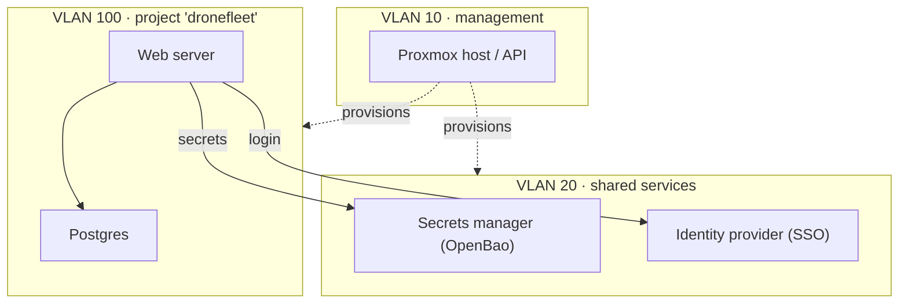

<p align="center">
  <picture>
    <source media="(prefers-color-scheme: dark)" srcset="docs/assets/the-pudding-logo-dark.png">
    <source media="(prefers-color-scheme: light)" srcset="docs/assets/the-pudding-logo.png">
    
  </picture>
</p>

<p align="center">
  <b>Self-hosted, EU-first developer services on Proxmox — provisioned with Terraform, configured with Ansible, shipped as Docker Compose.</b>
</p>

<p align="center">
  <a href="./LICENSE.md"></a>
  
  
  
  
  
</p>

---

## Table of contents

- [What is The Pudding?](#what-is-the-pudding)
- [Design principles](#design-principles)
- [What's in the box](#whats-in-the-box)
- [Quick start](#quick-start)
- [Architecture at a glance](#architecture-at-a-glance)
  - [Addressing by example](#addressing-by-example)
  - [How Terraform keeps projects apart](#how-terraform-keeps-projects-apart)
  - [Onboarding a project](#onboarding-a-project)
- [Roadmap](#roadmap)
- [Documentation](#documentation)
- [Contributing](#contributing)
- [License](#license)

## What is The Pudding?

**The Pudding** is a catalog of standard, hardened developer services — SQL and
NoSQL databases, an identity provider, a secrets manager, reverse proxy, VPN mesh,
CI runners, container registry, observability, MQTT, model serving, OTA updates,
backup — that a platform operator stands up **once** on a Proxmox instance and
reuses for every new project. A **project** is your own custom-developed software,
deployed on that same Proxmox instance.

Instead of every team re-inventing a database, an IDP or a message broker, each
project gets its own isolated VLAN and consumes the shared services it needs.
Everything is infrastructure-as-code.

**The proof is in the deployment.** Because these services are already running,
you can build your software against real, deployed services from day one — not
mocks or a stack on your laptop. Your project proves it works correctly where it
will actually run, from the very start of its development lifecycle.

> [!NOTE]
> **This GitHub repository is a read-only mirror of tagged releases.** Development
> happens on the private primary repository at [git.xenopz.com](https://git.xenopz.com).
> See [Contributing](#contributing) for how to get involved.

## Design principles

| | Principle | In practice |
|---|---|---|
| 🇪🇺 | **Self-hosted, open source, EU-first** | The default for every service is the most credible option with European governance. Where none exists, it is flagged explicitly — never silently swapped for a non-EU SaaS. |
| 🧱 | **Proxmox VM/LXC only** | Every guest is provisioned with the [`bpg/proxmox`](https://registry.terraform.io/providers/bpg/proxmox/latest/docs) Terraform provider and configured by Ansible. **No Kubernetes, k3s or k0s.** |
| 🐳 | **Docker Compose is the deployment unit** | One Compose stack per service, exposed only through Traefik. |
| 🔒 | **VLAN-per-project multi-tenancy** | Each project gets its own dedicated VLAN with fully computed addressing. No shared "projects VLAN". |

The binding rules are in [`project-constitution.md`](./.kiro/steering/project-constitution.md).

## What's in the box

The first release ships the platform foundation and the first shared service.

| Component | Status | What it does | Runbook | Spec |
|---|---|---|---|---|
| **Platform prerequisites** | ✅ Released | Bootstraps the `terraform@pve` identity and token, the base LXC/VM template, the Proxmox SDN VLAN zone and shared VLAN 20, and the host L3 gateway / firewall / routing. | [Install runbook](./infra/platform-foundation/INSTALL-RUNBOOK.md) | [`platform-prerequisites-bootstrap`](./.kiro/specs/platform-prerequisites-bootstrap/) |
| **Network foundation** | ✅ Released | Per-project VLAN onboarding with computed VLAN IDs, subnets, host IPs and hostnames, backed by an append-only `projects.yaml` registry. | [Foundation README](./infra/platform-foundation/README.md) | [`platform-prerequisites-bootstrap`](./.kiro/specs/platform-prerequisites-bootstrap/) |
| **SVC-07 — Secrets manager** ([OpenBao](https://openbao.org)) | ✅ Released | OpenBao primary plus a Transit auto-unsealer on two LXCs, with automated install, init/unseal, onboarding and live contract tests. | [Install runbook](./infra/projects/svc-07-secrets-manager/INSTALL-RUNBOOK.md) | [`svc-07-secrets-manager`](./.kiro/specs/svc-07-secrets-manager/) |

## Quick start

> [!WARNING]
> The quick start **creates real infrastructure**. Try it first on a throwaway
> Proxmox instance — never on a shared or production one.

**Requirements:** a reachable Proxmox VE instance (1–3 nodes), Terraform 1.6 or newer,
Python 3, and Ansible.

**1. Create the tooling virtualenv** (one time — the tooling calls it by absolute path):

<!-- doctest: offline -->
<!-- cwd: . -->
```bash
python3 -m venv ~/venv/devinfra
~/venv/devinfra/bin/pip install --upgrade pip
~/venv/devinfra/bin/pip install pytest hypothesis pyyaml
```

**2. Describe your Proxmox instance** with the guided wizard:

<!-- doctest: display-only -->
```bash
~/venv/devinfra/bin/python scripts/installer/cluster_env_wizard.py --env-file cluster.dev.env
```

**3. Bootstrap the platform prerequisites** (identity, template, SDN fabric, gateway).
On a completely clean Proxmox instance, `bootstrap_pve_identity=true` creates the `terraform@pve` token for you:

<!-- doctest: requires-infra -->
<!-- cwd: . -->
```bash
~/venv/devinfra/bin/ansible-playbook -i ansible/inventory/localhost.yml \
  ansible/playbooks/platform-bootstrap.yml \
  -e cluster_env_file=cluster.dev.env \
  -e bootstrap_scope=all \
  -e bootstrap_pve_identity=true
```

**4. Deploy a service** — SVC-07, the secrets manager:

<!-- doctest: requires-infra -->
<!-- cwd: . -->
```bash
~/venv/devinfra/bin/ansible-playbook -i ansible/inventory/localhost.yml \
  ansible/playbooks/svc-07-bootstrap.yml \
  -e cluster_env_file=cluster.dev.env
```

For the full provision-then-test walkthrough, clean-slate reset and troubleshooting,
see the [platform install runbook](./infra/platform-foundation/INSTALL-RUNBOOK.md)
and the [SVC-07 install runbook](./infra/projects/svc-07-secrets-manager/INSTALL-RUNBOOK.md).

## Architecture at a glance

The Proxmox instance is split into numbered VLANs. Each VLAN is a `/24` subnet
whose third octet **is** its VLAN ID (`10.0.<vlan_id>.0/24`), and nobody ever picks
a VLAN ID, IP or hostname by hand.

| VLAN | Subnet | Example address | Purpose |
|---|---|---|---|
| **10** | `10.0.10.0/24` | `10.0.10.x` | Management — Proxmox hosts and API only, never workloads |
| **20** | `10.0.20.0/24` | `10.0.20.10` | Shared platform services — one instance each of SSO, secrets, Traefik, registry, observability… |
| **30–99** | `10.0.30.0/24` … `10.0.99.0/24` | — | Reserved |
| **100** | `10.0.100.0/24` | `10.0.100.10` | First project, e.g. `dronefleet` |
| **101** | `10.0.101.0/24` | `10.0.101.10` | Second project, e.g. `mlvideo` — and so on, one VLAN per project, never reused |



- Project VLANs **cannot** reach VLAN 10, so a compromised workload never touches the hypervisor control plane.
- Projects **cannot** talk to each other; they share only through services on VLAN 20.

### Addressing by example

Hostnames follow `<svc-code>-<vlan_id>-<instance>`, and host IPs start at `.10` in
each subnet (`.2`–`.9` are reserved). Say `dronefleet` is the first project
onboarded, so it gets VLAN 100, and its first host is a PostgreSQL database
(catalog service SVC-01):

| Part | Value | Where it comes from |
|---|---|---|
| `svc-code` | `svc01` | Catalog slot SVC-01 (SQL database) |
| `vlan_id` | `100` | `dronefleet` was the first project onboarded |
| `instance` | `01` | First instance of this service in the project |
| **Hostname** | **`svc01-100-01`** | |
| **IP address** | **`10.0.100.10`** | Subnet `10.0.100.0/24`, first host → `.10` |

The next host in the same project gets `10.0.100.11`. The shared SSO on VLAN 20
works the same way: `svc06-20-01` at `10.0.20.10`. The hostname is tied to the
catalog slot, not the product, so swapping the technology behind a service never
forces a rename.

The full rules are in [`NET-00-vlan-ip-addressing-plan.md`](./requirements/NET-00-vlan-ip-addressing-plan.md).

### How Terraform keeps projects apart

You don't need to know Terraform to use The Pudding, but two of its terms explain
why one project can never break another:

- A **root** is a folder of Terraform code that describes one self-contained piece
  of infrastructure and is applied as a unit.
- A **state** is Terraform's ledger of what that root actually created. Terraform
  only changes or deletes what is listed in its own ledger.

Think of an apartment building. The **`platform-foundation`** root is the building
itself — the shared structure every apartment plugs into (the network zone and the
register of which project owns which VLAN). Each **project** is an apartment with
its own key and its own inventory list (its own root and state). Clearing out one
apartment only touches the items on that apartment's list, so it can never damage
the building or a neighbour's apartment.

### Onboarding a project

<!-- doctest: offline -->
<!-- cwd: . -->
```bash
# Dry run against a scratch copy of the registry — nothing real changes
cp infra/platform-foundation/projects.yaml /tmp/projects.scratch.yaml
PYTHONPATH=infra/platform-foundation/scripts \
  ~/venv/devinfra/bin/python infra/platform-foundation/scripts/onboard_project.py \
  --slug my-project --registry /tmp/projects.scratch.yaml --no-mr
```

The script allocates the next free VLAN ID, appends it to `projects.yaml`, and —
without `--no-mr` — opens a merge request so a human reviews the record. Then copy
`infra/projects/_TEMPLATE/` to `infra/projects/<slug>/` and apply. Details are in the
[foundation README](./infra/platform-foundation/README.md#onboarding-a-new-project).

## Roadmap

Services are delivered in tiers from the [service catalog](./00-developer-services-catalog.md)
(32 entries). Tier 1 is the next set of targets:

| Area | Tier-1 services (default technology) |
|---|---|
| Data | SVC-01 SQL — PostgreSQL · SVC-02 Cache — Redis 🚩 · SVC-03 Object storage — Garage |
| Identity & secrets | SVC-06 IDP — ZITADEL · **SVC-07 Secrets — OpenBao ✅** |
| Networking | SVC-09 Reverse proxy — Traefik · SVC-11 Mesh VPN — NetBird |
| CI/CD | SVC-13 CI runners — GitLab Runner 🚩 · SVC-14 Registry — Zot 🚩 |
| Observability | SVC-17 Prometheus + Grafana · SVC-18 Loki |
| Messaging | SVC-21 MQTT — Mosquitto |
| ML / AI | SVC-23 Model serving — vLLM + Triton 🚩 |
| Embedded | SVC-28 OTA updates — Mender |
| Resilience | SVC-32 Backup — Proxmox Backup Server |

🚩 = no European option of comparable maturity found; flagged deliberately. See the catalog for the reasoning behind each choice.

## Documentation

| Document | Covers |
|---|---|
| [Service catalog](./00-developer-services-catalog.md) | All 32 services, tenancy, technology origin, rollout order |
| [Requirements](./requirements/) | Platform foundation, network plan and per-service requirements |
| [Platform install runbook](./infra/platform-foundation/INSTALL-RUNBOOK.md) | Prerequisites bring-up, reset and troubleshooting |
| [SVC-07 install runbook](./infra/projects/svc-07-secrets-manager/INSTALL-RUNBOOK.md) | OpenBao provision-then-test |
| [Maintainer README](./docs/README.md) | The in-depth Developer-A guide: quick starts, principles, network foundation, onboarding, docs map |
| [TESTING.md](./docs/TESTING.md) | Offline and live test tiers |
| [Steering docs](./.kiro/steering/) | Constitution, tech choices, structure, security standards |
| [Specs](./.kiro/specs/) | Per-feature requirements, design, tasks, validation |

## Contributing

This mirror only receives tagged releases, and the primary repository at
[git.xenopz.com](https://git.xenopz.com) is private, so merge requests are not
accepted yet. Contributions are still welcome — see [`CONTRIBUTING.md`](./CONTRIBUTING.md)
for how to get involved.

Found a security issue? Please **do not** open a public issue — follow [`SECURITY.md`](./SECURITY.md).

## License

Licensed under the [Apache License 2.0](./LICENSE.md).
