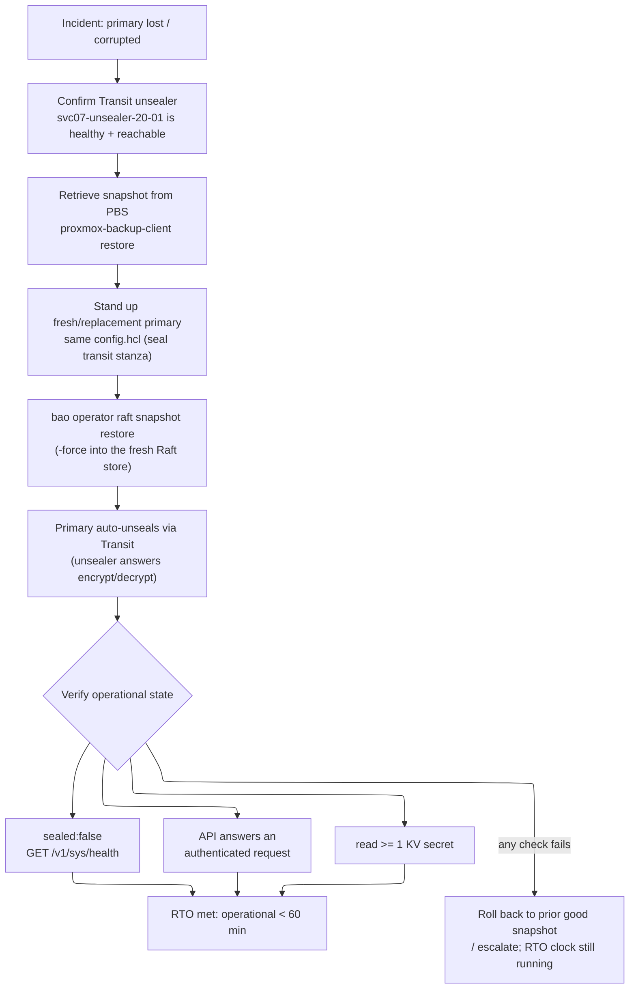

# OpenBao (SVC-07) — Raft Snapshot Restore Runbook (60-minute RTO)

> **Task 11.2 artifact.** This runbook documents restoring the OpenBao **primary**
> (`svc07-20-01`, `10.0.20.10`) from a PBS-retained Raft snapshot produced by the
> nightly job (task 11.1: [`tasks/backup.yml`](./tasks/backup.yml) +
> [`templates/openbao-snapshot.sh.j2`](./templates/openbao-snapshot.sh.j2)).
> It satisfies **Requirement 11.4** and **design.md "Testing Strategy §3
> (Backup/restore)"**: a restored primary must reach **operational state**
> — unsealed, API answering authenticated requests, ≥ 1 KV secret readable —
> **within 60 minutes** of the restore command being issued.
>
> Task 13.1 links this file from the SVC-07 role/runbook documentation set; the
> runnable code blocks below carry the doctest tier annotations
> (`documentation-testing.md`) that 13.1's doctest harness validates.

## Scope and audience

- **Audience:** the platform operator performing a disaster-recovery restore of
  the single-node OpenBao primary after an LXC/host loss or data corruption.
  (Single-node Raft has no HA quorum yet — see design.md "Open Risks"; restore
  is the recovery path, bounded by the 60-min RTO of Req 11.4.)
- **In scope:** retrieve a snapshot from Proxmox Backup Server (SVC-32), restore
  it into a fresh/replacement primary via `bao operator raft snapshot restore`,
  confirm the Transit unsealer auto-unseals it, and verify operational state.
- **Out of scope:** provisioning the LXCs (SVC-07 Terraform root), the nightly
  snapshot job itself (task 11.1), and the downstream `openbao-agent` sidecar.

## Placeholders — never paste real values

This runbook uses **placeholders only**. Substitute at run time from a
never-committed source (a root-only file or the systemd `EnvironmentFile` the
snapshot job already uses). **Never echo a credential value into a shell,
history, log, or this document.**

| Placeholder | Substitute with | Source |
|---|---|---|
| `<PBS_REPOSITORY>` | `proxmox-backup-client` repo spec, e.g. `backup@pbs!openbao@svc32-20-01.platform.internal:openbao` | `openbao_backup_pbs_repository` (non-secret id) |
| `<PBS_BACKUP_ID>` | PBS backup-id label | `openbao_backup_pbs_backup_id` (e.g. `svc07-openbao`) |
| `PBS_PASSWORD` | PBS repo password / API token | root-only `EnvironmentFile` (`openbao_backup_env_file`), env-var **name** only |
| `<SNAPSHOT_TIME>` | the PBS snapshot timestamp to restore (e.g. the latest good nightly) | `proxmox-backup-client snapshot list` output |
| `<RESTORE_TOKEN>` | a token authorized for `sys/storage/raft/snapshot` (write) | root-only token file; passed by env-var name, never a literal |
| `<PRIMARY_CONTAINER>` | the primary Compose container name | `openbao_primary_container_name` (`openbao-openbao-1`) |
| `<KV_PROBE_PATH>` | a known-present KV v2 path to read as the ≥ 1-secret proof | e.g. `secret/platform/svc07/restore-probe` |

The primary auto-unseals via the **Transit unsealer** (`svc07-unsealer-20-01`,
`https://10.0.20.11:8200`) — the restored primary's `config.hcl` already carries
the `seal "transit"` stanza (see [`README.md`](./README.md)), so **no operator
unseal keys are entered** during restore. The unsealer must be reachable.

## Restore flow



## RTO budget breakdown (target ≤ 60 min)

The 60-minute clock starts when the **restore command** (`bao operator raft
snapshot restore`, Step 4) is issued (Req 11.4). Steps 0–3 are preparation; they
should be brisk but the hard SLA is measured from Step 4. Budget:

| Phase | Steps | Budget | Notes |
|---|---|---|---|
| Preparation | 0–1 | ~10 min | Confirm unsealer health; locate/retrieve the snapshot from PBS. |
| Stand up replacement primary | 3 | ~10 min | Fresh LXC/stack already provisioned by Terraform/`openbao_install`; bring the container up with an **empty** Raft store. |
| **Restore command** | 4 | ~5 min | `bao operator raft snapshot restore -force`; RTO clock authoritative from here. |
| Auto-unseal | 5 | ~5 min | Transit unsealer answers; `sealed:false`. |
| Verification | 6 | ~10 min | Health, authenticated API call, ≥ 1 KV read. |
| Contingency reserve | — | ~20 min | Absorbs a retry, a second snapshot, or slow PBS retrieval and still lands < 60 min. |

If verification (Step 6) has not passed by **T+40 min**, treat the restore as
failing, roll back to the prior good snapshot, and escalate — do not let the
clock silently run past the RTO.

## Preflight checks (offline / tooling sanity)

Confirm the tools are present and the primary stack config is valid **before**
touching the live cluster. These are offline and safe to run anywhere.

<!-- doctest: offline -->
```bash
bao -help
```

<!-- doctest: offline -->
```bash
proxmox-backup-client --help
```

<!-- doctest: offline -->
<!-- cwd: ansible -->
```bash
~/venv/devinfra/bin/ansible-lint roles/openbao_install
```

Render + validate the primary Compose stack config (no host ports, Traefik
labels, pinned image) before bringing the replacement primary up:

<!-- doctest: offline -->
```bash
docker compose config
```

### Step 0 — Confirm the Transit unsealer is healthy and reachable

The restored primary auto-unseals **only** if the unsealer answers Transit
encrypt/decrypt. Confirm it is up and reachable from the primary's VLAN-20 path
first (this is illustrative output shape; run against the live unsealer):

<!-- doctest: requires-infra -->
```bash
curl -sS --cacert /etc/openbao/tls/ca.pem \
  https://10.0.20.11:8200/v1/sys/health
```

Expect `initialized:true`. If the unsealer is down or itself sealed, **stop** —
restoring the primary now would leave it stuck sealed (design.md degraded-mode:
"unsealer unreachable → primary stays sealed, logs ERROR"). Recover the unsealer
first.

### Step 1 — Locate and retrieve the snapshot from PBS (SVC-32)

List available snapshots, then retrieve the latest good nightly. `PBS_PASSWORD`
is read from the root-only `EnvironmentFile` (`openbao_backup_env_file`) — it is
referenced by **name** only and never echoed.

<!-- doctest: requires-infra -->
```bash
set +o history
source /etc/openbao/backup.env            # sets PBS_PASSWORD in-env, not on disk-in-repo
export PBS_REPOSITORY='<PBS_REPOSITORY>'
proxmox-backup-client snapshot list --repository "${PBS_REPOSITORY}"
```

Restore the chosen snapshot's OpenBao Raft image out of PBS to a working path on
the replacement primary host. The nightly job stored it as the archive
`openbao-raft.img` under `<PBS_BACKUP_ID>` (see the snapshot script's PBS
hand-off):

<!-- doctest: requires-infra -->
```bash
proxmox-backup-client restore \
  "host/<PBS_BACKUP_ID>/<SNAPSHOT_TIME>" \
  openbao-raft.img \
  /var/backups/openbao/openbao-raft-restore.snap \
  --repository "${PBS_REPOSITORY}"
unset PBS_PASSWORD
set -o history
```

Confirm the retrieved file is **non-empty** before proceeding (mirrors the
nightly job's non-empty gate):

<!-- doctest: requires-infra -->
```bash
test -s /var/backups/openbao/openbao-raft-restore.snap \
  && echo "snapshot present and non-empty"
```

### Step 3 — Stand up the fresh / replacement primary

Bring up the replacement primary LXC (provisioned by the SVC-07 Terraform root)
with the **same** `config.hcl` `openbao_install` renders — crucially the
`seal "transit"` stanza pointing at `https://10.0.20.11:8200`, the Raft storage
at `/openbao/data`, and `node_id = svc07-20-01`. Start the container with an
**empty** Raft store (a fresh data volume); the snapshot restore in Step 4
populates it.

> **⚠ Reachability prerequisite (ADR-0004).** The `ansible-playbook` run below
> reaches the VLAN-20 primary (`svc07-20-01`, `10.0.20.10`) over SSH; a Proxmox
> SDN VLAN zone is L2-only, so an off-VLAN control host must first have the
> Proxmox host routing + firewalling VLAN 20 and a dev-machine static route in
> place. See
> [`0004-ansible-control-node-placement-and-sdn-reachability.md`](../../../.kiro/decisions/0004-ansible-control-node-placement-and-sdn-reachability.md)
> (running Ansible directly on the Proxmox node needs no static route).

First (re)generate the dynamic Ansible inventory from the replacement primary's
SVC-07 Terraform outputs — the restore stands up a fresh primary via the SVC-07
root, so the inventory must be regenerated to target the current host (run from
the repo root):

<!-- doctest: requires-infra -->
<!-- cwd: . -->
```bash
~/venv/devinfra/bin/python ansible/inventory/generate_inventory.py \
  --root infra/projects/svc-07-secrets-manager
```

Then run the install tag against the generated inventory, limited to the primary
group. The generator emits the group `openbao` for the primary (its
`service_role`), so `--limit openbao` targets the replacement primary
(`svc07-20-01`); the hostname `--limit svc07-20-01` also works since the
generated inventory contains both the group and the host — prefer the group form:

<!-- doctest: requires-infra -->
<!-- cwd: . -->
```bash
~/venv/devinfra/bin/ansible-playbook \
  -i ansible/inventory/svc-07-secrets-manager.generated.yml \
  ansible/playbooks/openbao.yml --limit openbao --tags install
```

Wait for the API to answer (it will be **sealed** and **uninitialized** at this
point — that is expected before the restore):

<!-- doctest: requires-infra -->
```bash
curl -sS --cacert /etc/openbao/tls/ca.pem \
  https://10.0.20.10:8200/v1/sys/health
```

### Step 4 — Restore the Raft snapshot (RTO clock is authoritative from here)

Run `bao operator raft snapshot restore` against the fresh primary. Use
`-force`: the fresh instance's cluster identity differs from the snapshot's, and
`-force` accepts the snapshot into the empty store. The `<RESTORE_TOKEN>` is
authorized for `sys/storage/raft/snapshot` and is passed via env-var name — it
is **never** written into this document or traced (`set -x` intentionally not
enabled).

<!-- doctest: requires-infra -->
```bash
docker exec \
  -e "BAO_ADDR=https://127.0.0.1:8200" \
  -e "BAO_TOKEN=${RESTORE_TOKEN}" \
  -e "BAO_SKIP_VERIFY=true" \
  <PRIMARY_CONTAINER> \
  bao operator raft snapshot restore -force /openbao/data/.restore.snap
```

(Copy the retrieved snapshot into the container at `/openbao/data/.restore.snap`
with `docker cp` first if it is not already on the mounted data volume — the
same in/out-of-container copy pattern the nightly save script uses.)

### Step 5 — Confirm auto-unseal via the Transit unsealer

After restore, the primary reads the `seal "transit"` stanza and asks the
unsealer to decrypt its root key — **no operator keys are entered**. Poll health
until `sealed:false` (expected within ~5 min given a healthy unsealer):

<!-- doctest: requires-infra -->
```bash
curl -sS --cacert /etc/openbao/tls/ca.pem \
  https://10.0.20.10:8200/v1/sys/health
```

If it stays `sealed:true`, check the primary container logs for an ERROR
mentioning the transit seal being unreachable (design.md swap-gate/degraded-mode
behavior) and re-confirm Step 0.

## Step 6 — Verify operational state (the three Req 11.4 acceptance checks)

All three must pass **within 60 minutes** of the Step 4 command for the RTO to
be met. Each maps directly to design.md "Testing Strategy §3 (Backup/restore)".

**6a — Unsealed** (`sealed:false` from `GET /v1/sys/health`):

<!-- doctest: requires-infra -->
```bash
curl -sS --cacert /etc/openbao/tls/ca.pem \
  https://10.0.20.10:8200/v1/sys/health
```

Illustrative expected shape (Tier-3, not executed):

<!-- doctest: display-only -->
```json
{ "initialized": true, "sealed": false, "standby": false }
```

**6b — API answers an authenticated request** (token lookup-self succeeds; use a
`platform-admin`-scoped token supplied at run time, referenced by env-var name):

<!-- doctest: requires-infra -->
```bash
docker exec \
  -e "BAO_ADDR=https://127.0.0.1:8200" \
  -e "BAO_TOKEN=${VERIFY_TOKEN}" \
  -e "BAO_SKIP_VERIFY=true" \
  <PRIMARY_CONTAINER> \
  bao token lookup -format=json
```

**6c — At least one KV secret is readable** (proves the restored Raft store
carries real data, not just an empty unsealed instance):

<!-- doctest: requires-infra -->
```bash
docker exec \
  -e "BAO_ADDR=https://127.0.0.1:8200" \
  -e "BAO_TOKEN=${VERIFY_TOKEN}" \
  -e "BAO_SKIP_VERIFY=true" \
  <PRIMARY_CONTAINER> \
  bao kv get -mount=secret <KV_PROBE_PATH>
```

When 6a–6c all pass, the primary is **operational** and the restore has met the
60-minute RTO (Req 11.4). Record the elapsed time from Step 4 in the incident
log.

## Post-restore

- Re-point / restart any downstream `openbao-agent` sidecars that lost their
  lease during the outage; existing leases survived up to their max TTL (24 h),
  so most dependents kept working during the restore window (design.md Req 12.3).
- Confirm the nightly snapshot timer is enabled on the restored primary
  (`systemctl status openbao-raft-snapshot.timer`) so backup coverage resumes.
- If the Bootstrap_Transit_Token KV entry
  (`secret/platform/svc07/transit-token`) was part of the restored data, the
  auto-unseal path is self-contained; no external token copy is re-introduced
  (design.md "Open Risks — bootstrap chicken-and-egg").

## Verification of this runbook (doctest tiers)

- **Tier-1 (`offline`)**: `bao -help`, `proxmox-backup-client --help`,
  `docker compose config`, `ansible-lint` — runnable with no live cluster.
- **Tier-2 (`requires-infra`)**: the actual PBS retrieve, `raft snapshot
  restore`, auto-unseal, and the three operational-state verifications — run
  against a live cluster (exercised by the `requires_infra`-gated integration
  test in task 12.4).
- **Tier-3 (`display-only`)**: the illustrative JSON health shape.

No repo-local Tier-1 doctest runner is wired yet; task 13.1 / the
`documentation-testing.md` tooling validates these annotations and executes the
Tier-1 blocks. All commands use placeholders only — no real tokens, snapshot
paths carrying secrets, or hostnames, and no credential value is ever echoed.
