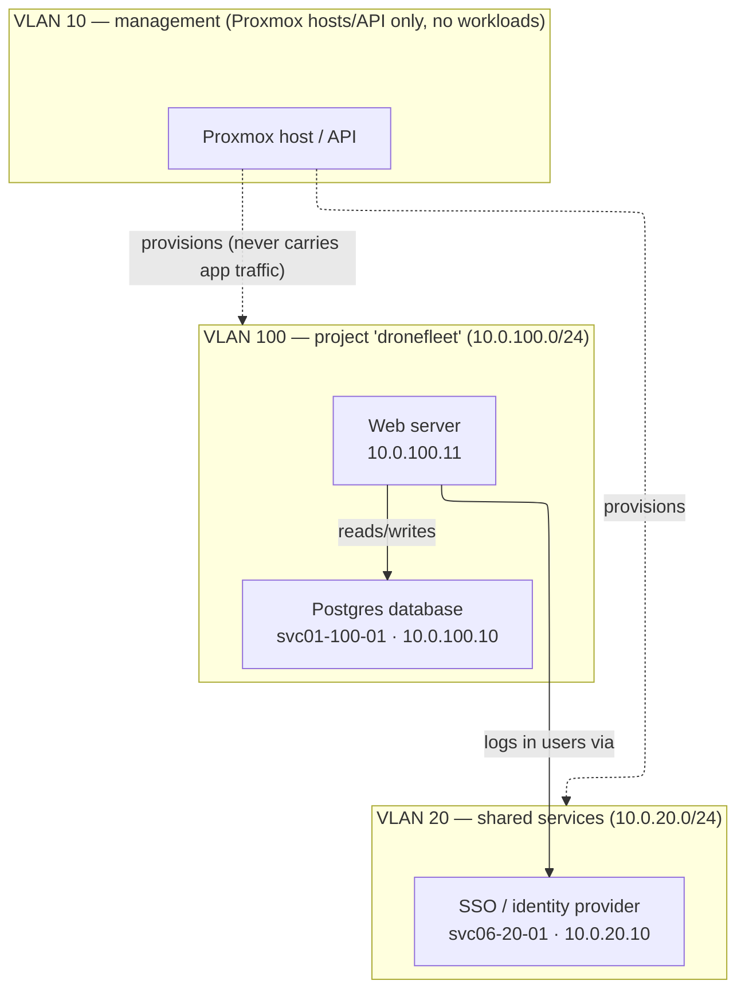
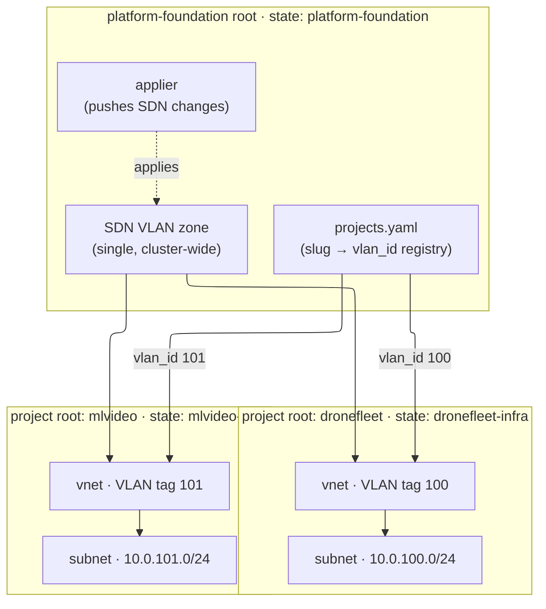

# Developer Services Platform

Internal, self-hosted developer infrastructure for the organization: a catalog of
**standard, reusable services** — SQL/NoSQL databases, an identity provider,
secrets manager, reverse proxy, VPN mesh, CI runners, container registry,
observability stack, MQTT broker, model-serving endpoint, OTA update server, and
backup/DR — provisioned on a **Proxmox** cluster with **Terraform** and
**Ansible**. Every new project (embedded / Raspberry Pi / NXP, drone hardware, or
ML for video/image/text) consumes these shared, already-hardened services instead
of re-inventing a database, an IDP, or a message broker each time.

This is not a product sold to external customers. It is the infrastructure a
**platform operator** stands up once and reuses for every subsequent project.

> New here? Jump to [Development quick start](#development-quick-start), or read the
> [service catalog](../00-developer-services-catalog.md) for the full list of
> services and their chosen technologies.

---

## Quick start (platform users)

Standing the platform up on your own Proxmox cluster? This is the shortest path.
It targets **platform users** (Developer B) who want a running platform. If you are
a developer working **on** the services in this repo (running the test suite,
validating Terraform), you want the [Development quick start](#development-quick-start)
instead.

### 1. One-time virtualenv

Create the `~/venv/devinfra` virtualenv the tooling runs from (invoked by absolute
path). This is the same venv described in the
[Development quick start prerequisites](#development-quick-start) — create it once:

<!-- doctest: offline -->
<!-- cwd: . -->
```bash
python3 -m venv ~/venv/devinfra
~/venv/devinfra/bin/pip install --upgrade pip
~/venv/devinfra/bin/pip install pytest hypothesis pyyaml
```

### 2. Author the cluster env file

The bring-up reads all cluster/provider parameters from a gitignored env file
(e.g. `cluster.dev.env`) — it holds secrets and is **never committed**. Author it
either way:

- **(a) Guided wizard** — prompts for each parameter, validates, and stops (it
  mutates nothing, and never writes the admin bootstrap credential to disk):

<!-- doctest: display-only -->
```bash
~/venv/devinfra/bin/python scripts/installer/cluster_env_wizard.py \
  --env-file cluster.dev.env
```

- **(b) Copy the template and edit by hand:**

<!-- doctest: offline -->
<!-- cwd: . -->
```bash
cp cluster.env.example cluster.dev.env
```

Either way, you can validate the finished file offline before bringing anything up:

<!-- doctest: offline -->
<!-- cwd: . -->
```bash
~/venv/devinfra/bin/python scripts/installer/cluster_env.py \
  --env-file cluster.dev.env --check
```

### 3. Bring it up — two commands

First the **platform prerequisites** (identity, template, SDN fabric, host
gateway). Add `-e bootstrap_pve_identity=true` on a true clean slate so it mints
the `terraform@pve` token for you:

<!-- doctest: requires-infra -->
<!-- cwd: . -->
```bash
~/venv/devinfra/bin/ansible-playbook \
  -i ansible/inventory/localhost.yml \
  ansible/playbooks/platform-bootstrap.yml \
  -e cluster_env_file=cluster.dev.env \
  -e bootstrap_scope=all \
  -e bootstrap_pve_identity=true
```

Then a **service**, e.g. SVC-07 (the secrets manager):

<!-- doctest: requires-infra -->
<!-- cwd: . -->
```bash
~/venv/devinfra/bin/ansible-playbook \
  -i ansible/inventory/localhost.yml \
  ansible/playbooks/svc-07-bootstrap.yml \
  -e cluster_env_file=cluster.dev.env
```

### 4. Going deeper

For the full provision-then-test walkthrough, clean-slate reset, and
troubleshooting, see the
[platform install runbook](../infra/platform-foundation/INSTALL-RUNBOOK.md).

---

## Guiding principles

Four constraints are binding across every service and every spec in this
repository (see [`00-developer-services-catalog.md`](../00-developer-services-catalog.md) §1):

1. **Self-hosted, open source first, European by default.** The primary candidate
   for every service is the most credible option with genuine European governance
   or headquarters. Where none exists at comparable maturity, it is **flagged
   explicitly** rather than silently defaulting to a non-EU vendor.
2. **IaC-native, Proxmox VM/LXC only — no Kubernetes.** Every service is a Proxmox
   VM or LXC provisioned by the [`bpg/proxmox`](https://registry.terraform.io/providers/bpg/proxmox/latest/docs)
   Terraform provider and configured by Ansible.
3. **Docker Compose as the sole deployment unit.** Every service ships as one
   Compose stack, reverse-proxied by Traefik. No bare `docker run` in production,
   no orchestrator beyond Compose.
4. **Multi-tenancy is VLAN-per-project.** Each project gets its own dedicated VLAN.

### Non-negotiables

- **No Kubernetes / k3s / k0s** — anywhere, ever.
- **Compose-only deployment unit** — no per-service bespoke runtime.
- **Self-hosted / EU-first, with explicit flagging** — a quietly-added non-EU SaaS
  dependency is treated as incomplete, not just suboptimal.
- **VLAN-per-project multi-tenancy** — no shared "projects VLAN with namespacing".

Full detail lives in [`.kiro/steering/project-constitution.md`](../.kiro/steering/project-constitution.md).

---

## Repository structure

<!-- doctest: display-only -->
```text
.
├── 00-developer-services-catalog.md   # source-of-truth service catalog (SVC-01 … SVC-32)
├── requirements-template.md           # 15-section template for every SVC-xx requirements doc
├── requirements/                      # PF, NET-00, and per-service requirements docs
├── infra/
│   ├── platform-foundation/           # shared cluster-wide Terraform root (SDN zone + applier + VLAN registry)
│   │   └── scripts/                   #   onboard_project.py + netfoundation derivation package
│   ├── modules/
│   │   └── proxmox-compute/           # shared module: every VM/LXC goes through this
│   ├── projects/
│   │   └── _TEMPLATE/                  # per-project Terraform root template (copy to infra/projects/<slug>/)
│   └── tests/                         # contract / degraded-mode / integration tests for the IaC layer
└── .kiro/
    ├── steering/                      # always-/conditionally-loaded project conventions
    ├── specs/                         # one dir per feature: requirements.md → design.md → tasks.md → validation.md
    └── decisions/                     # ADRs
```

The full rationale for this layout is in
[`.kiro/steering/structure.md`](../.kiro/steering/structure.md).

---

## Technology stack

| Layer | Choice |
|---|---|
| Virtualization / compute | **Proxmox VE** (1–3 nodes, `local-zfs`, ≥1 GPU node) — the only compute layer |
| Provisioning | **Terraform**, provider [`bpg/proxmox`](https://registry.terraform.io/providers/bpg/proxmox/latest/docs) (version-pinned), GitLab-managed HTTP state |
| Configuration | **Ansible**, dynamic inventory rendered from `terraform output -json` |
| In-guest runtime | **Docker + Compose plugin** (pre-baked into templates) |
| Ingress | **Traefik** — the only HTTP/HTTPS entrypoint, via Docker labels |
| Networking | **Proxmox SDN, VLAN zone type** — one dedicated VLAN per project |

See [`.kiro/steering/tech.md`](../.kiro/steering/tech.md) for the per-service
default technology table and the excluded-technology list.

---

## Development quick start

### Prerequisites

- A **Proxmox VE** cluster you can reach, and a `terraform@pve` API token whose
  custom PVE role carries the `SDN.Allocate` privilege.
- **Terraform CLI** `>= 1.6.0` on your `PATH` (for `fmt`/`validate`/`plan`/`apply`).
- A **Python virtual environment** at `~/venv/devinfra/` with `pytest`,
  `hypothesis`, and `pyyaml` installed — used by the VLAN derivation layer,
  property tests, and the onboarding script.

Create the venv (one time):

<!-- doctest: offline -->
<!-- cwd: . -->
```bash
python3 -m venv ~/venv/devinfra
~/venv/devinfra/bin/pip install --upgrade pip
~/venv/devinfra/bin/pip install pytest hypothesis pyyaml
```

> Kiro's agent invokes these binaries by absolute path (e.g.
> `~/venv/devinfra/bin/pytest`) rather than relying on shell activation — see
> [`.kiro/steering/dev-workflow.md`](../.kiro/steering/dev-workflow.md).

### Run the test suite

> **See [`TESTING.md`](./TESTING.md) for the full testing guide** — the two test
> tiers, the offline-vs-cluster distinction, and how to run every test **without
> CI**.

The pure-Python derivation layer, property tests, onboarding-script tests, and the
static IaC-shape tests all run offline (no Terraform binary or live Proxmox
needed):

<!-- doctest: offline -->
<!-- cwd: . -->
```bash
PYTHONPATH=infra/platform-foundation/scripts \
  ~/venv/devinfra/bin/pytest \
  infra/platform-foundation/scripts/tests/ infra/tests/ -q
```

The live tests (integration apply, destroy-isolation, missing-`SDN.Allocate`) are
marked `requires_infra` and are **deselected by default** by the root
`pytest.ini` (`addopts = -m "not requires_infra"`), so the offline command above
is safe even with a live-test `.env` loaded — the live tests are never collected
and cannot hang or hit a real cluster. When explicitly opted into (next section),
they **skip cleanly** if their credentials are absent. **CI is not required to run
them** — see the next section. See the per-feature
`validation.md` for the requirement→evidence map.

### Live / acceptance tests (requires a test cluster — not CI)

The `requires-infra` tests are a first-class part of **acceptance**: they run
real `terraform apply`/`destroy` against a Proxmox SDN cluster and prove the
foundation + project roots provision, coexist with distinct VLANs, isolate on
`terraform destroy`, and fail correctly when the `SDN.Allocate` privilege is missing.
They skip (never fail) when their environment variables are absent, so the
offline suite above stays green without a cluster.

**These tests do NOT require CI.** They read plain environment variables, so the
primary, fully-supported path is running them **locally** against an ephemeral
test cluster with a `.env` (below). Running them in CI — with the same variables
injected as CI variables — is just *one other place* to run them, not a
precondition.

> **Run these only against an ephemeral / throwaway Proxmox SDN cluster** — they
> create and tear down real SDN zones, VNets, and subnets. Never point them at a
> shared or production cluster; an interrupted `destroy` can orphan SDN objects.

**1. Provide credentials via a local `.env` (never committed).** Copy the
template and fill in your test-cluster values:

<!-- doctest: offline -->
<!-- cwd: . -->
```bash
cp .env.example .env
```

`.env` is gitignored; `.env.example` is the committed, placeholder-only template.
The variables it documents:

| Variable | Used by | Notes |
|---|---|---|
| `PROXMOX_SDN_TEST_ENDPOINT` | apply-coexistence, destroy-isolation, applier-failure | Test-cluster API URL. |
| `PROXMOX_SDN_TEST_TOKEN` | same 3 tests | Token **with** `SDN.Allocate` — performs real apply/destroy. |
| `PROXMOX_TEST_ENDPOINT` | missing-`SDN.Allocate` negative test | Test-cluster API URL. |
| `PROXMOX_TEST_TOKEN_NO_SDN_ALLOCATE` | missing-`SDN.Allocate` negative test | Token **without** `SDN.Allocate` — the test asserts the apply fails and provisions nothing, so a privileged token here makes the test fail. |
| `PROXMOX_TEST_PROJECT_SLUG` | missing-`SDN.Allocate` negative test | A slug registered in `projects.yaml`; defaults to `dronefleet`. |

Never commit `.env` and never paste real tokens into `.env.example`. A Proxmox
API token has the form `<user>@<realm>!<token-id>=<uuid>` and is a test-cluster
credential only — never a production token and never the built-in `Administrator`
role (see [`security-standards.md`](../.kiro/steering/security-standards.md)).

**2. Run the live tests.** Load `.env` into the same shell that runs `pytest`
(the variables must be present in the process environment, not just exported in a
different terminal):

<!-- doctest: requires-infra -->
<!-- cwd: . -->
```bash
set -a && . ./.env && set +a
PYTHONPATH=infra/platform-foundation/scripts   ~/venv/devinfra/bin/pytest -m requires_infra   infra/tests/test_degraded_sdn_use.py   infra/tests/test_integration_apply.py   infra/tests/test_destroy_isolation.py   infra/tests/test_degraded_modes.py -v
```

The `-m requires_infra` flag opts into the live tier, overriding the default
`-m "not requires_infra"` deselection in the root `pytest.ini` — without it the
live tests are deselected and nothing live runs.

To run the safest one first (the negative-auth test provisions nothing because it
*expects* the apply to fail), scope pytest to just that file:

<!-- doctest: requires-infra -->
<!-- cwd: . -->
```bash
set -a && . ./.env && set +a
PYTHONPATH=infra/platform-foundation/scripts   ~/venv/devinfra/bin/pytest -m requires_infra   infra/tests/test_degraded_sdn_use.py::TestMissingSdnUseAuthorizationFailure -v
```

If a live apply appears to hang or error partway through, stop and inspect the
cluster's SDN state before re-running — do not blindly re-run a `destroy`, which
could orphan objects. See each test file's module docstring for exactly what it
applies and asserts, and the per-feature `validation.md` for the
requirement→evidence map.

### Format and validate the Terraform (offline)

`terraform fmt -recursive` is repo-wide, but `init` and `validate` act on a
single root module and are **not** recursive — so run them **from inside each
Terraform root**, once per root. The two roots are `infra/platform-foundation/`
(the shared foundation) and `infra/projects/_TEMPLATE/` (the per-project
template). Running `init`/`validate` from the repo root instead reports a
misleading "empty directory / Success" because there are no `.tf` files there.

Formatting check (repo-wide, run from the repo root):

<!-- doctest: offline -->
<!-- cwd: . -->
```bash
terraform fmt -check -recursive
```

Validate the shared foundation root:

<!-- doctest: offline -->
<!-- cwd: infra/platform-foundation -->
```bash
cd infra/platform-foundation
terraform init -backend=false
terraform validate
```

Validate the per-project template root:

<!-- doctest: offline -->
<!-- cwd: infra/projects/_TEMPLATE -->
```bash
cd infra/projects/_TEMPLATE
terraform init -backend=false
terraform validate
```

---

## The network foundation

The first implemented feature is the **VLAN & IP network foundation** — the layer
that gives every project its own isolated VLAN with fully computed addressing (no
human ever picks a VLAN ID or an IP).

### 1. The network topology, by example

Think of the cluster as a small set of numbered VLANs, each a `/24` subnet whose
third octet **is** its VLAN ID (`10.0.<vlan_id>.0/24`):

- **VLAN 10 — management.** Proxmox host/API traffic only. No workload ever
  attaches here.
- **VLAN 20 — shared platform services.** One instance of each service that every
  project reuses lives here: the identity provider (ZITADEL / SSO), the secrets
  manager, Traefik, the container registry, observability, and so on.
- **VLANs 100+ — one per project, dedicated.** Each onboarded project gets exactly
  one VLAN, assigned sequentially and never reused. A project's own resources
  (its database, its web servers) live on its VLAN and nowhere else.

Worked example — the first project onboarded, `dronefleet`, gets **VLAN 100**
(`10.0.100.0/24`). It runs its own Postgres database and a web server on its
dedicated VLAN, and it *reuses* the shared SSO on VLAN 20 rather than standing up
its own. The management VLAN 10 sits underneath all of it — the operator reaches
the Proxmox hosts over VLAN 10 to provision everything, but no workload is ever
attached to it:



VLAN 10 is deliberately isolated: project VLANs cannot open connections back to
it, so a compromised workload can never reach the hypervisor control plane. Note
also what is *not* drawn — there is no line between `dronefleet`'s VLAN and any
other project's VLAN. Cross-project traffic is disallowed; projects only share via
services on VLAN 20.

Everything in that picture is computed, not chosen: the VLAN ID comes from
onboarding order (`dronefleet` was first, so it got 100), each subnet is
`10.0.<vlan_id>.0/24`, host IPs start at `.10` (`cidrhost(subnet, 10 + index)`),
and the hostname `<svc-code>-<vlan_id>-<instance>` is keyed to the stable catalog
service slot (so swapping the technology behind a service never forces a rename).
The reserved ranges — VLANs `30–99` and host addresses `.2`–`.9` — are held back
for future use.

### 2. How Terraform builds that topology

Which piece of Terraform code creates each VLAN from section 1? The
`platform-foundation` root is **not itself one of the numbered VLANs** — it builds
the shared plumbing that all the VLANs plug into (the SDN *zone*), while each
project's own root carves out that project's individual VLAN. Two kinds of root,
deliberately kept in separate Terraform states so one project can never affect
another:

- **One shared `platform-foundation` root** owns the single, cluster-wide SDN VLAN
  *zone* — the container that VLAN 20 and every project VLAN (100+) attach to —
  plus the `projects.yaml` registry (the append-only slug → VLAN-ID list) and the
  `applier` that pushes SDN changes to the cluster. It has its own Terraform state
  named `platform-foundation`. This root is the plumbing behind the whole picture,
  not a VLAN of its own.
- **One root per project** (copied from `infra/projects/_TEMPLATE/`) creates just
  that one project's VLAN — a `vnet` + `subnet` pair, e.g. `dronefleet`'s VLAN 100
  from section 1 — reading its assigned VLAN ID from `projects.yaml`. Each project
  has its own state named `<slug>-infra`, so a `terraform destroy` for one project
  can never touch the foundation or another project.



### 3. Where each piece is documented

The two diagrams above are the map; these docs are the territory — each explains
one box in detail:

- [`infra/platform-foundation/README.md`](../infra/platform-foundation/README.md) —
  the shared root: the SDN VLAN zone, the `projects.yaml` registry, and the
  onboarding script that assigns VLAN IDs.
- [`infra/projects/_TEMPLATE/README.md`](../infra/projects/_TEMPLATE/README.md) —
  the per-project root template you copy per project (the `vnet` + `subnet` pair).
- [`infra/modules/proxmox-compute/README.md`](../infra/modules/proxmox-compute/README.md) —
  the shared compute module every VM/LXC goes through (where the computed host IP
  and hostname are applied).
- [`requirements/NET-00-vlan-ip-addressing-plan.md`](../requirements/NET-00-vlan-ip-addressing-plan.md) —
  the addressing plan of record: the full VLAN/CIDR/hostname rules the diagrams
  summarize.

---

## Implemented services

This section lists the services that are actually **built** — with provisioning
code, install automation, and a spec — as opposed to the ones merely **cataloged**
in [`00-developer-services-catalog.md`](../00-developer-services-catalog.md); the
network foundation itself remains documented in [its own section above](#the-network-foundation).

Every implemented service follows the same entry pattern: a link to its install
runbook (the provision-then-test walkthrough) and a link to its spec.

| Service | Install runbook | Spec |
|---|---|---|
| **SVC-07 — Secrets manager (OpenBao)** | [`INSTALL-RUNBOOK.md`](../infra/projects/svc-07-secrets-manager/INSTALL-RUNBOOK.md) | [`svc-07-secrets-manager`](../.kiro/specs/svc-07-secrets-manager/) · [`svc-07-automated-installer`](../.kiro/specs/svc-07-automated-installer/) · [`svc07-installer-simplification`](../.kiro/specs/svc07-installer-simplification/) |

### Platform prerequisites

Not a catalog `SVC-NN` service, but a built, config-driven orchestrator for the
cluster prerequisites every service depends on (the `terraform@pve` identity/token,
the base LXC/VM template, the host L3 gateway/firewall, and the shared SDN VLAN-20
fabric) — same provision-then-test entry pattern as an implemented service:

| Prerequisite | Install runbook | Spec |
|---|---|---|
| **Platform prerequisites bootstrap** (host / api / devmachine buckets) | [`INSTALL-RUNBOOK.md`](../infra/platform-foundation/INSTALL-RUNBOOK.md) | [`platform-prerequisites-bootstrap`](../.kiro/specs/platform-prerequisites-bootstrap/) |

---

## Onboarding a new project

This is the end-to-end flow the whole platform exists to serve:

1. Run the onboarding script for the new slug. **The operator never types a VLAN
   ID** — the script computes the next sequential, never-reused ID, writes the new
   `{slug, vlan_id, onboarding_date}` row into
   `infra/platform-foundation/projects.yaml`, and opens a **merge request**
   carrying that one-line diff.

   Why a merge request if the ID is computed? Because `projects.yaml` is the
   *authoritative, permanent record* of every assignment (it is append-only —
   IDs are never reused, even after a project is retired). The script computes the
   value so no human picks it; the MR exists so a human *reviews and approves* the
   record before it is merged. So "computed" and "stored in `projects.yaml`" are
   two stages of the same step: the script derives the ID, then records it in the
   file, then the merge merges that record. The file holds a `vlan_id` because it
   is the ledger — not because anyone chose the number by hand.
2. Copy `infra/projects/_TEMPLATE/` to `infra/projects/<slug>/`; its Terraform root
   creates that project's dedicated VNet/subnet for the assigned VLAN and
   provisions the catalog services the project needs as Compose stacks on VM/LXC
   guests.
3. Terraform outputs feed a dynamic Ansible inventory; Ansible configures each
   host's OpenBao Agent, which pulls that host's secrets at container-start time —
   no secret is ever committed.
4. Every HTTP/HTTPS service registers with the shared Traefik instance via Docker
   labels rather than exposing host ports.
5. Hostnames and IPs are fully computed — no human chooses either.

To see what VLAN ID a new slug *would* get — a **local dry run** that changes
nothing real (no edit to the committed registry, no merge request, no live infra):

<!-- doctest: offline -->
<!-- cwd: . -->
```bash
cp infra/platform-foundation/projects.yaml /tmp/projects.scratch.yaml
PYTHONPATH=infra/platform-foundation/scripts \
  ~/venv/devinfra/bin/python \
  infra/platform-foundation/scripts/onboard_project.py \
  --slug my-project \
  --registry /tmp/projects.scratch.yaml \
  --no-mr
```

Reading that command line by line:

- `cp infra/platform-foundation/projects.yaml /tmp/projects.scratch.yaml` —
  copy the real registry to a throwaway scratch file so the dry run writes to the
  copy, leaving the committed `projects.yaml` untouched.
- `PYTHONPATH=infra/platform-foundation/scripts` — put the `netfoundation`
  derivation package (which the script imports for the allocation math) on Python's
  import path for this one command.
- `~/venv/devinfra/bin/python .../onboard_project.py` — run the script with the
  project virtualenv's Python, invoked by absolute path (Kiro's convention — no
  reliance on shell activation).
- `--slug my-project` — the new project slug to allocate (must be
  lowercase-hyphenated, ≤20 chars, and not already in the registry).
- `--registry /tmp/projects.scratch.yaml` — point the script at the scratch copy
  instead of the real registry.
- `--no-mr` — skip opening a GitLab merge request (the dry run allocates + appends
  to the scratch file only). Drop this flag in CI to open the real MR.

The script prints the VLAN ID it allocated (and appends the row to the scratch
file). Expected output (VLAN `<N>` and date depend on the current registry — see
below):

<!-- doctest: display-only -->
```text
  (--no-mr) skipped opening a merge request for 'my-project'.
INFO: ALLOCATION: slug 'my-project' -> VLAN <N> (onboarding_date <YYYY-MM-DD>); registry updated; no merge request was opened.
Onboarded 'my-project': VLAN <N>, onboarding_date <YYYY-MM-DD>. Registry updated; no merge request was opened.
```

The allocated VLAN `<N>` is **`max(existing vlan_ids, default 99) + 1`** — it is
**not always 100**. With the current committed registry
(`dronefleet=100`, `mlvideo=101`, `edge-sensors=102`) a dry run today allocates
**VLAN 103** (`max(100, 101, 102) + 1`). The "first project gets VLAN 100" worked
examples elsewhere assume an *empty* registry; the number you see depends on the
current registry contents.

For a real onboarding you run it **without** `--no-mr` and against the real
registry, so it opens the reviewable merge request from step 1.

See the [platform-foundation README](../infra/platform-foundation/README.md#onboarding-a-new-project)
for the full onboarding sequence, including the CI merge-request flow.

---

## How work is organized

This repository is **spec-driven**. Every meaningful change moves through an
explicit lifecycle — Intent → Requirements → Design → Implementation → Validation
→ Merge — with artifacts under `.kiro/specs/<feature-name>/`:

| Artifact | Purpose |
|---|---|
| `requirements.md` | what the system must do and why |
| `design.md` | the implementation approach and affected boundaries |
| `tasks.md` | the reviewable implementation increments |
| `validation.md` | the requirement→evidence map and test results |

The governing rules live in
[`.kiro/steering/spec-lifecycle.md`](../.kiro/steering/spec-lifecycle.md),
[`dev-workflow.md`](../.kiro/steering/dev-workflow.md),
[`git-workflow.md`](../.kiro/steering/git-workflow.md), and
[`testing-strategy.md`](../.kiro/steering/testing-strategy.md).

**Branching & commits:** all work happens on isolated branches
(`feature/<area>/<desc>`, `fix/<area>/<desc>`, …) merged via pull request — never
directly on `main`. Documented commands in every README carry a doctest tier
annotation (`offline` / `requires-infra` / `display-only`) per
[`documentation-testing.md`](../.kiro/steering/documentation-testing.md).

---

## Documentation map

| Document | What it covers |
|---|---|
| [`00-developer-services-catalog.md`](../00-developer-services-catalog.md) | The 32-entry service catalog, tenancy, origins, rollout order |
| [`requirements/`](../requirements/) | Platform foundation (`PF`), network plan (`NET-00`), and per-service requirements |
| [`.kiro/steering/`](../.kiro/steering/) | Product, constitution, domain rules, tech, structure, and process conventions |
| [`.kiro/specs/`](../.kiro/specs/) | Per-feature requirements/design/tasks/validation |
| `infra/**/README.md` | Runbooks for the foundation root, project template, and compute module |
| [`LICENSE.md`](../LICENSE.md) | License — Apache-2.0 |
| [`CONTRIBUTING.md`](../CONTRIBUTING.md) | How to contribute |
| [`SECURITY.md`](../SECURITY.md) | Security policy and vulnerability reporting |
