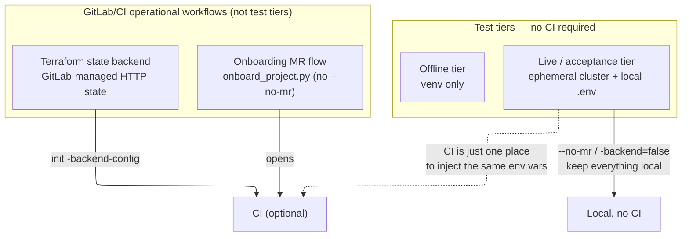

# Testing Guide

The authoritative guide to testing this repository. It covers **what to run**,
**where it runs**, and — most importantly — **the two distinctions people keep
conflating**:

1. **Offline vs. live/acceptance tests.** This axis is about whether a **Proxmox
   SDN test cluster is available**, *not* about whether CI is involved.
2. **Tests vs. GitLab/CI operational workflows.** GitLab/CI shows up in this
   project for the project-onboarding *merge-request* flow and the Terraform
   *state backend* — those are operational workflows, **not test tiers**. Neither
   of them makes the live/acceptance **tests** require CI.

If you take one thing from this document: **you can run every test in this
repository without CI.** The offline tier needs only a Python venv; the
live/acceptance tier needs a throwaway Proxmox SDN cluster and a local `.env`.

> **Offline-by-construction:** the live tests are marked `requires_infra` and are
> **deselected by default** via `addopts = -m "not requires_infra"` in the root
> `pytest.ini`. So the offline command below is safe to run **even with a
> live-test `.env` loaded in your shell** — the live tests are never collected,
> never run, and cannot hang on an unroutable endpoint or hit a real cluster.
> Running the live tier is an explicit opt-in with `-m requires_infra` (below).

---

## The two test tiers at a glance

| Tier | Needs a Proxmox cluster? | Needs CI? | Command entry point |
|---|---|---|---|
| **Offline** (`doctest: offline`) | No | No | `pytest infra/platform-foundation/scripts/tests/ infra/tests/` |
| **Live / acceptance** (`doctest: requires-infra`) | Yes — an **ephemeral** SDN test cluster | **No** — local `.env` is the primary path; CI is *one* option | `set -a && . ./.env && set +a` then scoped `pytest -m requires_infra` |

The live tier reads **plain environment variables** (from a local `.env` or,
equivalently, from CI-injected variables). It has **no GitLab/CI dependency of
its own**.

---

## Offline tests (no cluster, no CI)

### Prerequisites

A Python virtual environment at `~/venv/devinfra/` with `pytest`, `hypothesis`,
and `pyyaml` installed (see the root [`README.md`](./README.md#prerequisites) for
the one-time venv creation). Kiro's convention is to invoke the venv binaries by
absolute path rather than relying on shell activation.

### Run the offline suite

<!-- doctest: offline -->
<!-- cwd: . -->
```bash
PYTHONPATH=infra/platform-foundation/scripts \
  ~/venv/devinfra/bin/pytest \
  infra/platform-foundation/scripts/tests/ infra/tests/ -q
```

**What it covers:**

- the pure-Python VLAN/CIDR/host-IP/hostname **derivation layer**;
- the **Hypothesis property tests** for those formulas;
- the **onboarding-script** tests (`onboard_project.py`);
- the **static IaC-shape** tests over the Terraform sources;
- the **offline `terraform fmt`/`validate`/`plan`** checks — these are gated on a
  `terraform` binary and **skip cleanly** when it is absent, so the suite stays
  green on a machine with no Terraform installed.

**Expected result shape:** the terraform-gated tests skip when no `terraform`
binary is present, so a machine without Terraform sees a mix of passes and skips.
The latest known-good run was **139 passed, 7 skipped**. A run with a `terraform`
binary present will convert some of those skips into passes.

### Offline Terraform format / validate / plan loop

`terraform fmt -recursive` is repo-wide, but `init` and `validate` act on a
**single root module** and are **not recursive** — run them **from inside each
Terraform root**, once per root. The two roots are `infra/platform-foundation/`
and `infra/projects/_TEMPLATE/`. Use `init -backend=false` so `validate` can
install provider schemas without ever touching the GitLab-managed remote state.

Formatting check (repo-wide, from the repo root):

<!-- doctest: offline -->
<!-- cwd: . -->
```bash
terraform fmt -check -recursive
```

Validate the shared foundation root:

<!-- doctest: offline -->
<!-- cwd: infra/platform-foundation -->
```bash
cd infra/platform-foundation
terraform init -backend=false
terraform validate
```

Validate the per-project template root:

<!-- doctest: offline -->
<!-- cwd: infra/projects/_TEMPLATE -->
```bash
cd infra/projects/_TEMPLATE
terraform init -backend=false
terraform validate
```

An offline `terraform plan` (placeholder vars, `-refresh=false`) is documented in
the [platform-foundation README](../infra/platform-foundation/README.md#plan-offline-tier-1).

---

## Live / acceptance tests (requires a Proxmox test cluster)

**CI is NOT required to run these tests.** They read plain environment variables,
so the **primary, fully-supported path is running them locally** against an
ephemeral Proxmox SDN cluster with a local `.env`. CI is simply *one other place*
you can run the same tests, with the same variables injected as CI variables.

These tests run real `terraform apply`/`destroy` against a Proxmox SDN cluster and
prove the foundation + project roots provision, coexist with distinct VLANs,
isolate on `terraform destroy`, and fail correctly when the `SDN.Allocate`
privilege is missing.

## Provision-then-test: the whole path in order

This is the authoritative end-to-end order — from an empty throwaway cluster to a
passing SVC-07 live-test run — and each step links to its exact command block.
Follow it top to bottom; every SVC-07 env-var table and run block below is per-step
detail for one of these six steps.

1. Apply the platform-foundation root first — it creates the shared VLAN-20 VNet
   `p20` that every service attaches to; skip it and the SVC-07 containers fail at
   start with `bridge 'p20' does not exist`. See
   [platform-foundation README → Apply (Tier-2, requires-infra)](../infra/platform-foundation/README.md#apply-tier-2-requires-infra).
2. Apply the SVC-07 Terraform root to create the two OpenBao LXCs (primary +
   Transit unsealer). See
   [INSTALL-RUNBOOK → 1. Provision the two LXCs](../infra/projects/svc-07-secrets-manager/INSTALL-RUNBOOK.md#1-provision-the-two-lxcs).
3. **Satisfy the ADR-0004 reachability prerequisite** — a Proxmox SDN VLAN zone
   is Layer-2 only, so an off-VLAN control host (e.g. a developer workstation) has
   no route to the VLAN-20 guests (`10.0.20.10` / `10.0.20.11`) and every Ansible
   step below would SSH-time-out. This requires the Proxmox host to route +
   firewall VLAN 20 (a host VLAN sub-interface owning `10.0.20.1/24` + `ip_forward`
   + a `pve-firewall` allow rule for the dev host → VLAN 20 on tcp/22 and 80/443)
   plus a static route on the developer machine
   (`sudo ip route add 10.0.20.0/24 via <proxmox-lan-ip>`). The host-gateway half
   is host-level config outside the Terraform-managed SDN and is a separate
   follow-up step — this prerequisite must be satisfied; see
   [`.kiro/decisions/0004-ansible-control-node-placement-and-sdn-reachability.md`](../.kiro/decisions/0004-ansible-control-node-placement-and-sdn-reachability.md)
   and the
   [INSTALL-RUNBOOK reachability note](../infra/projects/svc-07-secrets-manager/INSTALL-RUNBOOK.md#1b-install-docker--compose-on-the-two-lxcs-the-common-role).
4. Generate the Ansible inventory from the SVC-07 Terraform outputs
   (`~/venv/devinfra/bin/python ansible/inventory/generate_inventory.py --root infra/projects/svc-07-secrets-manager`,
   writing the gitignored `ansible/inventory/svc-07-secrets-manager.generated.yml`),
   then install Docker + Compose on both LXCs by running the `common` role from the
   repo root against that generated inventory
   (`~/venv/devinfra/bin/ansible-playbook -i ansible/inventory/svc-07-secrets-manager.generated.yml ansible/playbooks/common.yml`)
   — the stock template ships no Docker. See
   [INSTALL-RUNBOOK → 1b. Install Docker + Compose](../infra/projects/svc-07-secrets-manager/INSTALL-RUNBOOK.md#1b-install-docker--compose-on-the-two-lxcs-the-common-role).
5. Bring up OpenBao by running the `openbao_install` → `openbao_init_unseal` →
   `openbao_project_onboard` roles in order — from the repo root against the same
   generated inventory
   (`~/venv/devinfra/bin/ansible-playbook -i ansible/inventory/svc-07-secrets-manager.generated.yml ansible/playbooks/openbao.yml --tags "install,init"` then `... --tags onboard`).
   See
   [INSTALL-RUNBOOK → 2. Install & bring up OpenBao](../infra/projects/svc-07-secrets-manager/INSTALL-RUNBOOK.md#2-install--bring-up-openbao).
6. Derive the `OPENBAO_TEST_*` variables from the instance you just built and write
   the throwaway `.env`. See
   [INSTALL-RUNBOOK → 3. Derive the test environment](../infra/projects/svc-07-secrets-manager/INSTALL-RUNBOOK.md#3-derive-the-test-environment-from-the-instance-you-just-built).
7. Run the SVC-07 live tests with `-m requires_infra` against what you built. See
   [INSTALL-RUNBOOK → 4. Run the requires_infra tests](../infra/projects/svc-07-secrets-manager/INSTALL-RUNBOOK.md#4-run-the-requires_infra-tests-against-what-you-built).

> **Run these ONLY against an ephemeral / throwaway Proxmox SDN cluster.** They
> create and tear down real SDN zones, VNets, and subnets. Never point them at a
> shared or production cluster; an interrupted `destroy` can orphan SDN objects.

### 1. Provide credentials via a local `.env` (never committed)

Copy the committed, placeholder-only template and fill in your test-cluster
values:

<!-- doctest: offline -->
<!-- cwd: . -->
```bash
cp .env.example .env
```

`.env` is gitignored; `.env.example` is the committed template. The variables:

| Variable | Used by | Notes |
|---|---|---|
| `PROXMOX_SDN_TEST_ENDPOINT` | apply-coexistence, destroy-isolation, applier/degraded tests | Test-cluster API URL. |
| `PROXMOX_SDN_TEST_TOKEN` | same tests | Token **with** `SDN.Allocate` — performs real apply/destroy. |
| `PROXMOX_TEST_ENDPOINT` | missing-`SDN.Allocate` negative test | Test-cluster API URL. |
| `PROXMOX_TEST_TOKEN_NO_SDN_ALLOCATE` | missing-`SDN.Allocate` negative test | Token **without** `SDN.Allocate`. The test asserts the apply fails and provisions nothing, so this token must **genuinely lack** `SDN.Allocate` — a privileged token here makes the test fail. |
| `PROXMOX_TEST_PROJECT_SLUG` | missing-`SDN.Allocate` negative test | A slug registered in `projects.yaml`; defaults to `dronefleet`. |

Never commit `.env` and never paste real tokens into `.env.example`.

#### SVC-07 OpenBao engine/auth/audit contract tests

**These tests need a live throwaway OpenBao to point at.** The tests below are
`requires_infra`, so they assume an OpenBao instance already exists. The full
ordered path from an empty cluster to a passing run is the
[Provision-then-test walkthrough](#provision-then-test-the-whole-path-in-order)
above — follow it as the authoritative sequence; the per-step build detail lives
in the [SVC-07 install runbook](../infra/projects/svc-07-secrets-manager/INSTALL-RUNBOOK.md).
The environment-variable table alone assumes an OpenBao that already exists; the
walkthrough above and the runbook are how you create that OpenBao in the first
place and derive the `OPENBAO_TEST_*` variables (below) from the instance you
just built.

The SVC-07 secrets-manager contract tests
(`infra/tests/test_svc07_openbao_engine_contract.py`, spec task 7.4) assert what a
**live OpenBao mount shape** actually stores and emits for the `jwt` role, the
`database` role, the `aws` role, and the file audit device (Req 2.2, 2.3, 3.2,
3.3, 4.2, 4.3, 7.1). They are `requires_infra` (deselected by default) and skip
cleanly when the OpenBao variables below are absent — the same clean-skip
contract as the Proxmox live tests. They reach a live OpenBao over its HTTP API
(stdlib `urllib`, no `bao` binary needed on the runner).

| Variable | Used by | Notes |
|---|---|---|
| `OPENBAO_TEST_ADDR` | all SVC-07 live tests (contract + auto-unseal) | Live **throwaway** OpenBao **primary** API base URL (e.g. `https://127.0.0.1:8200`). The contract tests WRITE disposable `ctest-*` policies/roles and enable a file audit device, then tear them down; the auto-unseal test STOPS/STARTS its container — point this at an ephemeral instance only, never production. |
| `OPENBAO_TEST_TOKEN` | same tests | A `platform-admin`-scoped (or root) token on the throwaway instance, able to write+read `sys/policies/acl/*`, `auth/jwt/role/*`, `database/roles/*`, `aws/roles/*`, and enable+read a `file` audit device; the auto-unseal test uses it to read `sys/health`. Threaded only into request headers, never logged. |
| `OPENBAO_TEST_SKIP_TLS_VERIFY` | same tests | Optional. `1`/`true` (default) skips TLS verification for the ephemeral instance's self-signed cert; set `0` to enforce. |
| `OPENBAO_TEST_AUDIT_HOST_DIR` | audit-line contract test only | Optional. A directory the live OpenBao writes `/openbao/audit` into **and** the test runner can read back, needed for the Req 7.1 one-JSON-object-per-line assertion. When unset, only that one assertion skips (the role-shape tests still run). |
| `OPENBAO_TEST_UNSEALER_ADDR` | auto-unseal test only (`test_svc07_openbao_autounseal.py`) | The Transit **unsealer's** API base URL (e.g. `https://127.0.0.1:8201`). Used to confirm the unsealer is healthy before the round-trip (Req 5.3) and to seal it for the Req 5.7 present-but-sealed swap-gate arm. |
| `OPENBAO_TEST_PRIMARY_CONTAINER` | auto-unseal test only | The docker container **name/id** of the primary OpenBao container, cycled with `docker stop`/`start`/`restart` to trigger auto-unseal and read its logs (Req 5.3, 5.6, 5.7). Requires a `docker` CLI on the runner. |
| `OPENBAO_TEST_UNSEALER_CONTAINER` | auto-unseal test only | The docker container **name/id** of the Transit unsealer container, stopped for the Req 5.6 "unsealer unreachable" swap-gate arm and restarted afterwards. Requires a `docker` CLI on the runner. |

Run the SVC-07 contract tier against a live throwaway OpenBao:

<!-- doctest: requires-infra -->
<!-- cwd: . -->
```bash
set -a && . ./.env && set +a
~/venv/devinfra/bin/pytest -m requires_infra \
  infra/tests/test_svc07_openbao_engine_contract.py -v
```

Run the SVC-07 auto-unseal round-trip + swap-gate seal tier (needs the primary +
unsealer APIs, a `docker` CLI, and both container names — it stops/starts
containers, so use a throwaway stack only):

<!-- doctest: requires-infra -->
<!-- cwd: . -->
```bash
set -a && . ./.env && set +a
~/venv/devinfra/bin/pytest -m requires_infra \
  infra/tests/test_svc07_openbao_autounseal.py -v
```

### 2. Run the live tests locally (primary path)

Load `.env` into the **same shell** that runs `pytest` — the variables must be
present in the process environment, not merely exported in a different terminal:

<!-- doctest: requires-infra -->
<!-- cwd: . -->
```bash
set -a && . ./.env && set +a
PYTHONPATH=infra/platform-foundation/scripts \
  ~/venv/devinfra/bin/pytest -m requires_infra \
  infra/tests/test_degraded_sdn_use.py \
  infra/tests/test_integration_apply.py \
  infra/tests/test_destroy_isolation.py \
  infra/tests/test_degraded_modes.py -v
```

The `-m requires_infra` flag is required: it opts into the live tier, overriding
the default `-m "not requires_infra"` deselection in the root `pytest.ini`.
Without it, the live tests would be deselected and nothing live would run.

**Run the safest test first.** The negative-auth test *expects* the apply to fail,
so it provisions nothing — start there before running any test that creates real
SDN objects:

<!-- doctest: requires-infra -->
<!-- cwd: . -->
```bash
set -a && . ./.env && set +a
PYTHONPATH=infra/platform-foundation/scripts \
  ~/venv/devinfra/bin/pytest -m requires_infra \
  infra/tests/test_degraded_sdn_use.py::TestMissingSdnUseAuthorizationFailure -v
```

If a live apply appears to hang or error partway through, stop and inspect the
cluster's SDN state before re-running — do not blindly re-run a `destroy`, which
could orphan objects.

### 3. Running the same tests in CI (an alternative, not a requirement)

The same tests run unchanged in CI when the five variables above are supplied as
CI variables instead of a local `.env` (and the run opts into the live tier with
`-m requires_infra`). CI is just another environment that happens to have the
variables present; it is **not** a precondition for the live/acceptance tier.
When the variables are absent (no cluster, no CI creds), the live tests **skip**
— they never fail for lack of infrastructure. And because the live tests are
deselected by default (`-m "not requires_infra"`), a run that forgets to opt in
simply never touches them rather than accidentally running them.

---

## What actually needs GitLab/CI (and what doesn't)

Neither test tier requires CI. Two *operational workflows* involve GitLab, and
they are frequently confused with the test tiers — they are separate concerns:

| Concern | Involves GitLab/CI? | Offline / no-CI alternative |
|---|---|---|
| **Offline tests** | No | — (already offline) |
| **Live / acceptance tests** | No | Local `.env` + ephemeral cluster |
| **Project-onboarding MR flow** (`onboard_project.py` *without* `--no-mr`) | Yes — opens a real GitLab merge request | Use `--no-mr` to allocate + append locally and open **no** MR |
| **Terraform state backend** | Yes — GitLab-managed HTTP state (`terraform init` with `-backend-config`) | Use `terraform init -backend=false` for offline fmt/validate/plan |

So: you can use the platform and run **all** tests without CI — pass `--no-mr` to
the onboarding script and use `-backend=false` (or local state) for Terraform work
that does not need the shared remote state.



---

## SDN VLAN reachability (before any live Ansible/test step against a served VLAN)

A Proxmox SDN **VLAN zone is Layer-2 only** — it tags traffic onto the bridge and
isolates segments, but **nothing on the host answers at the subnet's advertised
gateway** (`10.0.<vlan_id>.1`). The `gateway = "10.0.20.1"` set on the SDN subnet
is inert metadata handed to guests. So an **off-VLAN control host** (a developer
workstation, *not* the Proxmox node itself) has **no route** to a served VLAN's
guests, and any `ansible ... -m ping` / `ssh` against them **times out** — a
missing network *path*, not a credential or provisioning defect. This is exactly
the connect-timeout that motivated
[ADR-0004](../.kiro/decisions/0004-ansible-control-node-placement-and-sdn-reachability.md).

Reaching a served VLAN off-host is a two-part prerequisite. **Both** parts must be
satisfied before the live SVC-07 steps
([Provision-then-test walkthrough](#provision-then-test-the-whole-path-in-order),
steps 3–7) will connect instead of timing out:

### (a) The Proxmox host must route + firewall the VLAN — the host-gateway half

A served VLAN needs its **host gateway configured before it is reachable
off-host.** The Proxmox host must hold the gateway address `10.0.<vlan_id>.1/24`
on the SDN VNet bridge `p<vlan_id>` (the interface the guests attach to — not a
`vmbr0.<vlan>` sub-interface; see the ADR-0004 addendum), with
`net.ipv4.ip_forward=1`, a scoped `pve-firewall` ALLOW rule (dev/admin source →
the VLAN on tcp/22, and 80/443 for services), and a scoped egress masquerade (so
guests reach the internet for `apt`/Docker pulls) — while the isolation DENY rules
(→ management VLAN 10; cross-project VLAN→VLAN) stay in force. This is **host-level config OUTSIDE the
Terraform-managed SDN** — the deliberate L2 (SDN) / L3 (host) seam — converged by
the `sdn_gateway` Ansible role from the `status: active` desired-state view of
`projects.yaml`.

> **If you run Ansible directly on the Proxmox node**, it reaches `10.0.<vlan_id>.x`
> natively over the bridge and **neither the host gateway nor the developer static
> route below is needed** (ADR-0004 Option A). The two parts here apply only to an
> **off-VLAN** control host.

Offline preflight — confirm the gateway playbook and static host inventory are sane
without touching any cluster (structural syntax check + host-group resolution):

<!-- doctest: offline -->
<!-- cwd: . -->
```bash
~/venv/devinfra/bin/ansible-playbook --syntax-check \
  -i ansible/inventory/proxmox-hosts.yml \
  ansible/playbooks/sdn-gateway.yml
~/venv/devinfra/bin/ansible-playbook --list-hosts \
  -i ansible/inventory/proxmox-hosts.yml \
  ansible/playbooks/sdn-gateway.yml
```

Converge the host gateway + firewall for the served VLANs (`requires-infra` — it
mutates real host networking and `pve-firewall` on the live Proxmox node). The
active/decommissioned VLAN sets come from the desired-state JSON emitter (one
reader of truth over `projects.yaml`).

**Before you run this, replace the two example values in the command below with
your own — the command as written will not work as-is:**

- **`sdn_gateway_admin_source_cidr=192.0.2.0/24`** — set this to **the network your
  own computer is on**, written in CIDR form. This is the network that will be
  allowed to reach the served VLAN. For example, if your workstation's IP is
  `192.168.1.42`, your network is almost certainly `192.168.1.0/24`, so you would
  pass `sdn_gateway_admin_source_cidr=192.168.1.0/24`. (`192.0.2.0/24` is only a
  documentation example and reaches nothing.)
- **`ansible_host=198.51.100.10`** — set this to **the real LAN IP address of the
  Proxmox host** (`shrimp`) that Ansible should SSH into. The committed inventory
  (`ansible/inventory/proxmox-hosts.yml`) ships with the placeholder `<proxmox-lan-ip>`
  on purpose (no real IPs are committed to the repo), and Ansible cannot connect to
  a literal `<proxmox-lan-ip>` — it fails immediately with `hostname contains invalid
  characters`. Overriding `ansible_host` here supplies the real IP without editing
  (or committing) the inventory file. For example, if the node is at `10.1.1.5`, pass
  `ansible_host=10.1.1.5`.

**SSH key first (one time).** Ansible logs into the Proxmox host as `root` over SSH
using **key-based** auth, not a password. If your public key is not yet on the host,
this run fails with `Permission denied (publickey,password)`. Install it once with
`ssh-copy-id root@<real-proxmox-lan-ip>` (you will be asked for the host's `root`
password this one time). The ordered walkthrough's
[Step 1](#step-1--configure-the-host-gateway--firewall-for-vlan-20) has the full
copy-and-verify commands.

<!-- doctest: requires-infra -->
<!-- cwd: . -->
```bash
PYTHONPATH=infra/platform-foundation/scripts \
  ~/venv/devinfra/bin/python \
  infra/platform-foundation/scripts/registry_status.py \
  --json --out /tmp/vlan-status.json
~/venv/devinfra/bin/ansible-playbook \
  -i ansible/inventory/proxmox-hosts.yml \
  ansible/playbooks/sdn-gateway.yml \
  --extra-vars "@/tmp/vlan-status.json" \
  --extra-vars "sdn_gateway_admin_source_cidr=192.0.2.0/24" \
  --extra-vars "ansible_host=198.51.100.10"
```

### (b) The developer adds one static route — the client-side half

This is the **single client-side step**, and it lives **entirely on the
developer's own machine**: it requires **no** change to any shared router, switch,
or firewall appliance, and **no** VLAN-capable LAN gear. Add a static route so the
workstation's traffic to the VLAN subnet is sent via the Proxmox host's LAN IP
(`requires-infra` — it changes real routing and needs the host gateway from part
(a) to already exist). Substitute the placeholders — never a real host IP:

<!-- doctest: requires-infra -->
<!-- cwd: . -->
```bash
sudo ip route add 10.0.<vlan_id>.0/24 via <proxmox-lan-ip>
```

Then confirm the control host can now reach a served-VLAN guest over SSH before
running any playbook (`requires-infra` — needs the live guest, the host gateway,
and the route above). A clean exit means the path is up; a timeout means part (a)
or the route is still missing:

<!-- doctest: requires-infra -->
<!-- cwd: . -->
```bash
ssh -o ConnectTimeout=5 root@10.0.<vlan_id>.10 true
```

**Make the route persistent (Debian/Ubuntu workstation).** The `ip route add`
above is lost on reboot. Which mechanism to use depends on what manages your LAN
interface — check once:

<!-- doctest: requires-infra -->
<!-- cwd: . -->
```bash
systemctl is-active NetworkManager
```

**If that prints `active` (the usual case on a Debian/Ubuntu desktop or laptop),
use NetworkManager.** Add the route to the active connection — one command, no
files. Find the connection name with `nmcli connection show` (e.g. the default
wired connection is often `"Wired connection 1"`):

<!-- doctest: requires-infra -->
<!-- cwd: . -->
```bash
nmcli connection modify "Wired connection 1" \
  +ipv4.routes "10.0.<vlan_id>.0/24 <proxmox-lan-ip>"
nmcli connection up "Wired connection 1"
```

That persists across reboots and re-applies whenever the connection comes up. To
remove it later, use `-ipv4.routes "10.0.<vlan_id>.0/24 <proxmox-lan-ip>"` (note
the leading `-`).

**Only if NetworkManager is NOT active (an `ifupdown`-managed host)** — persist it
with an `up`/`down` hook under that interface's `iface` stanza. Find the interface
(the device after `dev` in `ip route show default`), then create the drop-in
(making the directory first, since a minimal host may not have it). Replace
`<iface>` and `<proxmox-lan-ip>`:

<!-- doctest: requires-infra -->
<!-- cwd: . -->
```bash
sudo mkdir -p /etc/network/interfaces.d
sudo tee /etc/network/interfaces.d/sdn-route-<vlan_id>.cfg >/dev/null <<'EOF'
iface <iface> inet manual
    up   ip route add 10.0.<vlan_id>.0/24 via <proxmox-lan-ip>
    down ip route del 10.0.<vlan_id>.0/24 via <proxmox-lan-ip>
EOF
```

(The `up`/`down` lines must sit under an `iface <iface>` stanza — a file with bare
`up ...` lines and no `iface` stanza never fires. And `/etc/network/interfaces.d/`
only takes effect if `ifupdown` manages the interface, which is why the
NetworkManager path above is preferred on a workstation.)

Either way, without persistence the route is lost on reboot and part (b) must be
re-run.

> **Degraded-mode symptoms.** If the **host gateway** (part a) is not configured,
> an off-VLAN host cannot reach the VLAN and the failure is a **connect timeout**
> (no path). If the **static route** (part b) is missing, the control host cannot
> reach the VLAN **even after** the host gateway exists — the cause is the missing
> client-side route, not a host-side failure. If a project's row was flipped to
> `decommissioned` but the `sdn_gateway` role has **not yet been re-run**, that
> VLAN's gateway + firewall opening **persist until the next converge** — the
> decommission is only fully effected once the role runs.

### (c) One-time SSH client config — pin the right key for the platform hosts

Both you (interactive `ssh`) and Ansible connect to the Proxmox host and to the
VMs/LXCs over SSH. If your SSH agent holds several keys, SSH offers them one at a
time and a guest's `sshd` (default `MaxAuthTries 6`) **disconnects before it
reaches the authorized key** — the symptom is
`Received disconnect ... Too many authentication failures`, even though the
correct key is loaded. The fix is `IdentitiesOnly yes` plus the one identity that
is actually authorized on the platform hosts, set once in `~/.ssh/config`.

Because the platform's addressing is known upfront — every VLAN's guests live in
`10.0.<vlan_id>.0/24` (NET-00), so the whole guest space is `10.0.0.0/16` — a
**single wildcard block** covers VLAN 20 shared services *and* every future
project VLAN (100+); no per-IP or per-VLAN entries are ever needed. Add one block
for the guests and one for the Proxmox host (over the LAN). Replace the
placeholders with your own identity file and the real Proxmox LAN IP:

<!-- doctest: display-only -->
```
# ~/.ssh/config — platform SSH access (developer workstation)

# All SDN guests (VLAN 20 shared services + every project VLAN 100+):
# 10.0.<vlan>.0/24 per NET-00, so 10.0.0.0/16 covers them all in one block.
Host 10.0.*
    User root
    IdentitiesOnly yes
    IdentityFile ~/.ssh/git.xenopz.com_id_ed25519

# The Proxmox host itself (reached over the LAN, not via 10.0.*):
Host <proxmox-lan-ip> shrimp
    User root
    IdentitiesOnly yes
    IdentityFile ~/.ssh/git.xenopz.com_id_ed25519
```

Notes:

- **`IdentitiesOnly yes` is the actual fix** — it stops SSH from cycling every
  agent key and on-disk default identity (which is what trips `MaxAuthTries`). The
  `IdentityFile` selects the authorized key; the agent still supplies the private
  half, so only the **public** key file needs to exist at that path. Use whichever
  identity is injected into the guests' `root` account (the same key the Proxmox
  `user_account.keys` / cloud-init mechanism installed).
- **Scope caveat.** `Host 10.0.*` is deliberately broad. If this workstation also
  SSHes to unrelated `10.0.x.x` hosts, that block would force this identity for
  them too. At homelab/office scale that is usually fine; if not, narrow the
  pattern (e.g. `Host 10.0.20.* 10.0.10?.*`) to just the platform's VLANs.
- This block also makes the plain `ssh root@10.0.<vlan>.10` reachability check in
  part (b) — and every `ansible-playbook` run against the generated inventory —
  use the right key automatically, with no `-o IdentitiesOnly=...` on the command
  line and no per-host `ansible_ssh_*` overrides.

**Onward:** for the full SVC-07 provision-then-test path that consumes this
reachability (provisioning the LXCs, installing Docker, bringing up OpenBao, and
running the live tests), follow the
[SVC-07 install runbook](../infra/projects/svc-07-secrets-manager/INSTALL-RUNBOOK.md).

### Gateway operator walkthrough — configure → reach → decommission-teardown → reboot-persistence

Parts (a) and (b) above give the *individual* commands; this is the **ordered,
end-to-end operator walkthrough** that ties them into one provision-then-test flow
and proves the two behaviours the design's
[Testing Strategy §5](../.kiro/specs/sdn-vlan-gateway-reachability/design.md)
calls for on a live `shrimp` node: (1) the connect-timeout that motivated
[ADR-0004](../.kiro/decisions/0004-ansible-control-node-placement-and-sdn-reachability.md)
is closed — both OpenBao LXCs (`10.0.20.10` / `10.0.20.11`) answer `-m ping` — and
(2) a `status: active → decommissioned` flip, on the next converge, *removes* that
VLAN's gateway + firewall opening (Req 6.3, FD.4), with the gateway address on the
SDN VNet bridge `p<vlan>` surviving a networking reload (Req 1.1 persistence).

Every mutating command here is **`requires-infra`**: it runs against the live
Proxmox node and the live VLAN-20 guests, and is **operator-run only** — do not run
it in an environment without the `shrimp` node and its credentials. The
`requires-infra` doctest tier is deselected by default and **skips cleanly when the
infra/creds are absent** (the same clean-skip contract as the rest of this file's
live tier); the offline preflight below is the only part that runs everywhere.

> **Off-VLAN control host assumed.** This whole walkthrough is for the case ADR-0004
> calls Option B — an off-VLAN control host (a developer workstation). If you run
> Ansible **directly on the Proxmox node** (Option A), it reaches `10.0.20.x`
> natively; the CONFIGURE step still applies (the host must still own the gateway
> for *other* off-VLAN hosts and for the firewall isolation floor), but the
> developer static route and the off-host reachability re-check are unnecessary.

> **Throwaway / non-shared cluster only for the decommission step.** The
> decommission-teardown check (step 3) flips a **scratch** project row and mutates
> real host networking + `pve-firewall`; run it only against an ephemeral or
> non-shared `shrimp`, never a cluster whose VLANs other people depend on.

#### Step 0 — offline preflight (runs everywhere)

Confirm the gateway playbook and static host inventory are structurally sane and
the `proxmox` host group resolves, without touching any cluster. This is the same
offline preflight from part (a) above — run it first so a typo fails fast before
any live step:

<!-- doctest: offline -->
<!-- cwd: . -->
```bash
~/venv/devinfra/bin/ansible-playbook --syntax-check \
  -i ansible/inventory/proxmox-hosts.yml \
  ansible/playbooks/sdn-gateway.yml
~/venv/devinfra/bin/ansible-playbook --list-hosts \
  -i ansible/inventory/proxmox-hosts.yml \
  ansible/playbooks/sdn-gateway.yml
```

#### Step 1 — CONFIGURE the host gateway + firewall for VLAN 20

Converge the Proxmox host to own the VLAN-20 gateway — the address `10.0.20.1/24`
on the **SDN VNet bridge `p20`** (the interface the guests attach to; a `vmbr0.20`
sub-interface would be the wrong L2 segment — see the ADR-0004 addendum) — plus
`net.ipv4.ip_forward=1` and the scoped `pve-firewall` ALLOW rule, driven by the
desired-state JSON emitter (the one reader of truth over `projects.yaml`). This is
the same converge command as part (a) above.

The converge **also enables scoped guest egress**: a masquerade (SNAT) rule so the
VLAN's guests can reach the internet (needed for `apt` / Docker image pulls). It is
deliberately scoped to internet-bound traffic only (`! -d 10.0.0.0/16`), so
inter-VLAN and guest→LAN-internal flows are **not** NAT'd and the isolation model is
preserved (toggle: `sdn_gateway_enable_egress_nat`, default on — see the ADR-0004
egress addendum). Without it, guests reach the host gateway but have no route back
from the internet and `apt` fails.

**Replace the two example values before running** (see the fuller explanation in
part (a)): set **`sdn_gateway_admin_source_cidr`** to the CIDR of **your own
computer's network** (e.g. `192.168.1.0/24`) so that network is allowed to reach the
VLAN, and set **`ansible_host`** to the **real LAN IP of the Proxmox host** so Ansible
can SSH in. Leaving `ansible_host` as the inventory's `<proxmox-lan-ip>` placeholder
makes the run fail immediately with `hostname contains invalid characters`; the
`192.0.2.0/24` / `198.51.100.10` values shown are documentation examples only.

**One-time SSH-key setup (do this first, before the very first converge).** Ansible
logs into the Proxmox host over SSH as `root` (the `ansible_user` in the inventory)
using **key-based** auth — it does not prompt for a password. If your public key is
not yet installed in the host's `root` authorized-keys, the run fails with a
`Permission denied (publickey,password)` / authentication error. Copy your key to the
host once (you will be prompted for the host's `root` password this one time), using
the **same real Proxmox LAN IP** you pass as `ansible_host`:

<!-- doctest: requires-infra -->
<!-- cwd: . -->
```bash
ssh-copy-id root@198.51.100.10
```

Then confirm key-based login works without a password prompt before running Ansible:

<!-- doctest: requires-infra -->
<!-- cwd: . -->
```bash
ssh -o BatchMode=yes root@198.51.100.10 true && echo "key auth OK"
```

`ssh-copy-id` is idempotent — re-running it will not add a duplicate key — so it is
safe to run again if you are unsure. If your workstation has no SSH key yet, create
one first with `ssh-keygen -t ed25519`. (Replace `198.51.100.10` with your node's
real LAN IP — it is a documentation example.)

Now converge:

<!-- doctest: requires-infra -->
<!-- cwd: . -->
```bash
PYTHONPATH=infra/platform-foundation/scripts \
  ~/venv/devinfra/bin/python \
  infra/platform-foundation/scripts/registry_status.py \
  --json --out /tmp/vlan-status.json
~/venv/devinfra/bin/ansible-playbook \
  -i ansible/inventory/proxmox-hosts.yml \
  ansible/playbooks/sdn-gateway.yml \
  --extra-vars "@/tmp/vlan-status.json" \
  --extra-vars "sdn_gateway_admin_source_cidr=192.0.2.0/24" \
  --extra-vars "ansible_host=198.51.100.10"
```

Confirm the host now owns the gateway address on the SDN VNet bridge, its persistent
stanza, and the egress masquerade (a converged first run adds `10.0.20.1/24` to `p20`
and writes the `/etc/network/interfaces.d/` file the role manages). On the Proxmox
node:

<!-- doctest: requires-infra -->
```bash
ip -brief addr show p20
ls -l /etc/network/interfaces.d/sdn-gw-20.cfg
sudo iptables -t nat -S POSTROUTING | grep '10.0.20.0/24'
```

`p20` should show `10.0.20.1/24`; the `sdn-gw-20.cfg` stanza should exist (its
`post-up` hook is what makes the address **survive a reboot** — a bare `ip addr add`
would not, and the same hook re-adds the masquerade); and the `iptables` line should
show `-s 10.0.20.0/24 ! -d 10.0.0.0/16 -o vmbr0 -j MASQUERADE`. The reboot-persistence
spot check in step 4 re-verifies the address.

**Idempotency:** re-run the same `ansible-playbook … sdn-gateway.yml` command once
more and confirm the play reports **`changed=0`** in the recap — a converged host
must not churn the gateway address, the firewall rule, or the masquerade
(Req 1.5, 6.5).

#### Step 2 — REACH: add the developer static route, then ping both LXCs

Add the client-side static route (part (b) above) so the workstation's VLAN-20
traffic is sent via the Proxmox host's LAN IP — placeholders only, never a real host
IP:

<!-- doctest: requires-infra -->
<!-- cwd: . -->
```bash
sudo ip route add 10.0.20.0/24 via <proxmox-lan-ip>
```

Now re-run the SVC-07 generated-inventory ping and assert **both** OpenBao LXCs
answer — this is the exact `-m ping` that returned an SSH **connect timeout** before
the gateway existed, and a clean `SUCCESS`/`pong` from both `10.0.20.10` and
`10.0.20.11` is the closure of the ADR-0004 timeout (and unblocks
`terraform-ansible-handoff` Task 13). The generated inventory is produced by the
SVC-07 provisioning steps (see the
[SVC-07 install runbook](../infra/projects/svc-07-secrets-manager/INSTALL-RUNBOOK.md#1b-install-docker--compose-on-the-two-lxcs-the-common-role)):

<!-- doctest: requires-infra -->
<!-- cwd: . -->
```bash
~/venv/devinfra/bin/ansible -i ansible/inventory/svc-07-secrets-manager.generated.yml \
  all -m ping
```

Expect a `SUCCESS => { ... "ping": "pong" }` line for **both** hosts. A `UNREACHABLE`
/ connect-timeout for either host means the host gateway (step 1) or the static route
above is still missing — see the degraded-mode symptoms note in part (b).

#### Step 3 — DECOMMISSION-TEARDOWN: flip a scratch row, re-converge, assert removal

Prove the teardown direction. Onboard a **scratch** project so it gets a real project
VLAN, then flip its row to `status: decommissioned` and re-converge — the role must
*remove* that VLAN's gateway address, ALLOW rule, and egress masquerade (Req 6.3, 6.4, FD.4). Use a scratch
registry copy so the committed `projects.yaml` is never mutated (mirrors the dry-run
convention in [Project onboarding](#project-onboarding-dry-run-vs-real) below):

<!-- doctest: requires-infra -->
<!-- cwd: . -->
```bash
cp infra/platform-foundation/projects.yaml /tmp/projects.scratch.yaml
PYTHONPATH=infra/platform-foundation/scripts \
  ~/venv/devinfra/bin/python \
  infra/platform-foundation/scripts/onboard_project.py \
  --slug scratch-teardown --registry /tmp/projects.scratch.yaml --no-mr
```

Note the VLAN it allocated (call it `<scratch-vlan>`). Serve it as an opted-in active
project VLAN and converge once so the gateway + ALLOW rule for `<scratch-vlan>` exist:

<!-- doctest: requires-infra -->
<!-- cwd: . -->
```bash
PYTHONPATH=infra/platform-foundation/scripts \
  ~/venv/devinfra/bin/python \
  infra/platform-foundation/scripts/registry_status.py \
  --registry /tmp/projects.scratch.yaml --json --out /tmp/vlan-status.json
~/venv/devinfra/bin/ansible-playbook \
  -i ansible/inventory/proxmox-hosts.yml \
  ansible/playbooks/sdn-gateway.yml \
  --extra-vars "@/tmp/vlan-status.json" \
  --extra-vars "sdn_gateway_admin_source_cidr=192.0.2.0/24" \
  --extra-vars "ansible_host=198.51.100.10" \
  --extra-vars "sdn_gateway_served_project_vlan_ids=[<scratch-vlan>]"
```

Now flip that scratch row to `status: decommissioned` (a `status`-field edit on the
scratch registry — the row is retained, never removed, so the VLAN ID stays retired
per the append-only rule), re-emit the status, and re-converge. Because the row is no
longer `active`, the emitter puts `<scratch-vlan>` in `decommissioned_vlan_ids`, and
`tasks/teardown.yml` runs `state: absent` for that VLAN:

<!-- doctest: requires-infra -->
<!-- cwd: . -->
```bash
# Edit /tmp/projects.scratch.yaml: set the scratch-teardown row's
#   status: active  ->  status: decommissioned
# (retain the row; do not delete it — the ID stays retired).
PYTHONPATH=infra/platform-foundation/scripts \
  ~/venv/devinfra/bin/python \
  infra/platform-foundation/scripts/registry_status.py \
  --registry /tmp/projects.scratch.yaml --json --out /tmp/vlan-status.json
~/venv/devinfra/bin/ansible-playbook \
  -i ansible/inventory/proxmox-hosts.yml \
  ansible/playbooks/sdn-gateway.yml \
  --extra-vars "@/tmp/vlan-status.json" \
  --extra-vars "sdn_gateway_admin_source_cidr=192.0.2.0/24" \
  --extra-vars "ansible_host=198.51.100.10" \
  --extra-vars "sdn_gateway_served_project_vlan_ids=[<scratch-vlan>]"
```

Assert the gateway address, its stanza, the ALLOW rule, and the egress masquerade for
`<scratch-vlan>` are **gone**, so the retired project retains no live routed gateway,
firewall opening, or egress (Req 6.3, SEC.3). Note the SDN VNet bridge
`p<scratch-vlan>` itself is **not** removed (the SDN owns it, and the guests use it) —
teardown removes only *our* gateway address from it. Run **on the Proxmox node as
root** (prefix `sudo` if not root):

<!-- doctest: requires-infra -->
```bash
ip -o -4 addr show dev p<scratch-vlan> | grep -c '10.0.<scratch-vlan>.1/24'   # want 0
test ! -e /etc/network/interfaces.d/sdn-gw-<scratch-vlan>.cfg && echo "stanza gone (expected)"
iptables -t nat -S POSTROUTING | grep -c '10.0.<scratch-vlan>.0/24'           # want 0
pvesh get /cluster/firewall/rules --output-format json \
  | grep -c "sdn_gateway: ALLOW admin -> VLAN <scratch-vlan> (managed)"       # want 0
```

The gateway-address `grep -c` should print `0` (the `.1` is no longer on
`p<scratch-vlan>`), the stanza file should be absent, and both the masquerade and the
ALLOW-rule `grep -c` should print `0`. Confirm the VLAN is now **unreachable**
off-host (a connect timeout, not a refused connection — the path itself is gone),
then re-run the teardown converge once more and confirm the recap is **`changed=0`**
(idempotent teardown, Req 6.5). Discard the scratch registry when done; the committed
`projects.yaml` was never touched.

> **Decommission lag (FD.4):** flipping the row to `decommissioned` does **not**
> tear anything down until the role is re-run — the gateway + opening persist until
> the next converge. That is the expected, documented lag; the re-converge above is
> what actually effects the teardown.

#### Step 4 — REBOOT-PERSISTENCE spot check

Confirm the VLAN-20 gateway configured in step 1 survives a networking reload — the
design requires a *persistent* mechanism (the `/etc/network/interfaces.d/` stanza's
`post-up` hook) precisely so reachability survives a node reboot; a bare
`ip addr add` would not. Run these **on the Proxmox node as root** (prefix with
`sudo` if you are not root).

To make this a *real* persistence test, first **remove** the live gateway address,
then reload — otherwise `ifreload` just reconciles an address that never left and
proves nothing. The `post-up` hook in the stanza must re-add it:

<!-- doctest: requires-infra -->
```bash
ip addr del 10.0.20.1/24 dev p20        # drop it so the reload has to re-add it
ip -brief addr show p20                 # confirm .1 is now GONE
ifreload -a                             # applies the persistent stanza's post-up hook
ip -brief addr show p20                 # .1 must be BACK
iptables -t nat -S POSTROUTING | grep '10.0.20.0/24'   # masquerade re-added too
```

After `ifreload -a`, `p20` must show `10.0.20.1/24` again and the masquerade line
must reappear — both re-materialised from the persistent stanza's `post-up` hook,
not from any transient in-memory state. (If `p20` already showed `10.0.20.1/24`
*before* the `ip addr del`, that is just the still-live address from step 1 — the
`del` + `ifreload` cycle above is what actually exercises persistence.)

If you can afford a full node reboot on the throwaway cluster, reboot and re-run
`ip -brief addr show p20` and the step-2 `-m ping` to confirm end-to-end
reachability comes back with no manual re-configuration.

---

## Project onboarding (dry-run vs real)

### Dry run — see the VLAN a slug *would* get, change nothing real

This copies the registry to a scratch file and runs the onboarding script against
the copy with `--no-mr`, so the committed `projects.yaml` is untouched and no
merge request is opened:

<!-- doctest: offline -->
<!-- cwd: . -->
```bash
cp infra/platform-foundation/projects.yaml /tmp/projects.scratch.yaml
PYTHONPATH=infra/platform-foundation/scripts \
  ~/venv/devinfra/bin/python \
  infra/platform-foundation/scripts/onboard_project.py \
  --slug my-project \
  --registry /tmp/projects.scratch.yaml \
  --no-mr
```

Exact output (VLAN `<N>` and date depend on the current registry — see below):

<!-- doctest: display-only -->
```text
  (--no-mr) skipped opening a merge request for 'my-project'.
INFO: ALLOCATION: slug 'my-project' -> VLAN <N> (onboarding_date <YYYY-MM-DD>); registry updated; no merge request was opened.
Onboarded 'my-project': VLAN <N>, onboarding_date <YYYY-MM-DD>. Registry updated; no merge request was opened.
```

(The first and third lines are on **stdout**; the `INFO: ALLOCATION:` line is the
decision-trail entry on **stderr**.)

### Why `<N>` is 103 today, not 100

The allocated VLAN is **`max(existing vlan_ids, default 99) + 1`** — it is **not
always 100**. The committed `infra/platform-foundation/projects.yaml` currently
registers:

| slug | vlan_id |
|---|---|
| `dronefleet` | 100 |
| `mlvideo` | 101 |
| `edge-sensors` | 102 |

so a dry-run **today** allocates **VLAN 103** (`max(100, 101, 102) + 1`). The
"first project gets VLAN 100" worked examples elsewhere describe an **empty**
registry (`max(default 99) + 1 = 100`), not the current one. **The number you see
depends on the current registry contents.**

### `--no-mr` vs a real onboarding, and scratch vs real registry

- **`--no-mr`** allocates + appends locally and opens **no** merge request. A real
  onboarding drops `--no-mr` so the script opens the reviewable GitLab MR.
- **`--registry /tmp/projects.scratch.yaml`** points the script at a throwaway
  copy, so the committed registry is untouched. Note: `--no-mr` used **without**
  `--registry` pointed at a scratch copy would append to the **real**
  `projects.yaml` — the dry run above uses the scratch copy precisely to avoid
  that.

---

## Where to go deeper

| Document | What it covers |
|---|---|
| [root `README.md`](./README.md) | Quick start, prerequisites, the network topology, and the onboarding flow. |
| [`infra/platform-foundation/README.md`](../infra/platform-foundation/README.md) | The shared foundation root: Terraform workflow, offline vs. requires-infra tiers, and the full onboarding sequence. |
| [`infra/projects/_TEMPLATE/README.md`](../infra/projects/_TEMPLATE/README.md) | The per-project Terraform root template. |
| `.kiro/specs/<feature>/validation.md` | Per-feature requirement→evidence maps and test-execution results. |
| [`.kiro/steering/testing-strategy.md`](../.kiro/steering/testing-strategy.md) | The authoritative testing-requirements policy (categories, coverage, determinism). |
| [`.kiro/steering/documentation-testing.md`](../.kiro/steering/documentation-testing.md) | The doctest tier annotations (`offline` / `requires-infra` / `display-only`) used throughout these docs. |
