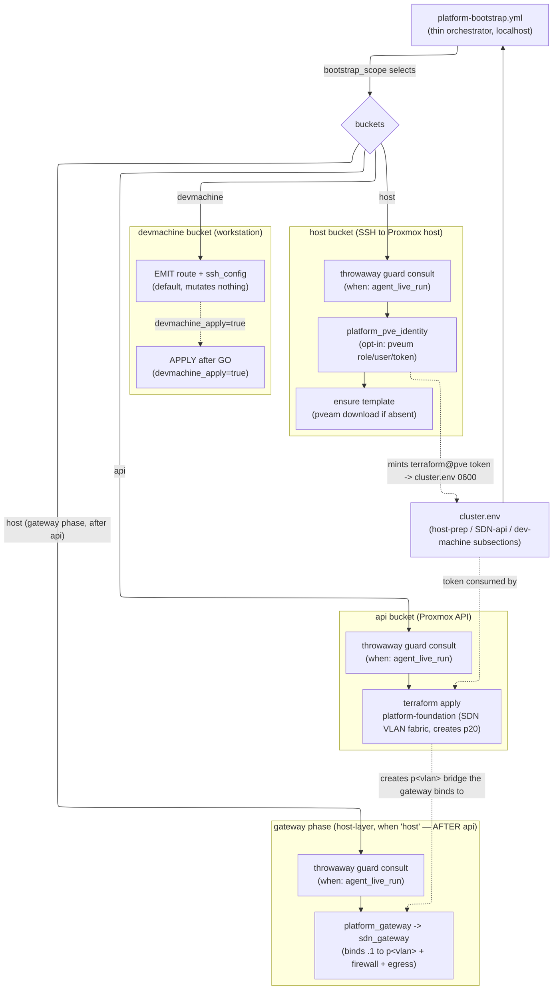

# Platform Prerequisites Bootstrap — Install Runbook

This is the **provision-then-test spine** for the platform prerequisites: it takes
a fresh Proxmox cluster from nothing to a state where any catalog service can be
provisioned — the `terraform@pve` identity + token, the base LXC/VM template, the
Proxmox host L3 gateway/firewall, the shared SDN VLAN-20 fabric — and then proves
the prerequisites are complete by standing a real service (SVC-07) up against them.

It is the operator-facing companion to the orchestrator play
[`ansible/playbooks/platform-bootstrap.yml`](../../ansible/playbooks/platform-bootstrap.yml).
Spec: [`.kiro/specs/platform-prerequisites-bootstrap/`](../../.kiro/specs/platform-prerequisites-bootstrap/)
(requirements.md, design.md, tasks.md, validation.md).

> **Why this runbook lives here.** This is a **platform-level** prerequisite
> feature, not a catalog `SVC-NN` service, so it has no `infra/projects/<slug>/`
> Terraform root. Its `api` bucket applies **this** directory's
> `platform-foundation` Terraform root, and the sibling [`README.md`](./README.md)
> is already the platform prerequisites' documentation entry point — so the
> runbook that stitches the host / api / devmachine layers into one
> provision-then-test flow belongs beside that root, mirroring the
> [SVC-07 runbook](../projects/svc-07-secrets-manager/INSTALL-RUNBOOK.md)'s
> `infra/projects/<slug>/INSTALL-RUNBOOK.md` placement (see
> [`structure.md`](../../.kiro/steering/structure.md) for the location
> convention).

> **Placeholders only.** Every token, credential, IP, and hostname below is an
> obviously-fake placeholder. Secrets are referenced by environment-variable
> **name** only (e.g. `PROXMOX_ADMIN_TOKEN`), never by value — nothing here is ever
> committed or echoed (`documentation-testing.md`, `security-standards.md`;
> Req 2.3, 2.4, 6.4).

> **Doctest tiers.** Offline preflight / validate / emit-mode / `--syntax-check`
> commands carry `<!-- doctest: offline -->`; the actual host/api live bootstrap
> runs (`pveum`/`pveam`/`terraform` against a live Proxmox) and the live service
> apply carry `<!-- doctest: requires-infra -->`. Tier rules are owned by
> [`documentation-testing.md`](../../.kiro/steering/documentation-testing.md); the
> install-runbook location convention is owned by
> [`structure.md`](../../.kiro/steering/structure.md).

---

## ⚠ Throwaway cluster only for the live steps

The live steps in sections 2–4 **provision and mutate real infrastructure** on the
Proxmox host and API — creating a PVE role/user/token, downloading a template,
converging the host gateway/firewall, and applying the SDN fabric. Run them **only
against a throwaway / ephemeral Proxmox cluster**, never a shared or production
cluster. When the **Kiro agent** itself drives these live steps, they are further
gated by the `AGENT_LIVE_AUTHORIZED` interlock + the fail-closed throwaway guard
(see [section 1b](#1b--agent-driven-live-runs-throwaway-guard)); the interlock is
off by default and set per run — the governing rule is the **"Agent Live-Test
Authorization"** section of
[`testing-strategy.md`](../../.kiro/steering/testing-strategy.md).

The **devmachine** bucket is the exception: it only ever touches the developer's
own workstation, defaults to **emit** (prints commands, mutates nothing), and
carries no throwaway guard (Req 7.4).

---

## The three buckets, at a glance

The orchestrator selects **buckets** with `-e bootstrap_scope=` — `all` (default),
a single bucket, or a comma-list (`host,api`). `platform_preflight` runs first for
every invocation and fails closed on any missing mandatory-per-bucket parameter
before any mutation.



| Phase | Runs against | Does | Guard |
|---|---|---|---|
| `host` bucket | Proxmox host (SSH) | opt-in PVE identity (`pveum`), ensure base template (`pveam`) | yes (when armed) |
| `api` bucket | Proxmox API | `terraform apply` of the `platform-foundation` root (SDN VLAN-20 fabric, creates `p20`) | yes (when armed) |
| gateway phase | Proxmox host (SSH) | the `sdn_gateway` role (host L3 gateway + firewall + egress) — runs when `host` is selected, but sequenced **after** the api bucket | yes (when armed) |
| `devmachine` bucket | developer workstation | emit (default) / apply the static route + `~/.ssh/config` identity pin | no (Req 7.4) |

Dependency/phase order when `bootstrap_scope=all` (ADR-0010):
**PVE-identity** (mints the token) → **ensure-template** → **api** (creates the
SDN fabric `p20`) → **gateway** (binds `.1` to `p<vlan>`) → **devmachine**. The
gateway is host-layer config (it runs whenever `host` is selected) but is
sequenced after the api bucket, because it binds the host gateway address to the
SDN VNet bridge `p<vlan>` the api bucket's `terraform apply` creates — on a clean
slate it cannot run before the fabric exists. Two cross-bucket preconditions,
opposite directions, both fail closed at preflight before any mutation:

- running `api` alone without a resolvable `terraform@pve` token names the host
  bucket;
- running `host` alone (its gateway phase would run) without the api bucket AND
  without a pre-existing `p20` names the api bucket / that `terraform apply` must
  run first.

---

## Selection & opt-in flags

| Flag | Default | Effect |
|---|---|---|
| `-e bootstrap_scope=all\|host\|api\|devmachine` | `all` | which buckets run; accepts a comma-list (`host,api`) |
| `-e bootstrap_pve_identity=true` | `false` | opt in to minting the `terraform@pve` role + token (needs an Admin_Bootstrap_Credential) |
| `-e bootstrap_pve_token_force=true` | `false` | rotate the token: re-mint under a fresh secret (PVE never re-emits an existing token's secret) |
| `-e devmachine_apply=true` | `false` | apply the devmachine route + ssh_config instead of only emitting them |
| `-e cluster_env_file=cluster.dev.env` | `cluster.env` | the gitignored env file the orchestrator reads |

`AGENT_LIVE_AUTHORIZED` is an **environment variable**, never a `-e` play var and
never a committed default — see [section 1b](#1b--agent-driven-live-runs-throwaway-guard).

---

## The whole path, in order

1. **[A.0 / section 0]** Offline preflight — validate the code paths (no cluster).
2. **[section 1]** Fill in a gitignored `cluster.env`.
3. **[section 2]** Provision the prerequisites from nothing: `host` + `api`
   buckets, in the order identity → template → api → gateway (opt-in PVE identity
   mints the token; template ensured; SDN fabric applied — creating `p20`; then
   the gateway converged against the freshly-created bridge).
4. **[section 3]** Prove it: a real service (SVC-07) applies successfully against
   the freshly-built prerequisites.
5. **[section 4]** (optional) devmachine — emit (offline) or apply (throwaway
   workstation) the static route + ssh_config pin.

---

## 0. Offline preflight (no cluster needed)

Sanity-check the code paths the orchestrator drives before you touch any
infrastructure. These contact nothing — no Proxmox, no state backend — so they are
`offline`.

Parse-check the orchestrator play (compiles the play without connecting to
`localhost` or any guest):

<!-- doctest: offline -->
<!-- cwd: . -->
```bash
~/venv/devinfra/bin/ansible-playbook --syntax-check \
  -i ansible/inventory/localhost.yml \
  ansible/playbooks/platform-bootstrap.yml
```

Confirm the pure-logic cluster-env helper the Preflight phase calls self-documents
its usage (prints help, exits 0, contacts nothing):

<!-- doctest: offline -->
<!-- cwd: . -->
```bash
~/venv/devinfra/bin/python scripts/installer/cluster_env.py --help
```

Validation-only parse of the committed example env file (resolves the aliases and
checks completeness against the schema, exits 0, contacts nothing):

<!-- doctest: offline -->
<!-- cwd: . -->
```bash
~/venv/devinfra/bin/python scripts/installer/cluster_env.py \
  --env-file cluster.env.example --check
```

Confirm the throwaway guard the destructive buckets consult is runnable and
self-documents (contacts nothing, exits 0):

<!-- doctest: offline -->
<!-- cwd: . -->
```bash
~/venv/devinfra/bin/python scripts/installer/throwaway_guard.py --help
```

Validate the `platform-foundation` Terraform root the `api` bucket applies (the
`-backend=false` init avoids contacting the state backend):

<!-- doctest: offline -->
<!-- cwd: infra/platform-foundation -->
```bash
cd infra/platform-foundation
terraform fmt -check -recursive
terraform init -backend=false
terraform validate
```

Run the offline installer suite (the extended `cluster_env.py` example/Hypothesis
tests + the orchestrator wiring drift-guards — all deselect `requires_infra` by
default via the root `pytest.ini`):

<!-- doctest: offline -->
<!-- cwd: . -->
```bash
~/venv/devinfra/bin/pytest tests/installer/
```

---

## 1. Prepare the cluster env file

Copy the committed template to a **gitignored** per-environment file and fill in
your throwaway cluster's values. Editing a local file contacts nothing, so this is
`offline`:

<!-- doctest: offline -->
<!-- cwd: . -->
```bash
cp cluster.env.example cluster.dev.env
# Then edit cluster.dev.env. For a from-nothing host+api bootstrap set, at minimum:
#   # SDN / API section:
#     PROXMOX_ENDPOINT / PROXMOX_NODE_NAME / PROXMOX_LXC_TEMPLATE
#     (leave PROXMOX_API_TOKEN unset — the opt-in PVE-identity step MINTS it and
#      writes it back here at 0600, section 2)
#   # Host prep (bootstrap) section:
#     PROXMOX_HOST_LAN_IP  (the ansible_host + devmachine via-gateway)
#     PROXMOX_ADMIN_PASSWORD *or* PROXMOX_ADMIN_TOKEN  (bootstrap-only admin cred,
#      needed ONLY for -e bootstrap_pve_identity=true; no_log, never persisted,
#      remove it from the file after a successful mint)
#     ADMIN_SOURCE_CIDR  (your workstation/LAN CIDR the gateway permits)
#   # Dev machine section:
#     PLATFORM_SERVED_VLAN_IDS  (defaults to 20 when unset)
# Placeholders only in the committed example; real throwaway-cluster values go in
# cluster.dev.env, which is gitignored and never echoed.
```

> **Credential handling (Req 2.4, 6.4; security-standards).** The
> Admin_Bootstrap_Credential (`PROXMOX_ADMIN_PASSWORD` / `PROXMOX_ADMIN_TOKEN`) is
> **bootstrap-only**: it is read `no_log`, used only by the opt-in PVE-identity
> step, and **never persisted or echoed**. Remove it from `cluster.dev.env` after a
> successful mint. The **minted** `terraform@pve` token is written back to
> `PROXMOX_API_TOKEN` at mode `0600` and is referenced by name only, never shown.

### 1b. Agent-driven live runs (throwaway guard)

Everything in sections 2–4 can be run by a **human operator** exactly as written —
in that case the interlock below is unset and this subsection does not apply. This
subsection is only for letting the **Kiro agent** drive the destructive `host` /
`api` buckets on a throwaway cluster. Doing so is a governed, off-by-default
control; the governing rule is the **"Agent Live-Test Authorization"** section of
[`testing-strategy.md`](../../.kiro/steering/testing-strategy.md). This runbook
does not restate those rules — it shows the precondition and the exact invocation.

To arm an agent-driven run, **two** things must both hold, or the run is refused
before any `pveum`/`pveam`/`terraform` mutation (Req 7.1):

1. The run is **armed** with the `AGENT_LIVE_AUTHORIZED` environment variable
   (referenced by name only; export it per invocation — never a committed default,
   never a key in an env file). An optional `AGENT_LIVE_AUTHORIZED_SERVICES=platform`
   narrows the arm to this feature's `--service platform` scope; it only narrows,
   never broadens.
2. The target is a **throwaway cluster listed** in
   [`../../scripts/installer/throwaway-clusters.yml`](../../scripts/installer/throwaway-clusters.yml),
   and the run reads its cluster parameters from the isolated
   [`.env.throwaway`](../../.env.throwaway.example) source — not a developer's
   manual `cluster.*.env`.

Copy the isolated agent env source and fill in your throwaway cluster's values
(gitignored; editing a local file contacts nothing, so this is `offline`):

<!-- doctest: offline -->
<!-- cwd: . -->
```bash
cp .env.throwaway.example .env.throwaway
# Then edit .env.throwaway: set the THROWAWAY cluster's PROXMOX_ENDPOINT /
# PROXMOX_NODE_NAME / LXC template. The resolved identity (normalized endpoint
# host + exact node name) MUST match an entry in
# scripts/installer/throwaway-clusters.yml, or the guard fails CLOSED.
# Do NOT put AGENT_LIVE_AUTHORIZED in this file — it is an env var, set per run.
```

**Guard-refusal behavior (fail closed).** If `AGENT_LIVE_AUTHORIZED` is unset, or
the resolved cluster identity is not on the allowlist (or the allowlist is
missing/empty/unparseable), the guard returns REFUSED and the orchestrator halts
**before** any host or API mutation, printing the INFO decision reason and the
resolved (non-secret) identity. Consulting the guard against the committed
placeholder example **without** arming the interlock resolves the identity and
checks the allowlist — it contacts nothing — and exits non-zero (REFUSED). It is
shown **display-only** because a REFUSED exit is a non-zero code an `offline`
runner would treat as failure:

<!-- doctest: display-only -->
```bash
# NOT armed (AGENT_LIVE_AUTHORIZED unset) → REFUSED, non-zero exit, mutates nothing.
~/venv/devinfra/bin/python scripts/installer/throwaway_guard.py \
  --service platform \
  --env-file .env.throwaway.example \
  --allowlist scripts/installer/throwaway-clusters.yml
# → {"authorized": false, "reason": "interlock unset", ...}
```

The armed host+api invocation is shown in [section 2](#2-provision-the-prerequisites-from-nothing-host--api).

---

## 2. Provision the prerequisites from nothing (host + api)

This is the from-nothing bring-up, in the order identity → template → api →
gateway (ADR-0010): the `host` bucket mints the `terraform@pve` identity/token
(opt-in) and ensures the base template; the `api` bucket then applies the SDN
VLAN-20 fabric using the minted token, **creating the VNet bridge `p20`**; and
finally the **gateway phase** converges the host L3 gateway by binding `.1` to
that freshly-created `p20`. The gateway is sequenced after the api bucket
precisely because it depends on the bridge the api bucket creates — on a true
clean slate it cannot run before the fabric exists. It **provisions and mutates
real infrastructure**, so it is `requires-infra` and runs **only against a
throwaway cluster**.

> **Idempotence & fail-closed (Req 1.6, 2.6, 3.1).** Every "ensure X" step
> detect-then-acts: an existing role/token with the right privileges is a no-op, a
> present template is not re-downloaded, a converged gateway reports `changed=0`. A
> re-run against an already-converged cluster changes only what drifted. A missing
> mandatory param, a missing admin cred when `bootstrap_pve_identity=true`, a
> missing token for `api`, or a `pveam` download failure each halts at preflight/
> before-mutation naming the exact remedy.

**Operator run (interlock unset).** Run the host + api buckets with the opt-in PVE
identity so the token is minted for you. Point `-e cluster_env_file=` at your
gitignored `cluster.dev.env` from section 1:

<!-- doctest: requires-infra -->
<!-- cwd: . -->
```bash
~/venv/devinfra/bin/ansible-playbook \
  -i ansible/inventory/localhost.yml \
  ansible/playbooks/platform-bootstrap.yml \
  -e cluster_env_file=cluster.dev.env \
  -e bootstrap_scope=host,api \
  -e bootstrap_pve_identity=true
```

On success, in the identity → template → api → gateway order: the `host` bucket
has created the least-privilege `terraform@pve` role (with `SDN.Allocate` +
`SDN.Audit` + `SDN.Use`, never Administrator — `SDN.Use` is the guest-NIC attach
privilege the minted token needs to place service guests onto the shared VNet
`p20`, per NET-00 §6 and ADR-0009), the user + ACL, and minted its API token —
persisting it to `cluster.dev.env` `PROXMOX_API_TOKEN` at mode `0600` (value never
echoed); the base template is present (downloaded if it was absent); the `api`
bucket has applied the `platform-foundation` SDN fabric (the VLAN-20 VNet `p20` +
subnet `10.0.20.0/24`); and finally the gateway phase has converged the host
gateway/firewall/egress for the served VLAN set by binding `.1` to the
freshly-created `p20`. Expect `failed=0`, exit 0.

> **Token rotation.** To deliberately rotate the `terraform@pve` token — PVE never
> re-emits an existing token's secret — add `-e bootstrap_pve_token_force=true`,
> which re-mints under a fresh secret and rewrites `PROXMOX_API_TOKEN` at `0600`.
> Without it, an existing token id is a reported no-op.

**Agent-driven run (armed, allowlisted).** Identical, but pointed at the isolated
`.env.throwaway` source with the interlock exported for the invocation. The guard
is consulted at the head of each destructive bucket (gated on the armed interlock)
and refuses before any mutation if the identity is not allowlisted. It mutates real
infrastructure, so it is `requires-infra`:

<!-- doctest: requires-infra -->
<!-- cwd: . -->
```bash
AGENT_LIVE_AUTHORIZED=1 ~/venv/devinfra/bin/ansible-playbook \
  -i ansible/inventory/localhost.yml \
  ansible/playbooks/platform-bootstrap.yml \
  -e cluster_env_file=.env.throwaway \
  -e bootstrap_scope=host,api \
  -e bootstrap_pve_identity=true
```

To re-run this from a genuine clean slate, first reset the prerequisites — see
[section 5](#5-clean-slate-reset) (Clean-slate reset). The
[automated path (5a)](#5a-automated-clean-slate-recommended) is recommended; note
the stale-Terraform-state trap documented under the
[manual fallback (5b)](#5b-manual-fallback-hand-run-teardown--host-reboot).

---

## 3. Prove it — a service applies against the fresh prerequisites

The prerequisites are complete only when a real service can be provisioned on top
of them. Run the **SVC-07 from-scratch bring-up** against the freshly-bootstrapped
prerequisites — it consumes exactly what section 2 built: the minted
`terraform@pve` token (now in the env file / `PROXMOX_API_TOKEN`), the base
template ensured on the host, the host gateway, and the SDN VLAN-20 fabric `p20`
its LXCs attach to.

Follow the SVC-07 install runbook's Developer-B one-command path, which provisions
and then runs its own `requires-infra` acceptance against what it built:
[`../projects/svc-07-secrets-manager/INSTALL-RUNBOOK.md`](../projects/svc-07-secrets-manager/INSTALL-RUNBOOK.md)
(section A). In short, the single-command install run — `requires-infra`, throwaway
cluster only:

<!-- doctest: requires-infra -->
<!-- cwd: . -->
```bash
~/venv/devinfra/bin/ansible-playbook \
  -i ansible/inventory/localhost.yml \
  ansible/playbooks/svc-07-bootstrap.yml \
  -e cluster_env_file=cluster.dev.env
```

When that reaches its green Phase-4 handoff (a healthy OpenBao primary + unsealer),
the prerequisites this runbook stood up are proven end-to-end — the SVC-07 apply
found the `p20` fabric, authenticated with the minted token, and reached its guests
through the host gateway. That is the acceptance signal for the whole
platform-prerequisites feature (Req 8.3).

> **Reachability note (ADR-0004).** If you drive the SVC-07 Ansible steps from an
> **off-VLAN** workstation, the host gateway from section 2 plus a static route on
> your machine are what make the VLAN-20 guests reachable — that route is exactly
> what the [devmachine bucket](#4-devmachine--reach-the-vlan-from-your-workstation)
> emits for you. Running Ansible **on the Proxmox node** reaches `10.0.20.x`
> natively and needs neither.

---

## 4. devmachine — reach the VLAN from your workstation

The `devmachine` bucket composes, from your resolved `cluster.env`, the exact
static-route command(s) for the served VLAN subnet(s)
(`ip route add 10.0.<vlan>.0/24 via <proxmox-lan-ip>`), an ifupdown persistence
stanza, and the `~/.ssh/config` identity-pin block. It **defaults to emit** (prints
them for review/sharing, mutates nothing) and carries no throwaway guard (Req 7.4).

**Emit mode (default, offline).** This contacts no cluster — it only renders the
commands from `cluster.env` and prints them, mutating nothing (all APPLY tasks are
skipped because `devmachine_apply` defaults false). It needs `PROXMOX_HOST_LAN_IP`
set in the env file (the via-gateway); `PLATFORM_SERVED_VLAN_IDS` defaults to `20`:

<!-- doctest: offline -->
<!-- cwd: . -->
```bash
~/venv/devinfra/bin/ansible-playbook \
  -i ansible/inventory/localhost.yml \
  ansible/playbooks/platform-bootstrap.yml \
  -e cluster_env_file=cluster.dev.env \
  -e bootstrap_scope=devmachine
```

Review the printed commands (or hand them to a colleague on the same Proxmox host).
Nothing on your workstation changed.

**Apply mode (opt-in, throwaway workstation).** After you review the emitted
commands, apply them on your own workstation with an explicit GO. This adds the
route (tolerating "File exists"), writes the persistence stanza, and ensures the
`~/.ssh/config` block idempotently; it needs local `sudo` for the route. It mutates
the developer's own machine, so it is `requires-infra` (it needs the real
workstation networking to act on):

<!-- doctest: requires-infra -->
<!-- cwd: . -->
```bash
~/venv/devinfra/bin/ansible-playbook \
  -i ansible/inventory/localhost.yml \
  ansible/playbooks/platform-bootstrap.yml \
  -e cluster_env_file=cluster.dev.env \
  -e bootstrap_scope=devmachine \
  -e devmachine_apply=true
```

A second apply run is idempotent (`changed=0`): an already-present route / ssh
block is not duplicated (Req 5.3). If a step fails (e.g. `ip route` without sudo),
the OS error is surfaced and the remaining setup is left documented for manual
completion (Req 5.5).

---

## 5. Clean-slate reset

Re-testing the from-nothing provision path of
[section 2](#2-provision-the-prerequisites-from-nothing-host--api) means resetting
the prerequisites layer back to a true from-nothing state. There are now **two
paths**:

- **[5a] Automated (recommended)** — the orchestrator's `-e clean_slate=true`
  branch (the `platform_clean_slate` role) tears the whole prerequisites layer
  down in a destroy-safe order, verifies an empty baseline, and — opt-in — handles
  the stuck-SDN-zone reboot for you. This is the primary path.
- **[5b] Manual fallback** — the hand-run `terraform destroy` + `ip link delete` +
  host-reboot procedure below. Use it only when the automated path itself fails,
  or when you need the underlying host-reboot knowledge (it is the mechanism the
  automated reboot step performs for you). This is also the exact procedure used
  to reproduce and validate the ADR-0010 phase-reorder fix (gateway sequenced
  after the api bucket), which is observable only on a genuine clean slate.

> **⚠ Throwaway cluster only — destructive.** Every live command in this section
> **destroys real infrastructure** (the SDN fabric and, potentially, the live host
> bridge, plus a host reboot). Run them **only against a throwaway / ephemeral
> Proxmox cluster**, never a shared or production cluster — the same restriction as
> the live steps in sections 2–4. Only ever tear down the **platform SDN fabric**
> (and throwaway service guests, via their own clean-slate); **never** touch
> unrelated containers on the host.

---

### 5a. Automated clean-slate (recommended)

The orchestrator carries a `-e clean_slate=true` branch that delegates to the
`platform_clean_slate` role — the tear-DOWN counterpart to the section-2 bring-up.
Spec: [`.kiro/specs/platform-clean-slate/`](../../.kiro/specs/platform-clean-slate/).
It executes a **destroy-safe REVERSE order** (the reverse of the bring-up order),
scoped strictly to what the platform layer owns:

1. **Service clean-slates first.** It discovers which services have a guest on the
   shared fabric (file-mediated — it `stat`s each catalog service's generated
   inventory, per `integration-boundaries.md` §4; it never parses `.tfstate` and
   never `pct list`s to enumerate services), then invokes **each service's OWN
   clean-slate** as a child run (e.g. `svc-07-bootstrap.yml -e clean_slate=true`).
   The platform role NEVER `pct destroy`s a service guest and NEVER
   `terraform destroy`s a service's per-service state — that stays authoritative
   and isolated inside the service's own clean-slate.
2. **Fabric teardown.** Only once the fabric is free of service guests: a scoped
   `terraform destroy` of the `platform-foundation` SDN objects (zone, VNet `p20`,
   subnet, applier), then the host L3 gateway teardown (the `sdn_gateway`
   decommission branch removes the `.1`-on-`p20` stanza, its firewall/egress
   rules, and the VLAN-20 SNAT).
3. **Reboot / SDN-absence step.** `terraform destroy` alone does not reliably
   clear the stuck SDN zone/bridge (it can linger in an ERROR state until the host
   re-reads `interfaces.d`). The role verifies the `p20` bridge is actually gone;
   if it survives it either performs the host reboot for you (opt-in
   `-e platform_clean_slate_reboot=true`, with the same shared-host WARNING) or
   **fails closed** naming the survivor and directing a reboot — never a
   false-clean. Because the survive-then-halt case is the common one, **pass
   `-e platform_clean_slate_reboot=true` on the first run** (recommended on a
   throwaway cluster) so the clean-slate reaches an empty baseline in one pass
   instead of halting for a second run.
4. **Three-way verification gate.** It proves an empty baseline before reporting
   success: `pct list` (no discovered-service VMIDs survive) **and**
   `terraform state list` (empty for each service TF root AND `platform-foundation`)
   **and** SDN absence (`p20` gone from `ip link` AND `pvesh get /cluster/sdn/vnets`).
   Any survivor exits non-zero naming every survivor.

**Controls (all default to the safe/off position):**

| Flag / env | Default | Effect |
|---|---|---|
| `-e clean_slate=true` | `false` | route to the tear-down branch instead of the bring-up |
| `-e clean_slate_confirm=force` | `""` (prompt) | skip the interactive typed-`yes` confirmation prompt (which names that this tears the WHOLE prerequisites layer down); **required for non-interactive / CI / agent runs** |
| `-e platform_clean_slate_reboot=true` | `false` | opt in to the host reboot when the SDN zone/bridge survives the destroy; **reboots a shared host — throwaway only** |
| `-e clean_slate_scope=all\|fabric-only` | `all` | `all` orchestrates service clean-slates then the fabric; `fabric-only` still fails closed if a service guest is attached (never orphan-destroys) |
| `-e platform_clean_slate_proxmox_host=<proxmox-lan-ip>` | `""` (fail closed) | the real Proxmox LAN IP for the host-scoped `pct`/`ip link`/reboot child runs — **required**; a host-scoped step fails closed naming this var if unset |
| `AGENT_LIVE_AUTHORIZED=1` (env) | unset | arms an **agent-driven** run; consulted by the throwaway guard at the HEAD of the role before ANY destruction (see [section 1b](#1b--agent-driven-live-runs-throwaway-guard)) |

**Offline preflight (no cluster needed).** Compile-check the play carrying the
branch, and confirm the guard the role consults self-documents — these contact
nothing, so they are `offline`:

<!-- doctest: offline -->
<!-- cwd: . -->
```bash
~/venv/devinfra/bin/ansible-playbook --syntax-check \
  -i ansible/inventory/localhost.yml \
  ansible/playbooks/platform-bootstrap.yml
~/venv/devinfra/bin/python scripts/installer/throwaway_guard.py --help
```

**Operator run (interlock unset).** Tear the prerequisites layer down. Point
`-e cluster_env_file=` at your gitignored `cluster.dev.env`, and supply the real
throwaway host LAN IP. It destroys real infrastructure, so it is `requires-infra`:

<!-- doctest: requires-infra -->
<!-- cwd: . -->
```bash
~/venv/devinfra/bin/ansible-playbook \
  -i ansible/inventory/localhost.yml \
  ansible/playbooks/platform-bootstrap.yml \
  -e cluster_env_file=cluster.dev.env \
  -e clean_slate=true \
  -e platform_clean_slate_proxmox_host=<proxmox-lan-ip> \
  -e platform_clean_slate_reboot=true
```

**Include `-e platform_clean_slate_reboot=true` on the first run.** On a throwaway
cluster it is the recommended default, and here is why you want it *upfront* rather
than discovering it after a failed run: `terraform destroy` alone does **not**
reliably clear the SDN zone/bridge `p20` — it routinely lingers in an ERROR state
until the host re-reads `interfaces.d` on reboot. Without the reboot opt-in the
run does exactly what it is designed to do — it **fails closed** at the
"surviving SDN zone" gate rather than report a false-clean, and tells you to
re-run *with* `-e platform_clean_slate_reboot=true`. That halt is correct
behavior, not an error, but it means an extra round-trip. Passing the reboot
opt-in on the first run lets the clean-slate reboot the throwaway host for you
(the same reboot the [manual fallback](#5b-manual-fallback-hand-run-teardown--host-reboot)
Step 3 performs) and reach a verified-empty baseline in one pass.

You will be prompted to type `yes` to confirm before anything is destroyed. Add
`-e clean_slate_confirm=force` to skip the prompt (required for a non-interactive /
CI / agent run). For example, the forced + reboot-opt-in one-pass form:

<!-- doctest: requires-infra -->
<!-- cwd: . -->
```bash
~/venv/devinfra/bin/ansible-playbook \
  -i ansible/inventory/localhost.yml \
  ansible/playbooks/platform-bootstrap.yml \
  -e cluster_env_file=cluster.dev.env \
  -e clean_slate=true \
  -e clean_slate_confirm=force \
  -e platform_clean_slate_proxmox_host=<proxmox-lan-ip> \
  -e platform_clean_slate_reboot=true
```

> **If you omit `-e platform_clean_slate_reboot=true` and the SDN zone survives**
> (the common case), you will see the fail-closed halt
> `The SDN zone/bridge p20 SURVIVED terraform destroy and the reboot opt-in was
> NOT supplied …`. Nothing is wrongly destroyed and no false-clean is reported —
> simply re-run the command adding `-e platform_clean_slate_reboot=true`.

**Agent-driven run (armed, allowlisted).** Identical, but pointed at the isolated
`.env.throwaway` source with the interlock exported for the invocation. The guard
is consulted at the HEAD of the role (gated on the armed interlock) and refuses
before any destruction if the identity is not allowlisted (see
[section 1b](#1b--agent-driven-live-runs-throwaway-guard)). It destroys real
infrastructure, so it is `requires-infra`:

<!-- doctest: requires-infra -->
<!-- cwd: . -->
```bash
AGENT_LIVE_AUTHORIZED=1 ~/venv/devinfra/bin/ansible-playbook \
  -i ansible/inventory/localhost.yml \
  ansible/playbooks/platform-bootstrap.yml \
  -e cluster_env_file=.env.throwaway \
  -e clean_slate=true \
  -e clean_slate_confirm=force \
  -e platform_clean_slate_proxmox_host=<proxmox-lan-ip> \
  -e platform_clean_slate_reboot=true
```

On success the three-way gate reports the prerequisites baseline is empty and a
fresh from-scratch bring-up (section 2) may run — `failed=0`, exit 0. A
clean-slate against an already-empty baseline is a `changed=0` no-op that still
reports the baseline empty.

> **The automated path handles the stale-SDN-zone reboot for you (opt-in) and
> fails closed if the zone survives without the reboot opt-in** — so it never
> reports a false-clean. The manual Step 3 reboot below is documented as the
> fallback and as the knowledge behind that automated behavior.

---

### 5b. Manual fallback (hand-run teardown + host reboot)

Use this only when the [automated path (5a)](#5a-automated-clean-slate-recommended)
itself fails, or when you need the underlying host-reboot knowledge. It resets the
prerequisites layer back to a from-nothing state by hand. This is the exact
procedure used to reproduce and validate the ADR-0010 phase-reorder fix, and the
mechanism the automated reboot step performs for you.

#### Where `p20` comes from (create ↔ delete)

Before tearing `p20` down by hand, know how it is created — because there are
**two** independent creation paths, and a manual teardown that misses the second
one silently returns the bridge on the next boot.

- **Create path 1 — the `api` bucket `terraform apply`.** The SDN VLAN-20 fabric
  (the zone, the VNet bridge `p20`, its subnet, and the `proxmox_sdn_applier`) is
  created by [section 2](#2-provision-the-prerequisites-from-nothing-host--api)'s
  `api` bucket `terraform apply` of the `platform-foundation` root. This is the
  Terraform-owned side of `p20` — and the object the Step 1 `terraform destroy`
  below removes.
- **Create path 2 — the `sdn_gateway` role's persistent host stanza (the subtle
  one).** The gateway phase (`platform_gateway`, via the `sdn_gateway` role) writes
  a **persistent** host network stanza at
  `/etc/network/interfaces.d/sdn-gw-<vlan>.cfg` whose `auto p<vlan>` line tells
  ifupdown to bring `p<vlan>` up on every boot. Because that file survives a
  Terraform destroy, ifupdown **re-creates `p<vlan>` on the next boot** from the
  leftover stanza — so a reboot **alone** does not clear the bridge, it can
  re-materialize it. A complete manual teardown must therefore remove **both** the
  Terraform SDN objects (Step 1) **and** that gateway stanza file (Step 2), and
  only then reboot and verify (Steps 3–4). See the ADR-0010 addendum
  ([`../../.kiro/decisions/0010-platform-bootstrap-phase-order-identity-api-gateway.md`](../../.kiro/decisions/0010-platform-bootstrap-phase-order-identity-api-gateway.md)).
  The [automated path (5a)](#5a-automated-clean-slate-recommended) handles all of
  this for you — its gateway teardown removes the `sdn-gw-<vlan>.cfg` stanza via the
  `sdn_gateway` decommission branch, then the opt-in reboot clears the bridge.

#### The stale-Terraform-state trap (read this first)

A true clean slate needs **two** independent conditions to hold, and getting only
one of them is the classic operator trap:

1. the **live** SDN VNet bridge `p20` is gone from the host, **and**
2. the platform-foundation Terraform **state** no longer records the SDN objects
   (or is at least reconciled so the next `apply` is a genuine *create*, not a
   no-op).

Here is why both matter. If you delete the live `p20` bridge but leave the
platform-foundation Terraform state still recording the SDN objects, the next api
bucket `terraform apply` sees its desired state already satisfied and does
**nothing** — a no-op. Because nothing changes, the `proxmox_sdn_applier` does not
re-commit the pending SDN configuration, so the live `p20` bridge is **never
re-materialized**. The gateway phase then runs against a host where `p20` is still
absent and fails with `Device p20 does not exist`. So resetting the live bridge
without also reconciling the state produces a cluster that looks reset but can
never re-provision. Reset **both**.

#### Reset commands

**Step 1 — reconcile the Terraform state to empty (destroy the SDN objects).** From
the platform-foundation root, destroy the SDN zone / vnet / subnet / applier this
root manages. This both removes the live objects Terraform still owns and empties
the state so the next `apply` is a genuine create. You may need the `terraform@pve`
token exported / the backend initialized first, as documented in the
platform-foundation [`README.md`](./README.md). It mutates live infrastructure, so
it is `requires-infra`:

<!-- doctest: requires-infra -->
<!-- cwd: infra/platform-foundation -->
```bash
cd infra/platform-foundation
# Full destroy of everything this root manages (the SDN VLAN-20 fabric):
terraform destroy
# — or a targeted destroy of just the SDN objects, if you prefer to scope it:
#   terraform destroy \
#     -target=proxmox_virtual_environment_sdn_applier.this \
#     -target=proxmox_virtual_environment_sdn_subnet.p20 \
#     -target=proxmox_virtual_environment_sdn_vnet.p20 \
#     -target=proxmox_virtual_environment_sdn_zone_vlan.this
```

> **Guests on `p20` block the SDN destroy.** If prior SVC guests still sit on the
> `p20` bridge, the SDN destroy will refuse (the bridge is in use). Remove those
> guests **first** via the **service's own clean-slate contract** — e.g. the SVC-07
> clean-slate in
> [`../projects/svc-07-secrets-manager/INSTALL-RUNBOOK.md`](../projects/svc-07-secrets-manager/INSTALL-RUNBOOK.md).
> Do **not** ad-hoc `pct destroy` service guests from here — drive each service's
> own clean-slate so its Terraform state is reconciled too. Only the platform SDN
> fabric and throwaway service guests are in scope; never touch unrelated
> containers.

**Step 2 — delete the live bridge and remove the persistent gateway stanza.** If
`p20` survives on the host after the destroy (e.g. a partial prior run left it
behind), delete the live bridge directly on the Proxmox host. Then **remove the
`sdn_gateway` role's persistent stanza** `/etc/network/interfaces.d/sdn-gw-20.cfg`
— per the [create ↔ delete](#where-p20-comes-from-create--delete) note above, its
`auto p20` line makes ifupdown re-create `p20` on the next boot, so deleting the
live bridge and reconciling Terraform state is **not** enough on its own: leave the
stanza in place and Step 3's reboot brings the bridge straight back. Use your
throwaway host's `PROXMOX_HOST_LAN_IP` for `<proxmox-host>`. It mutates the live
host, so it is `requires-infra`:

<!-- doctest: requires-infra -->
<!-- cwd: . -->
```bash
# <proxmox-host> is the throwaway host's PROXMOX_HOST_LAN_IP.
ssh root@<proxmox-host> ip link delete p20 type bridge
# Remove the persistent gateway stanza so ifupdown does not re-create p20 on boot:
ssh root@<proxmox-host> rm -f /etc/network/interfaces.d/sdn-gw-20.cfg
# — or, run both directly on the Proxmox host itself:
#   ip link delete p20 type bridge
#   rm -f /etc/network/interfaces.d/sdn-gw-20.cfg
```

**Step 3 — reboot the Proxmox host to clear the stale SDN zone/bridge.** Only after
Step 2 has removed the persistent `sdn-gw-20.cfg` stanza (otherwise the reboot
re-creates `p20` from its `auto p20` line rather than clearing it), reboot the host.
After the `terraform destroy` (and the `ip link delete` + stanza removal), the SDN
zone/bridge (`vlanzone` / `p20`) may still **linger in an ERROR state** in the
Proxmox GUI — the destroy + `ip link delete` remove what Terraform and the live
kernel link track, but the SDN applier's **generated host network config** (e.g.
`/etc/network/interfaces.d/sdn`) and the live zone/kernel state can **diverge**, so
the stale zone/bridge is only fully cleared by a **host reboot** (a reboot re-reads
the network config from scratch, dropping the stale zone). Reboot the Proxmox host,
then verify (Step 4). Use your throwaway host's `PROXMOX_HOST_LAN_IP` for
`<proxmox-host>`. It reboots the live host, so it is `requires-infra`:

<!-- doctest: requires-infra -->
<!-- cwd: . -->
```bash
# <proxmox-host> is the throwaway host's PROXMOX_HOST_LAN_IP.
ssh root@<proxmox-host> systemctl reboot
# — or, run directly on the Proxmox host itself:
#   reboot
```

> **⚠ Throwaway cluster only.** This reboots the whole Proxmox host — run it **only
> against a throwaway / ephemeral cluster**, never a shared or production host. The
> host will be **briefly unreachable** while it restarts; **wait for it to come back**
> (SSH answers again) before running the Step 4 verification or re-provisioning.
> Re-provisioning without a reboot was not validated — the reboot is the
> confirmed-clean path.

**Step 4 — verify the slate is truly clean before re-provisioning.** After the host
has rebooted and is reachable again, confirm all three conditions: the live bridge
is gone, the SDN API lists no `p20`, and the platform-foundation state records no
SDN objects. It queries the live host / API, so it is `requires-infra`:

<!-- doctest: requires-infra -->
<!-- cwd: infra/platform-foundation -->
```bash
# On the Proxmox host — the bridge must be absent:
ssh root@<proxmox-host> ip link show p20
# The SDN API must list no p20 vnet:
ssh root@<proxmox-host> pvesh get /cluster/sdn/vnets
# The platform-foundation state must be empty (or carry no SDN objects):
cd infra/platform-foundation
terraform state list
```

A truly clean slate shows the bridge absent, no `p20` in the vnet listing, and an
empty (or SDN-free) `terraform state list`. The bridge-absent line looks like this
— it is illustrative expected output, so it is `display-only`:

<!-- doctest: display-only -->
```bash
# Expected from `ip link show p20` on a clean host:
# → Device "p20" does not exist.
```

Once the host has rebooted (Step 3) and all three Step 4 checks pass, re-provision
from nothing by returning to
[section 2](#2-provision-the-prerequisites-from-nothing-host--api) — the api
bucket's `terraform apply` is now a genuine create, the `proxmox_sdn_applier`
re-commits the fabric, `p20` re-materializes, and the gateway phase binds `.1` to
the freshly-created bridge as ADR-0010 intends. The reboot-then-clean-verify path
is the confirmed-clean sequence (re-provisioning without the reboot was not
validated).

---

## Doctest tiers used in this runbook

Per [`documentation-testing.md`](../../.kiro/steering/documentation-testing.md),
every runnable block above carries an explicit tier:

- **Tier-1 (`<!-- doctest: offline -->`)** — no live dependency: the section-0
  offline preflight (`ansible-playbook --syntax-check`, `cluster_env.py --help`,
  `cluster_env.py --env-file cluster.env.example --check`, `throwaway_guard.py
  --help`, the `terraform fmt -check`/`init -backend=false`/`validate` of the
  platform-foundation root, and the offline `pytest tests/installer/` run); the
  section-1 `cp cluster.env.example cluster.dev.env` and section-1b
  `cp .env.throwaway.example .env.throwaway` env-file prep; the section-4
  **devmachine emit-mode** run (renders + prints, mutates nothing); and the
  section-5a **automated clean-slate offline preflight** (the branch-carrying
  `ansible-playbook --syntax-check` + `throwaway_guard.py --help`).
- **Tier-2 (`<!-- doctest: requires-infra -->`)** — needs a live throwaway
  cluster: the section-2 host+api provisioning runs (operator and armed
  agent-driven), the section-3 SVC-07 service apply that proves the prerequisites,
  the section-4 **devmachine apply-mode** run, the section-5a **automated
  clean-slate** teardown runs (the `platform-bootstrap.yml -e clean_slate=true`
  operator run, the same with `-e platform_clean_slate_reboot=true`, and the armed
  agent-driven form — each destroys the fabric and drives the host-scoped
  `pct`/`ip link`/reboot child runs), and the section-5b **manual fallback**
  commands (the platform-foundation `terraform destroy`, the
  `ssh root@<proxmox-host> ip link delete p20 type bridge`, the
  `ssh root@<proxmox-host> rm -f /etc/network/interfaces.d/sdn-gw-20.cfg` that
  removes the persistent gateway stanza so the bridge does not return on boot, the
  `ssh root@<proxmox-host> systemctl reboot` host reboot that clears the stale SDN
  zone/bridge, and the post-reboot `ip link show p20` / `pvesh get
  /cluster/sdn/vnets` / `terraform state list` verification queries — all act on or
  query the live host). Skipped (not failed) when infra/credentials are absent, per
  `documentation-testing.md`.
- **Tier-3 (`<!-- doctest: display-only -->`)** — the section-1b guard-refusal
  illustration, whose expected REFUSED exit is a non-zero code an `offline` runner
  would treat as failure; and the section-5 illustrative `ip link show p20`
  expected-output line (`Device "p20" does not exist.`).

No repo-local Tier-1 doctest runner is wired yet; these annotations are ready for
the `documentation-testing.md` tooling (Tier-1 on every markdown save, all tiers on
demand). All examples use placeholders only — no real tokens, credentials, or
hostnames — and no credential value is ever echoed.
