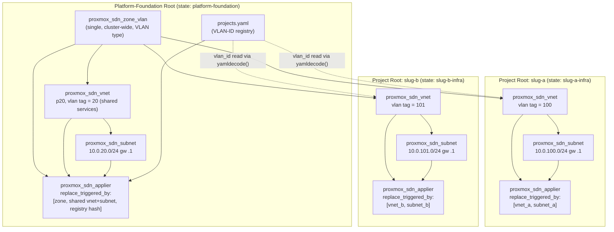
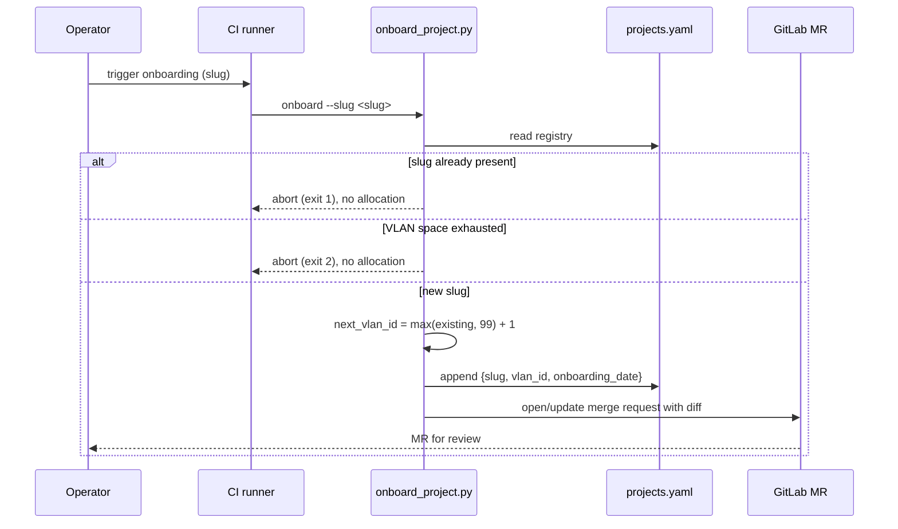

# Platform-Foundation Terraform Root

The cluster-wide, **non-per-project** network fabric for the developer-services
platform. This root owns exactly the shared pieces of the Proxmox SDN that every
project attaches to, plus the authoritative VLAN-ID registry and the onboarding
script that appends to it.

It is deliberately separate — with its own GitLab-managed Terraform state name
`platform-foundation` — from every per-project root under
`infra/projects/<slug>/`, so that one project's `terraform destroy` can never
touch shared or other-project resources (NET-00 §6, PF §4, Requirement 6.3).

> **Related docs:** the per-project root is documented in
> [`../projects/_TEMPLATE/README.md`](../projects/_TEMPLATE/README.md); the
> compute module contract in
> [`../modules/proxmox-compute/README.md`](../modules/proxmox-compute/README.md).

---

## What this root declares

| File | Declares |
|---|---|
| `versions.tf` | `bpg/proxmox` provider pin (`~> 0.111.1`), Terraform `>= 1.6.0`, and the partial `backend "http"` (state name `platform-foundation`). |
| `providers.tf` | The API-token-based Proxmox provider (`terraform@pve` identity — never root). |
| `registry.tf` | Reads `projects.yaml` via `yamldecode()`; exposes the `slug_to_vlan_id` map and a `registry_hash`. |
| `sdn.tf` | Exactly **one** `proxmox_sdn_zone_vlan` + exactly **one** `proxmox_sdn_applier`, plus the **shared-services VLAN-20** VNet + subnet (`p20`, tag 20 / `10.0.20.0/24` gw `.1`). **Zero** *per-project* VNets/subnets (those are per-project-root-owned, VLAN 100–254). |
| `projects.yaml` | Append-only VLAN-ID registry (the single in-repo source of VLAN-ID truth). |
| `scripts/onboard_project.py` | Onboarding CLI: allocates the next VLAN ID and opens a GitLab MR. Never mutates live infra. |

The SDN built-in IPAM/DHCP is deliberately left **disabled** (it is Proxmox
tech-preview). Host IPs are computed by Terraform and injected via cloud-init in
the `proxmox-compute` module (Requirement 2.5, NET-00 §5).

---

## SDN resource graph

The zone is the anchor every VNet attaches to. This foundation root owns the
zone, the foundation-level applier (which watches the zone, the shared VNet +
subnet, and a hash of the registry), and the **shared-services VLAN-20** VNet +
subnet (`p20` / `10.0.20.0/24`) that every "Shared"-tenancy service attaches to.
Each **project** root adds its **own** VNet + subnet + applier in a **separate**
state — those remain per-project-root-owned (VLAN 100–254); only the shared
VLAN-20 VNet is foundation-owned. Diagram adapted from `design.md` — "Terraform
SDN resource graph".



---

## Prerequisites

- The Proxmox API token for `terraform@pve`, whose custom PVE role additionally
  carries the **`SDN.Allocate`** privilege (NET-00 §6, Requirement 7.3). This root
  only *consumes* the identity — it never declares or re-grants the role.
- The venv with Terraform tooling and PyYAML available at
  `~/venv/devinfra/` (see `dev-workflow.md`).
- Terraform CLI (`>= 1.6.0`) on `PATH` in the CI runner. **Terraform is not
  installed in the local authoring environment** — the Tier-1 `terraform`
  commands below are annotated `offline` (no infra/credentials needed) and run
  in CI where the binary exists.

### Credentials — placeholders only

Never put real credentials or hostnames in commands or `.tfvars`. Use
placeholders and substitute at run time:

| Placeholder in docs | Substituted with |
|---|---|
| `https://pve.example.internal:8006/` | `TF_VAR_proxmox_endpoint` |
| `USER@REALM!TOKENID=UUID` | `TF_VAR_proxmox_api_token` |
| `<GITLAB-HOST>` / `<PROJECT-ID>` | `CI_API_V4_URL` / `CI_PROJECT_ID` |
| CI job token | `CI_JOB_TOKEN` |

---

## Terraform workflow

State is a GitLab-managed HTTP **partial** backend: all attributes are supplied
at `init` time via `-backend-config` (the `backend "http"` block is intentionally
empty). The state name for this root is `platform-foundation`.

### Initialize (partial backend)

Run from the `infra/platform-foundation` root (the `cd` below handles it):

<!-- doctest: requires-infra -->
<!-- cwd: . -->
```bash
cd infra/platform-foundation
terraform init \
  -backend-config="address=${CI_API_V4_URL}/projects/${CI_PROJECT_ID}/terraform/state/platform-foundation" \
  -backend-config="lock_address=${CI_API_V4_URL}/projects/${CI_PROJECT_ID}/terraform/state/platform-foundation/lock" \
  -backend-config="unlock_address=${CI_API_V4_URL}/projects/${CI_PROJECT_ID}/terraform/state/platform-foundation/lock" \
  -backend-config="username=gitlab-ci-token" \
  -backend-config="password=${CI_JOB_TOKEN}" \
  -backend-config="lock_method=POST" \
  -backend-config="unlock_method=DELETE" \
  -backend-config="retry_wait_min=5"
```

`terraform init` reaches the GitLab state backend, so it is **Tier-2
(requires-infra)** — it needs the `CI_*` variables present. This `CI_*` path is
the CI *option* for state; it is not the only way to work with this root. For a
purely offline format/validate loop, use `-backend=false` (below); to apply
locally against an ephemeral test cluster without the GitLab state backend, see
the Apply section and [`TESTING.md`](../../TESTING.md).

### Format and validate (offline, Tier-1)

`terraform fmt` and `terraform validate` need no Proxmox and no state backend, so
they are Tier-1 offline. `validate` requires provider schemas, so run
`init -backend=false` first to install them without touching remote state.

<!-- doctest: offline -->
<!-- cwd: . -->
```bash
cd infra/platform-foundation
terraform fmt -check -recursive
```

<!-- doctest: offline -->
<!-- cwd: . -->
```bash
cd infra/platform-foundation
terraform init -backend=false
terraform validate
```

### Plan (offline, Tier-1)

A `terraform plan` that does not contact a live Proxmox — using placeholder
variables and the `-refresh=false` flag against local/fixture state — validates
the resource graph without infrastructure. This is the Tier-1 plan gate CI runs
for idempotency and resource-shape assertions.

<!-- doctest: offline -->
<!-- cwd: . -->
```bash
cd infra/platform-foundation
terraform plan \
  -refresh=false \
  -var="proxmox_endpoint=https://pve.example.internal:8006/" \
  -var="proxmox_api_token=USER@REALM!TOKENID=UUID" \
  -out=tfplan.foundation
# Dummy, non-contacting placeholder creds are passed as -var here ONLY because
#   -refresh=false makes this an offline graph check. A LIVE apply uses the
#   exported TF_VAR_proxmox_* convention instead (see the Apply section).
```

### Apply (Tier-2, requires-infra)

A **real** apply targets a live Proxmox cluster and creates the SDN zone,
applier, and the shared-services VLAN-20 VNet `p20` + subnet. It requires the
`SDN.Allocate` privilege and the `TF_VAR_proxmox_*` credentials, so it is
**Tier-2 (requires-infra)**. If the credentials are absent the doctest is skipped
(not failed), per the documentation-testing steering.

> **Scope: this apply creates only the shared SDN fabric — it is NOT a service
> apply.** This root needs ONLY the provider credentials
> (`proxmox_endpoint` / `proxmox_api_token`); it declares no guest, so the
> command below has no `node_name`/`vmid`/`template`/`datastore` vars. A service
> root (e.g. `infra/projects/svc-07-secrets-manager/`) is a **separate** apply
> with its own, larger var set — do not copy this command into a service root.
> Apply this foundation root **first** (it creates `p20`), then apply the service
> root; a service apply without `p20` present fails at container start with
> `bridge 'p20' does not exist`.

> Tier-2 apply can also be run **locally against an ephemeral test cluster** —
> the `CI_*` state-backend `init` above is the CI *option*, not the only path. For
> a local apply, use `terraform init -backend=false` (or a local state file) and
> supply the `TF_VAR_proxmox_*` credentials from your shell/`.env`. See
> [`TESTING.md`](../../TESTING.md) for the full offline-vs-cluster testing guide.

This root accepts exactly the variables below — the three credential vars go via
exported `TF_VAR_*` env vars (never `-var`); the remaining `sdn_zone_*` vars have
working defaults and are shown so you can substitute values once rather than
discovering missing ones by trial and error; drop any line whose default already
suits your cluster. (Guest vars like `proxmox_node_name` / `openbao_*` do **not**
exist in this root — those belong to a service root such as
`svc-07-secrets-manager`.)

Export the cluster credentials as `TF_VAR_*` first (mirrors `.env`'s
`PROXMOX_SDN_TEST_*`) — the same convention the SVC-07 runbook uses. Setting env
vars contacts nothing, so this export block is **offline**; the `terraform apply`
that consumes it is the requires-infra step.

<!-- doctest: offline -->
<!-- cwd: . -->
```bash
export TF_VAR_proxmox_endpoint="${PROXMOX_SDN_TEST_ENDPOINT}"
export TF_VAR_proxmox_api_token="${PROXMOX_SDN_TEST_TOKEN}"
export TF_VAR_proxmox_insecure="true"   # self-signed test cert
```

**Initialize the state backend first (this is required before `apply`).** This
root declares a **partial** `backend "http"` in `versions.tf` (empty block,
attributes supplied at `init` time; state name `platform-foundation`). Until you
initialize *some* backend, `terraform apply` fails with *"Backend initialization
required, please run terraform init"*, and because the offline Format/validate
step above ran `terraform init -backend=false`, the live init also needs
`-reconfigure` (that is the *"Changes to backend configurations require
reinitialization"* half of the error). You have two options — for a **solo
operator on a throwaway cluster you do NOT need GitLab**, and Option A is offline
until the apply itself:

**Option A — local backend (recommended for a hand-run acceptance).** Override the
partial `backend "http"` with a credential-free local backend. Drop a
`*_override.tf` file into this root — Terraform automatically merges any
`*_override.tf`, and the repo `.gitignore` ignores that pattern so it can never be
committed — then `init -reconfigure`. State lands in a local, gitignored
`terraform.tfstate`:

<!-- doctest: offline -->
<!-- cwd: . -->
```bash
cd infra/platform-foundation
cat > local_backend_override.tf <<'EOF'
# Local, gitignored state backend for a solo/offline apply — overrides the
# root's partial backend "http" {}. Never committed (.gitignore: *_override.tf).
terraform {
  backend "local" {}
}
EOF
terraform init -reconfigure
```

**Option B — GitLab-managed HTTP state (the CI path).** Use this when you want the
shared, GitLab-managed state (what the pipeline uses). The full `-backend-config`
flag list is already documented above under [**Initialize (partial
backend)**](#initialize-partial-backend) (state name `platform-foundation`); it
reads `CI_API_V4_URL` / `CI_PROJECT_ID` / `CI_JOB_TOKEN`. Because it reaches
GitLab it is `requires-infra`; Option A is offline until the apply itself.

Run from the `infra/platform-foundation` root (the `cd` below handles it):

<!-- doctest: requires-infra -->
<!-- cwd: . -->
```bash
cd infra/platform-foundation
terraform apply \
  -var="sdn_zone_bridge=vmbr0" \
  -var="sdn_zone_id=vlanzone" \
  -var="sdn_zone_nodes=[]"
# proxmox_endpoint / proxmox_api_token / proxmox_insecure come from the exported
#   TF_VAR_* block above — never re-passed as -var.
# sdn_zone_mtu is intentionally omitted so it keeps its `null` default (the
#   Proxmox default MTU). It CANNOT be passed as a bare null on the CLI: a
#   specific MTU must be given as a NUMBER, e.g. -var="sdn_zone_mtu=1500" —
#   never the string "null".
```

Variable reference for this root:

| Variable | Required? / default | Meaning |
|---|---|---|
| `proxmox_endpoint` | **required** | Proxmox API base URL. Supplied via the exported `TF_VAR_proxmox_endpoint` (mirrors `.env`'s `PROXMOX_SDN_TEST_ENDPOINT`) — not as `-var`. |
| `proxmox_api_token` | **required** | `terraform@pve` API token (`<user>@<realm>!<id>=<uuid>`) with the `SDN.Allocate` privilege. Supplied via the exported `TF_VAR_proxmox_api_token` (from `.env`) to keep it out of shell history — not as `-var`. |
| `proxmox_insecure` | default `true` | Skip TLS verification for a self-signed test-cluster cert; set `false` to enforce. Supplied via the exported `TF_VAR_proxmox_insecure` — not as `-var`. |
| `sdn_zone_bridge` | default `vmbr0` | The local Linux/OVS bridge the VLAN zone tags onto. **Confirm your node's bridge** (`ip -br link \| grep vmbr`) — change if it is not `vmbr0`. |
| `sdn_zone_id` | default `vlanzone` | SDN zone id (≤8 alphanumeric). |
| `sdn_zone_nodes` | default `[]` (all nodes) | Restrict the zone to specific nodes, e.g. `["shrimp"]`; empty = cluster-wide. |
| `sdn_zone_mtu` | default `null` | Zone MTU; `null` leaves the Proxmox default. **Cannot** be passed as a bare null via `-var` — a `-var="sdn_zone_mtu=<null>"` passes the *string* `"null"`, which fails the `number` type constraint. Omit the flag to keep the `null` default, or pass an integer (e.g. `-var="sdn_zone_mtu=1500"`) to set a specific MTU. |

With the credentials exported as `TF_VAR_*` (above), the minimal form is just
`terraform apply` with no `-var` at all — every `sdn_zone_*` var has a working
default. The `sdn_zone_*` `-var`s are shown for completeness; drop any whose
default already suits your cluster — and in particular, leave `sdn_zone_mtu`
omitted (never pass it as `null`) unless you are setting a numeric MTU.

### Outputs

After an apply, the root exposes the registry map and hash (both non-secret):

<!-- doctest: requires-infra -->
<!-- cwd: . -->
```bash
cd infra/platform-foundation
terraform output slug_to_vlan_id
terraform output registry_hash
```

---

## Onboarding a new project

Onboarding is a **registry edit + merge request only** — it never touches live
infrastructure. The script computes the next sequential, never-reused VLAN ID
(`max(existing, default=99) + 1`, range 100–254), appends
`{slug, vlan_id, onboarding_date}` to `projects.yaml`, and opens/updates a GitLab
MR carrying that diff. The actual VLAN is created later by the project root's
`terraform apply`, gated on MR review.

Run the script via the venv binary by absolute path, with `PYTHONPATH` pointed at
the `scripts` dir so the `netfoundation` derivation package resolves.

### Usage help (offline, Tier-1)

`--help` contacts nothing and exits 0, so it is Tier-1 offline.

<!-- doctest: offline -->
<!-- cwd: . -->
```bash
PYTHONPATH=infra/platform-foundation/scripts \
  ~/venv/devinfra/bin/python \
  infra/platform-foundation/scripts/onboard_project.py --help
```

Expected (abridged) output:

<!-- doctest: display-only -->
```text
usage: onboard_project.py [-h] --slug SLUG [--registry REGISTRY] [--no-mr]

Onboard a new project: compute its next sequential VLAN ID, append it to the
projects.yaml registry, and open/update a GitLab merge request with the diff.
Never mutates live infrastructure (registry edit + MR only).
```

### Local dry run — allocate + append, no MR (offline, Tier-1)

`--no-mr` skips the GitLab call, so allocation + registry append can be exercised
offline. Note this **writes** to `projects.yaml`; run it against a scratch copy
via `--registry` if you do not intend to commit the change.

<!-- doctest: offline -->
<!-- cwd: . -->
```bash
cp infra/platform-foundation/projects.yaml /tmp/projects.scratch.yaml
PYTHONPATH=infra/platform-foundation/scripts \
  ~/venv/devinfra/bin/python \
  infra/platform-foundation/scripts/onboard_project.py \
  --slug my-project \
  --registry /tmp/projects.scratch.yaml \
  --no-mr
```

Expected message shape (VLAN ID depends on the current registry):

<!-- doctest: display-only -->
```text
Onboarded 'my-project': VLAN <next-id>, onboarding_date <YYYY-MM-DD>. Registry
updated; merge request opened/updated for review.
```

### CI onboarding (Tier-2, requires-infra)

In CI, the script reads `CI_API_V4_URL`, `CI_PROJECT_ID`, and `CI_JOB_TOKEN`
(or `GITLAB_TOKEN`) to open the MR. That live GitLab call makes it **Tier-2
(requires-infra)**; the token is referenced by variable name only, never echoed.

<!-- doctest: requires-infra -->
<!-- cwd: . -->
```bash
PYTHONPATH=infra/platform-foundation/scripts \
  ~/venv/devinfra/bin/python \
  infra/platform-foundation/scripts/onboard_project.py --slug my-project
```

### Onboarding flow



---

## Registry rules (`projects.yaml`)

- **Append-only.** Entries are never removed and VLAN IDs are never reused —
  not even after a project is decommissioned (Requirement 1.6, domain-rules §1).
- Fields: `slug` (lowercase-hyphenated, ≤20 chars, unique), `vlan_id`
  (integer 100–254, globally unique), `onboarding_date` (ISO 8601 `YYYY-MM-DD`).
- Never hand-pick a `vlan_id` — always go through the onboarding script + MR.

---

## Cross-cutting notes

- **Multi-tenancy / VLAN isolation:** this root owns the shared zone and the
  shared-services VLAN-20 VNet/subnet (`p20`); per-project isolation lives in
  each project's own VNet/subnet/state (VLAN 100–254).
- **Terraform state isolation:** state name `platform-foundation`, distinct from
  every `<slug>-infra` (Requirement 6.3).
- **Secrets:** the Proxmox API token and GitLab token come only from GitLab
  CI/CD protected + masked variables (PF FR-8) — never committed, never echoed.
- **Deployment-unit convention:** SDN resources are API-managed Terraform
  objects; no Docker/Compose or host ports are involved at this layer.
