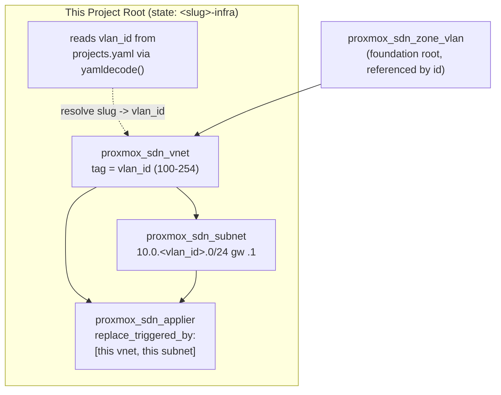

# Per-Project Terraform Root (TEMPLATE)

This directory is a **template**. It provisions exactly one project's network
slice on the Proxmox SDN: one VNet, one subnet, and this root's own applier — in
its own GitLab-managed Terraform state named `<slug>-infra`, deliberately
separate from the platform-foundation root and every other project (NET-00 §6,
PF §4, Requirement 6.3). That isolation is what makes one project's
`terraform destroy` safe.

The zone itself is **not** declared here — it is owned by the
[platform-foundation root](../../platform-foundation/README.md). This root only
references the zone by id.

---

## Copying the template

Copy the whole `_TEMPLATE` directory to `infra/projects/<slug>/`, where `<slug>`
matches an entry already recorded in
[`infra/platform-foundation/projects.yaml`](../../platform-foundation/projects.yaml)
(assigned earlier by the onboarding script + MR flow). Nothing in the template
hardcodes the slug — it is supplied as the `project_slug` input, and the state
name is derived from it at `terraform init` time.

<!-- doctest: offline -->
<!-- cwd: . -->
```bash
cp -r infra/projects/_TEMPLATE infra/projects/my-project
```

> Onboard the slug **first** (see the platform-foundation README). This root's
> `main.tf` has a precondition that fails the plan/apply if the slug is absent
> from the registry (Requirement 5.5, FD.3) — it will not provision an
> unregistered VLAN.

---

## Inputs and outputs

### Input

| Variable | Purpose |
|---|---|
| `project_slug` | The **only** project-identifying input. Must match a registered `slug`. The root reads the `vlan_id` from the registry for this slug — it never accepts a `vlan_id` as a free operator input ("read, don't choose"). |
| `sdn_zone_id` | Id of the shared foundation zone the VNet attaches to (default `vlanzone`). Must match the foundation zone's id. |
| `proxmox_endpoint`, `proxmox_api_token`, `proxmox_insecure` | Proxmox provider wiring (API-token identity, from CI variables). |

### Outputs (Requirement 6.4)

| Output | Value | Consumed by |
|---|---|---|
| `vlan_id` | integer 100–254, resolved from the registry | each service's Terraform (threaded into `proxmox-compute`) + Ansible inventory |
| `subnet_cidr` | `10.0.<vlan_id>.0/24` | same |
| `gateway_ip` | `10.0.<vlan_id>.1` | same |

All three are non-secret, formula-derived configuration.

---

## Where this root sits in the SDN graph



---

## Placeholders — no real credentials

| Placeholder in docs | Substituted with |
|---|---|
| `https://pve.example.internal:8006/` | `TF_VAR_proxmox_endpoint` |
| `USER@REALM!TOKENID=UUID` | `TF_VAR_proxmox_api_token` |
| `<slug>` | the real project slug (e.g. `my-project`) |
| `<GITLAB-HOST>` / `<PROJECT-ID>` | `CI_API_V4_URL` / `CI_PROJECT_ID` |

> **Terraform is not installed in the local authoring environment.** The Tier-1
> `terraform` commands below carry the `offline` annotation (no infra or
> credentials required) and run anywhere the binary exists — locally or in CI. See
> [`TESTING.md`](../../../TESTING.md) for the full offline-vs-cluster testing guide.

---

## Terraform workflow

Run everything from the copied project directory, e.g. `infra/projects/my-project`.
The examples below use `infra/projects/_TEMPLATE` as the `cwd` so they are
runnable against the template itself; substitute your real project directory.

### Initialize — state name `<slug>-infra` (partial backend)

The `backend "http"` block is empty; the `<slug>-infra` state name is supplied
at `init` via `-backend-config`. This contacts the GitLab state backend, so it
is **Tier-2 (requires-infra)**. Substitute the real slug for `<slug>`.

Run from the `infra/projects/_TEMPLATE` root (the `cd` below handles it):

<!-- doctest: requires-infra -->
<!-- cwd: . -->
```bash
cd infra/projects/_TEMPLATE
terraform init \
  -backend-config="address=${CI_API_V4_URL}/projects/${CI_PROJECT_ID}/terraform/state/<slug>-infra" \
  -backend-config="lock_address=${CI_API_V4_URL}/projects/${CI_PROJECT_ID}/terraform/state/<slug>-infra/lock" \
  -backend-config="unlock_address=${CI_API_V4_URL}/projects/${CI_PROJECT_ID}/terraform/state/<slug>-infra/lock" \
  -backend-config="username=gitlab-ci-token" \
  -backend-config="password=${CI_JOB_TOKEN}" \
  -backend-config="lock_method=POST" \
  -backend-config="unlock_method=DELETE" \
  -backend-config="retry_wait_min=5"
```

### Format and validate (offline, Tier-1)

<!-- doctest: offline -->
<!-- cwd: . -->
```bash
cd infra/projects/_TEMPLATE
terraform fmt -check -recursive
```

<!-- doctest: offline -->
<!-- cwd: . -->
```bash
cd infra/projects/_TEMPLATE
terraform init -backend=false
terraform validate
```

### Plan (offline, Tier-1)

An offline plan with placeholder credentials and `-refresh=false` validates the
VNet/subnet/applier graph and the registry precondition without a live Proxmox.
`project_slug` must be a slug present in `projects.yaml` (e.g. `dronefleet`).

<!-- doctest: offline -->
<!-- cwd: . -->
```bash
cd infra/projects/_TEMPLATE
terraform plan \
  -refresh=false \
  -var="project_slug=dronefleet" \
  -var="proxmox_endpoint=https://pve.example.internal:8006/" \
  -var="proxmox_api_token=USER@REALM!TOKENID=UUID" \
  -out=tfplan.project
# Dummy, non-contacting placeholder creds are passed as -var here ONLY because
#   -refresh=false makes this an offline graph check. A LIVE apply uses the
#   exported TF_VAR_proxmox_* convention instead (see the Apply section).
```

### Apply (Tier-2, requires-infra)

A **real** apply creates the VNet + subnet on the live Proxmox SDN and commits
via the applier. It needs the `SDN.Allocate` privilege and real `TF_VAR_proxmox_*`
credentials, so it is **Tier-2 (requires-infra)**; skipped (not failed) when the
credentials are absent.

Export the cluster credentials as `TF_VAR_*` first (mirrors `.env`'s
`PROXMOX_SDN_TEST_*`) — the same convention the SVC-07 runbook uses. Setting env
vars contacts nothing, so this export block is **offline**; the `terraform apply`
that consumes it is the requires-infra step. Credentials are **not** re-passed as
`-var` — the only non-cred `-var` this root takes is `project_slug`.

<!-- doctest: offline -->
<!-- cwd: . -->
```bash
export TF_VAR_proxmox_endpoint="${PROXMOX_SDN_TEST_ENDPOINT}"
export TF_VAR_proxmox_api_token="${PROXMOX_SDN_TEST_TOKEN}"
export TF_VAR_proxmox_insecure="true"   # self-signed test cert
```

Run from the `infra/projects/_TEMPLATE` root (the `cd` below handles it):

<!-- doctest: requires-infra -->
<!-- cwd: . -->
```bash
cd infra/projects/_TEMPLATE
terraform apply \
  -var="project_slug=<slug>"
# proxmox_endpoint / proxmox_api_token / proxmox_insecure come from the exported
#   TF_VAR_* block above — never re-passed as -var.
```

### Read the outputs

<!-- doctest: requires-infra -->
<!-- cwd: . -->
```bash
cd infra/projects/_TEMPLATE
terraform output vlan_id
terraform output subnet_cidr
terraform output gateway_ip
```

---

## Cross-cutting notes

- **Multi-tenancy / VLAN isolation:** this root places one project on its own
  VNet/subnet in the 100–254 range; the `vlan_id == 10` (management) placement is
  rejected upstream and the range is guarded here.
- **Terraform state isolation:** state name `<slug>-infra`, unique per project
  and distinct from `platform-foundation` (Requirement 6.3).
- **Secrets:** provider token comes from a GitLab CI/CD protected + masked
  variable — never committed, never echoed.
- **Naming & addressing:** `vlan_id`/`subnet_cidr`/`gateway_ip` are formula-
  derived (`10.0.<vlan_id>.x`); no IP is hand-chosen.
- **Deployment-unit convention:** SDN resources are API-managed Terraform
  objects; no Docker/Compose at this layer.
