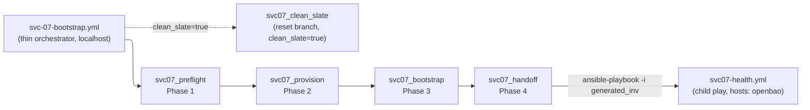

# SVC-07 Install Runbook — provision OpenBao from nothing, then run its live tests

This is the **provision-then-test spine** for SVC-07 (OpenBao): it takes you from
an empty throwaway Proxmox cluster to a running OpenBao primary + Transit
unsealer, and then runs the SVC-07 `requires_infra` tests against the instance
you just built. It is the "build the live thing, then test what you built" half
that the environment-variable table in [`../../../TESTING.md`](../../../TESTING.md)
assumes already exists.

There are **two paths through it**. Section **A** is the **Developer B** fast path:
one Ansible orchestrator command (`svc-07-bootstrap.yml`) that packages the whole
Day-0 bring-up and then runs the `requires-infra` installer tests against what it
built. Sections **0–5** are the **Developer A** manual reference spine for
diagnosing an individual phase. Both are provision-then-test walkthroughs; pick
the one that matches your need.

It is deliberately **thin**: every provisioning step links into the existing
SVC-07 docs rather than re-explaining them. It does **not** re-document
`config.hcl`, the two-LXC split, or the bootstrap-token lifecycle — those live in
the Terraform-root [`README.md`](./README.md) and its runbooks and are only linked
here. The one genuinely new content is section 3: how to derive the
`OPENBAO_TEST_*` variables from the instance this runbook just provisioned.

> **Placeholders only.** Every token, key, and hostname in this runbook is a
> placeholder. Secrets are referenced by environment-variable **name** only
> (e.g. `OPENBAO_TEST_TOKEN`), never by value — nothing here is ever committed or
> echoed (`documentation-testing.md`, `security-standards.md`; Req 4.7, Security
> AC 1–3).

> **Doctest tiers.** Offline preflight commands carry `<!-- doctest: offline -->`;
> the `terraform apply`, the Ansible role runs, the live test runs, and the
> teardown carry `<!-- doctest: requires-infra -->`. Tier rules are owned by
> [`documentation-testing.md`](../../../.kiro/steering/documentation-testing.md);
> the install-runbook location convention is owned by
> [`structure.md`](../../../.kiro/steering/structure.md).

---

## ⚠ Throwaway cluster only

The live steps in sections 1, 2, 4, and 5 **provision, mutate, and tear down real
infrastructure**. The install and test steps run **only against a throwaway /
ephemeral Proxmox SDN test cluster** — never a shared or production cluster
(Req 4.8, Security AC 4). This mirrors the strong warnings already in
[`../../../TESTING.md`](../../../TESTING.md) and [`README.md`](./README.md):

- Section 2 initialises and unseals OpenBao and **revokes the root token** as part
  of the one-time bootstrap — irreversible on a real instance.
- Section 4's contract tests **write and tear down** disposable `ctest-*`
  policies/roles and enable a file audit device; the auto-unseal test
  **stops/starts containers**.
- Section 5 runs `terraform destroy`, which **deletes the two LXCs**.

If what you actually need is to recover an *existing* primary rather than build a
fresh one, this is **not** the right runbook — use the disaster-recovery restore
procedure instead:
[`../../../ansible/roles/openbao_install/RESTORE-RUNBOOK.md`](../../../ansible/roles/openbao_install/RESTORE-RUNBOOK.md).

---

> **The whole path, in order** — full detail and per-step command links live in the
> [TESTING.md provision-then-test walkthrough](../../../TESTING.md#provision-then-test-the-whole-path-in-order):
> 1. Apply the platform-foundation root (creates the shared VLAN-20 VNet `p20`).
> 2. Apply the SVC-07 Terraform root (the two LXCs).
> 3. Install Docker + Compose on both LXCs (the `common` role).
> 4. Bring up OpenBao (install → init/unseal → onboard).
> 5. Derive the `OPENBAO_TEST_*` variables from the instance you built.
> 6. Run the SVC-07 live tests (`-m requires_infra`).

---

## A. Developer-B automated path — one command, provision-then-test

> **Two audiences, two paths.** Sections **0–5** below are the **Developer A**
> reference: the manual, step-by-step diagnostic spine (SDN fabric gate, host
> swap, Shamir key capture, per-container recovery). **This section A is the
> Developer B fast path**: a single Ansible orchestrator
> (`ansible/playbooks/svc-07-bootstrap.yml`) that packages the same Day-0
> bring-up — Preflight → Provisioning → Bootstrap → Handoff — behind one command,
> then points the `requires-infra` installer tests at the instance it just built.
> Read this section if you just want OpenBao standing up on a throwaway cluster;
> drop to sections 0–5 when you need to diagnose *why* a phase failed.

Every command below appears **exactly once**, in the order you run it: offline
preflight first (needs no cluster), then the single-command install, then the
live `requires-infra` test run against what you built, then the clean-slate reset.
Every runnable block carries its doctest tier. All tokens and hostnames are
placeholders; credentials are referenced by **environment-variable name only**
(e.g. `OPENBAO_ADMIN_TOKEN`), never by value.

### A.0 — Offline preflight (no cluster needed)

Sanity-check the code paths the orchestrator drives before you touch any
infrastructure. These contact nothing — no Proxmox, no state backend, no running
OpenBao — so they are `offline`.

Validate the SVC-07 Terraform root the orchestrator's Provisioning phase applies:

<!-- doctest: offline -->
<!-- cwd: . -->
```bash
cd infra/projects/svc-07-secrets-manager
terraform fmt -check -recursive
terraform init -backend=false
terraform validate
```

Parse-check the orchestrator playbook itself (the `--syntax-check` run compiles
the play without connecting to `localhost` or any guest):

<!-- doctest: offline -->
<!-- cwd: . -->
```bash
~/venv/devinfra/bin/ansible-playbook --syntax-check \
  -i ansible/inventory/localhost.yml \
  ansible/playbooks/svc-07-bootstrap.yml
```

Confirm the pure-logic cluster-env helper the Preflight phase calls is runnable
and self-documents its usage (prints help, exits 0, contacts nothing):

<!-- doctest: offline -->
<!-- cwd: . -->
```bash
~/venv/devinfra/bin/python scripts/installer/cluster_env.py --help
```

Run the offline installer unit/property suite (the `cluster_env.py` example +
Hypothesis tests and the backend swap-gate test — all deselect `requires_infra`
by default via the root `pytest.ini`):

<!-- doctest: offline -->
<!-- cwd: . -->
```bash
~/venv/devinfra/bin/pytest tests/installer/
```

### A.1 — Prepare the cluster env file

Copy the committed template to a **gitignored** per-environment file and fill in
your throwaway cluster's Proxmox endpoint, API token, node name, and LXC template.
The file holds the API token and is where the installer will later write
`OPENBAO_ADMIN_TOKEN` at mode `0600` — it must never be committed (the
`cluster.*.env` names are gitignored; `cluster.env.example` is the only committed
form). Editing a local file contacts nothing, so this is `offline`:

<!-- doctest: offline -->
<!-- cwd: . -->
```bash
cp cluster.env.example cluster.dev.env
# Then edit cluster.dev.env: set PROXMOX_ENDPOINT / PROXMOX_API_TOKEN (or their
# TF_VAR_* aliases), PROXMOX_NODE_NAME, and the LXC template id — placeholders
# only in the committed example; real throwaway-cluster values go in cluster.dev.env,
# which is gitignored and never echoed. Leave the datastore var unset to let the
# installer auto-detect local-zfs -> local-lvm.
```

### A.1b — Agent-driven acceptance (throwaway cluster)

Everything in section A can be run by a **human operator** exactly as written —
in that case the interlock below is unset and this subsection does not apply. This
subsection is only for letting the **Kiro agent** *itself* drive the live
acceptance (`clean_slate` + from-scratch bring-up). Doing so is a governed,
off-by-default control; the governing rule is the **"Agent Live-Test
Authorization"** subsection in
[`../../../.kiro/steering/testing-strategy.md`](../../../.kiro/steering/testing-strategy.md)
(agent live/destructive runs are allowed **only** against a throwaway cluster,
**only** with the interlock armed, and **never** in CI/acceptance/production; the
interlock defaults OFF). This runbook does not restate those rules — it only shows
the precondition and the exact invocation.

To arm an agent-driven run, **two** things must both hold, or the run is refused
before anything is touched:

1. The run is **armed** with the `AGENT_LIVE_AUTHORIZED` environment variable
   (referenced by name only; export it per invocation — it is never a committed
   default and never a key in an env file).
2. The target is a **throwaway cluster listed** in
   [`../../../scripts/installer/throwaway-clusters.yml`](../../../scripts/installer/throwaway-clusters.yml),
   and the run reads its cluster parameters from the isolated
   [`.env.throwaway`](../../../.env.throwaway.example) source (copied from
   `.env.throwaway.example`) — **not** a developer's manual `.env` / `cluster.*.env`.

Copy the isolated agent env source and fill in your throwaway cluster's values
(gitignored; editing a local file contacts nothing, so this is `offline`):

<!-- doctest: offline -->
<!-- cwd: . -->
```bash
cp .env.throwaway.example .env.throwaway
# Then edit .env.throwaway: set the THROWAWAY cluster's PROXMOX_ENDPOINT /
# PROXMOX_API_TOKEN / PROXMOX_NODE_NAME / LXC template. The resolved identity
# (normalized endpoint host + exact node name) MUST match an entry in
# scripts/installer/throwaway-clusters.yml, or the guard fails CLOSED.
# Do NOT put AGENT_LIVE_AUTHORIZED in this file — it is an env var, set per run.
```

**Offline guard self-check.** The throwaway guard is pure and offline-testable;
its `--help` contacts nothing and exits 0, so it is `offline`:

<!-- doctest: offline -->
<!-- cwd: . -->
```bash
~/venv/devinfra/bin/python scripts/installer/throwaway_guard.py --help
```

**Guard-refusal behavior (fail closed).** If `AGENT_LIVE_AUTHORIZED` is unset, or
the resolved cluster identity is not on the allowlist (or the allowlist is
missing/empty/unparseable), the guard returns REFUSED and the installer halts
**before** any `pct destroy` / `terraform apply` / `terraform state rm` — printing
the INFO decision reason and the resolved (non-secret) identity, and touching
nothing. For illustration, consulting the guard against the committed
placeholder example **without** arming the interlock resolves the identity from a
file and checks the allowlist — it contacts nothing — and exits non-zero (REFUSED,
exit `3`). It is shown here **display-only** because a REFUSED exit is a non-zero
code an `offline` runner would treat as failure:

<!-- doctest: display-only -->
```bash
# NOT armed (AGENT_LIVE_AUTHORIZED unset) → REFUSED, exit 3, destroys nothing.
~/venv/devinfra/bin/python scripts/installer/throwaway_guard.py \
  --service svc07 \
  --env-file .env.throwaway.example \
  --allowlist scripts/installer/throwaway-clusters.yml
# → {"authorized": false, "reason": "interlock unset", ...}   (exit 3)
```

**Armed agent-driven install (from nothing).** This is exactly the A.2
single-command install, but pointed at the isolated `.env.throwaway` source and
with the interlock exported for the invocation. It provisions/mutates real
infrastructure on the throwaway cluster, so it is `requires-infra`:

<!-- doctest: requires-infra -->
<!-- cwd: . -->
```bash
AGENT_LIVE_AUTHORIZED=1 ~/venv/devinfra/bin/ansible-playbook \
  -i ansible/inventory/localhost.yml \
  ansible/playbooks/svc-07-bootstrap.yml \
  -e cluster_env_file=.env.throwaway
```

**Armed agent-driven clean-slate reset.** Likewise the A.4 clean-slate reset,
pointed at `.env.throwaway` with the interlock armed. The guard is consulted first
(gated on the armed interlock) and refuses before any destroy if the identity is
not allowlisted; on AUTHORIZED it proceeds with the existing destroy flow
unchanged. It **destroys real infrastructure**, so it is `requires-infra`:

<!-- doctest: requires-infra -->
<!-- cwd: . -->
```bash
AGENT_LIVE_AUTHORIZED=1 ~/venv/devinfra/bin/ansible-playbook \
  -i ansible/inventory/localhost.yml \
  ansible/playbooks/svc-07-bootstrap.yml \
  -e cluster_env_file=.env.throwaway \
  -e clean_slate=true \
  -e clean_slate_confirm=force \
  -e svc07_proxmox_host=<throwaway-proxmox-host-lan-ip>
```

Once armed and AUTHORIZED, the run proceeds through A.2 (or the A.4 reset)
identically to the operator path below; the only difference is the guard consult
that gates the destructive steps. An optional per-service narrowing
(`AGENT_LIVE_AUTHORIZED_SERVICES=svc07`, also an env var) can restrict the arm to
named services — it only narrows, never broadens.

### A.2 — Single-command install (provisions from nothing)

This is the whole Day-0 bring-up in one invocation. `svc-07-bootstrap.yml` is now
a **thin (~150-line) orchestrator play** — a `hosts: localhost` / `connection:
local` sequence of exactly five `import_role` calls, each wrapped in its own
per-phase `block`/`rescue` that names the failing phase. All phase tasks live in
the roles, not the play (see the [**Developer A — five-role layout**](#the-five-role-layout--where-each-phases-tasks-live)
map below). The orchestrator runs its four install phases in order: Preflight
(`svc07_preflight` — env-file + Proxmox reachability + `p20` bridge + datastore
checks), Provisioning (`svc07_provision` — `terraform apply` of the two LXCs +
inventory generation + `known_hosts` reconciliation), Bootstrap (`svc07_bootstrap`
— `common` role → **delegated unsealer bootstrap** → primary bootstrap), and
Handoff (`svc07_handoff` — child-play health gate + completion banner); a sixth
role, `svc07_clean_slate`, is the destructive reset branch that runs instead of
the four phases when `clean_slate=true` (see [A.4](#a4--clean-slate-reset-tear-back-down-to-an-empty-baseline)).
The unsealer bootstrap is now a single child `openbao.yml`
run (`--limit openbao-unsealer --tags install,init`) whose `openbao_init_unseal`
role **owns** the guarded, readiness-aware `operator init` → threshold unseal →
Transit engine → `openbao-seal` policy → periodic `Bootstrap_Transit_Token` mint
→ unsealer root revoke — the same role the primary already delegates to, so the
`bao status` readiness guard (plus the post-init unseal-survival retry loop that
absorbs the single-node Raft leadership/init race — see §2 Step 2) that fixed the
fresh-bring-up race is applied to BOTH instances. The role hands the minted seal token back to the orchestrator via
a transient mode-`0600` handoff file (written only under the per-run dev-expose
opt-in, read and deleted immediately, gitignored, never committed), which the
orchestrator then bridges into the primary as `OPENBAO_BOOTSTRAP_TRANSIT_TOKEN`.
On success it writes `OPENBAO_ADMIN_TOKEN` into the
`cluster_env_file` at mode `0600` and prints the onboarding command. It **provisions
and mutates real infrastructure**, so it is `requires-infra` and runs **only against
a throwaway cluster**:

<!-- doctest: requires-infra -->
<!-- cwd: . -->
```bash
~/venv/devinfra/bin/ansible-playbook \
  -i ansible/inventory/localhost.yml \
  ansible/playbooks/svc-07-bootstrap.yml \
  -e cluster_env_file=cluster.dev.env
```

Phase 4 runs its health gate as a **child configurator play**,
`ansible/playbooks/svc07-health.yml`, which `svc07_handoff` invokes with
`ansible-playbook -i {{ svc07_generated_inventory }} svc07-health.yml`. That child
play runs `hosts: openbao` **natively on the guest** (its `openbao` group entry
already carries `ansible_host: 10.0.20.10` / `ansible_user: root` over SSH) — there
is **no `delegate_to` health task**. It verifies the primary via
`docker exec <primary-container> bao status` — `initialized:true` and
`sealed:false` — **not** a direct network poll of `https://10.0.20.10:8200`.
The primary publishes **no host port by design** (Req 6 crit 2), so a direct `:8200`
poll of the primary is expected to fail (HTTP 000) — that is why the check reaches it
via `docker exec` on the guest instead. The through-Traefik health check
(`https://openbao.<platform_domain>/v1/sys/health`, Req 6 crit 3) is an **opt-in**,
off by default, enabled with `-e svc07_health_check_via_traefik=true` once Traefik
(SVC-09) is deployed.

The completion banner names the internal API as VLAN-20-only via `docker exec ... bao`
(no host port published), the Traefik URL (`https://openbao.<platform_domain>`, active
once SVC-09 is deployed), and the absolute `cluster.dev.env` path where
`OPENBAO_ADMIN_TOKEN` was saved — by name only, never the value.

### A.3 — Run the `requires-infra` installer tests against what you just built

Point the installer integration suite (`tests/installer/test_installer_integration.py`)
at the instance section A.2 just provisioned. These tests drive the **same**
orchestrator against the live cluster and are gated by environment variables so a
bare `-m requires_infra` on a machine with no cluster skips cleanly rather than
touching anything:

- `SVC07_TEST_CLUSTER_ENV_FILE` — the **same** gitignored `cluster.dev.env` from
  A.1/A.2 (repo-relative or absolute). Without it every test in the module skips.
  This is how the tests point at the thing you just built.
- `SVC07_TEST_ALLOW_DESTROY` — set to `1` to arm the provision/destroy tests (the
  from-scratch and clean-slate round-trip). A safety interlock: unset, the
  mutating tests stay skipped even with a cluster env file present.
- `SVC07_TEST_PROXMOX_HOST` — the Proxmox host LAN IP, needed **only** by the
  clean-slate round-trip test (it runs `pct` on the node over SSH). Referenced by
  name; use your throwaway host's real LAN IP at run time, not a value committed
  here.

Wire those from what A.2 built, then run the live installer suite. This
**provisions/destroys** on the throwaway cluster, so it is `requires-infra`:

<!-- doctest: requires-infra -->
<!-- cwd: . -->
```bash
export SVC07_TEST_CLUSTER_ENV_FILE=cluster.dev.env
export SVC07_TEST_ALLOW_DESTROY=1
export SVC07_TEST_PROXMOX_HOST=<throwaway-proxmox-host-lan-ip>
~/venv/devinfra/bin/pytest -m requires_infra tests/installer/ -v
```

The tests assert a healthy primary + unsealer, that `OPENBAO_ADMIN_TOKEN` was
written at mode `0600`, and that no secret value ever appears in the installer's
captured output — referencing the token by name only.

### A.4 — Clean-slate reset (tear back down to an empty baseline)

When you are done, or to recover from a partial/drifted install, the orchestrator's
`svc07_clean_slate` branch destroys both SVC-07 LXCs and reconciles Terraform state
to empty, then verifies zero surviving containers and zero SVC-07 container
resources in state. The destroy now issues **`pct destroy <vmid> --purge`** (scoped
to the two SVC-07 VMIDs 1070/1071 only — never a global prune), so the guest's
**backing volumes are purged with it**: the OpenBao Raft/audit named volumes that
used to survive a bare `pct destroy` no longer do, and **you no longer need to
delete the LXCs by hand in the Proxmox GUI** or run a separate volume-removal step.
A subsequent from-scratch install therefore starts from a genuinely empty baseline
(the fresh primary reports `initialized=false` and the one-time bootstrap runs).
It **destroys real infrastructure**, so it is `requires-infra`. Pass
`clean_slate_confirm=force` to skip the interactive confirmation prompt (omit it
and the run pauses for explicit confirmation and destroys nothing on a
non-affirmative/absent response):

<!-- doctest: requires-infra -->
<!-- cwd: . -->
```bash
~/venv/devinfra/bin/ansible-playbook \
  -i ansible/inventory/localhost.yml \
  ansible/playbooks/svc-07-bootstrap.yml \
  -e cluster_env_file=cluster.dev.env \
  -e clean_slate=true \
  -e clean_slate_confirm=force \
  -e svc07_proxmox_host=<throwaway-proxmox-host-lan-ip>
```

After this reports the empty-baseline completion, the cluster is ready for a fresh
A.2 from-scratch run.

---

## The five-role layout — where each phase's tasks live

> **Developer A reference.** As of the `svc07-installer-simplification` spec
> ([`.kiro/specs/svc07-installer-simplification/`](../../../.kiro/specs/svc07-installer-simplification/)),
> `svc-07-bootstrap.yml` is a **thin ~150-line orchestrator**: a
> `hosts: localhost` / `connection: local` play whose tasks are exactly **five
> `import_role` calls**, each in its own per-phase `block`/`rescue`. The play only
> *sequences and phase-names*; every phase's real tasks and its phase-specific
> vars now live inside the named role. When you need to diagnose or edit a phase,
> open its role — not the play.

The orchestrator drives the roles as an **orchestrator/configurator seam**
(integration-boundaries.md §4): the play stays a Day-0 orchestrator on
`localhost`, and every task that must run *on a guest* is a child
`ansible-playbook -i {{ svc07_generated_inventory }} <play>` run (`common.yml`,
`openbao.yml`, and — new in this rework — `svc07-health.yml`). The play never
parses `.tfstate` or queries Proxmox for host discovery.



| Role | Phase | Tasks / responsibility | Location |
|---|---|---|---|
| `svc07_preflight` | 1 — Preflight | env-file resolve/validate (`cluster_env.py`, `no_log`), Proxmox `/version` reachability + auth, VLAN-20 `p20` SDN bridge check, datastore autodetect (`local-zfs` → `local-lvm`), operator SSH-key injection + INFO decision log, local prereq/version checks. Fails before any resource is created. | [`ansible/roles/svc07_preflight/`](../../../ansible/roles/svc07_preflight/) |
| `svc07_provision` | 2 — Provision | backend **swap-gate** (GitLab HTTP if the three CI keys present, else `local_backend_override.tf`) + its INFO decision log, `terraform init`/`apply`, `generate_inventory.py` + existence assert, `add_host`, `ssh-keygen -R` + `ssh-keyscan` `known_hosts` reconciliation. | [`ansible/roles/svc07_provision/`](../../../ansible/roles/svc07_provision/) |
| `svc07_bootstrap` | 3 — Bootstrap | child `common.yml` (both guests), delegated unsealer bootstrap → seal-token handoff capture (0600, `no_log`, deleted immediately, fail-closed-if-empty), primary bootstrap child run + drift guard, `OPENBAO_ADMIN_TOKEN` persistence to the cluster-env file at 0600. **The primary-bootstrap task is `no_log: true`** and every token-handling task defaults to `no_log: true`. | [`ansible/roles/svc07_bootstrap/`](../../../ansible/roles/svc07_bootstrap/) |
| `svc07_handoff` | 4 — Handoff | invokes the child health gate `svc07-health.yml` via `ansible-playbook -i {{ svc07_generated_inventory }}` (**no `delegate_to`**), then prints the completion banner (absolute cluster-env path, verbatim onboarding command, `OPENBAO_ADMIN_TOKEN` **by name only**). | [`ansible/roles/svc07_handoff/`](../../../ansible/roles/svc07_handoff/) |
| `svc07_clean_slate` | reset branch | confirmation gate, independent node-name resolution, two-target assembly (1070/1071), per-target child `clean-slate.yml` runs (via the `terraform_clean_slate` role, now `pct destroy --purge`), two-way empty-baseline verification gate. Runs **instead of** the four phases when `clean_slate=true`. | [`ansible/roles/svc07_clean_slate/`](../../../ansible/roles/svc07_clean_slate/) |

Two structural points worth calling out for a maintainer:

- **Phase-4 health is a child play, not a `delegate_to` idiom.** The baseline
  reached the guest with `docker inspect` / `docker exec bao status` tasks carrying
  `delegate_to: svc07-20-01` from a `connection: local` play — an idiom that worked
  only because an `add_host` had set `ansible_connection: ssh`. That is gone. The
  two-stage recreate-robust gate now lives in `ansible/playbooks/svc07-health.yml`
  (`hosts: openbao`, native on the guest), so the orchestrator needs no SSH profile
  of its own for the probe.
- **Restored secret hygiene.** The primary-bootstrap task is `no_log: true` (the
  baseline had a preserved `no_log: false` debug edit that revealed the Admin token
  in the run log); all token-handling tasks default to `no_log: true`. The only dev
  exposure is via the off-by-default opt-ins `openbao_dev_expose_secrets` /
  `svc07_debug_instrumentation`, which route any exposed secret to a **0600
  gitignored** artifact and never to stdout. The debug probes themselves are
  consolidated into two guarded includes — `svc07_bootstrap/tasks/debug_probes.yml`
  (Phase 3) and `ansible/playbooks/tasks/svc07-health-debug-probes.yml` (Phase 4) —
  each imported once under `when: svc07_debug_instrumentation | default(false) |
  bool`, with none left inline in the functional loops. Enable them for a single
  run with `-e svc07_debug_instrumentation=true`.

---

## 0. Prerequisite gate — is the shared VLAN-20 fabric up?

Do this **live gate first**, before anything else, and then run the offline
preflight below. The two "0" items are an ordered pair: this live gate confirms
the shared fabric exists on the cluster, then **0. Offline preflight** checks that
the code is sane — gate first, offline preflight second.

The SVC-07 LXCs attach to the shared-services VLAN-20 VNet `p20`, which the
**platform-foundation** root creates (it does **not** get created by the SVC-07
apply). Before you provision anything in section 1, confirm that VNet already
exists on the cluster by listing the SDN VNets. `sudo pvesh` runs **on a Proxmox
node** and queries the **live cluster** API, so this is a `requires-infra` check —
it needs the real cluster to answer:

<!-- doctest: requires-infra -->
<!-- cwd: . -->
```bash
sudo pvesh get /cluster/sdn/vnets
```

Confirm a **`p20`** row appears in the output — VLAN tag **20**, subnet
`10.0.20.0/24`. If it is there, the fabric is up and you can proceed to the
offline preflight and then section 1.

**If the result is empty, or no `p20` row is present, STOP.** That empty /
`p20`-missing result is *exactly* the condition that later causes the SVC-07
apply's containers to fail at start with `bridge 'p20' does not exist` — this is
the real observed failure case, not a hypothetical (an operator's earlier
`pvesh get /cluster/sdn/vnets` returned empty, and that is precisely why their
provisioning broke). SVC-07 consumes `p20`; it never creates it.

When `p20` is absent, apply the **platform-foundation root FIRST** — before
section 1's SVC-07 `terraform apply` — via its
[**Apply (Tier-2, requires-infra)**](../../platform-foundation/README.md#apply-tier-2-requires-infra)
section, then re-run the gate above and confirm `p20` now appears.

---

## 0. Offline preflight

Before touching the cluster, run the offline sanity checks. These need no
Proxmox, no state backend, and no running OpenBao. Detail for each lives in the
Terraform-root README — this section just orders them; it does not re-list the
full command flags.

**Where the Terraform roots live.** SVC-07 is provisioned from its own root at
`infra/projects/svc-07-secrets-manager/` (this directory), which depends on the
cluster-wide VLAN-20 SDN fabric owned by the **platform-foundation** root. If you
have never stood the fabric up on this throwaway cluster, read those two roots'
READMEs first — they own the state-backend and provider conventions this runbook
assumes:

- SVC-07 root: [`./README.md`](./README.md)
- Platform-foundation root (shared SDN — creates the SDN zone AND the
  shared-services VLAN-20 VNet `p20` + subnet `10.0.20.0/24` that SVC-07's LXCs
  attach to; **must be applied first**, or the SVC-07 apply's containers fail at
  start with `bridge 'p20' does not exist`):
  [`../../platform-foundation/README.md`](../../platform-foundation/README.md)
- Per-project root shape (reference): [`../_TEMPLATE/README.md`](../_TEMPLATE/README.md)

Format-check and validate the Terraform root (see the README
[**Format and validate**](./README.md#format-and-validate-offline-tier-1) section
for the `-backend=false` rationale):

<!-- doctest: offline -->
<!-- cwd: . -->
```bash
cd infra/projects/svc-07-secrets-manager
terraform fmt -check -recursive
terraform init -backend=false
terraform validate
```

**Install the `bao` CLI (once per workstation).** The `bao -help` check below
needs the OpenBao **client** on the machine you run this runbook from. The
`openbao_install` Ansible role installs OpenBao **on the LXC guests** (as a Docker
Compose stack) — it does **not** put the `bao` client on your workstation, so on a
fresh machine this preflight fails until you install it. Either download the
static binary for the pinned version from the
[OpenBao releases / install docs](https://openbao.org/docs/install/), or, if you
prefer not to install anything, use the same pinned image this platform already
runs (`openbao/openbao:2.4`, SVC-14) as a throwaway client:

<!-- doctest: offline -->
```bash
docker run --rm openbao/openbao:2.4 bao -help
```

Then confirm the CLI is reachable (contacts nothing, exits 0 — see the README
[**Preflight — CLI sanity**](./README.md#preflight--cli-sanity-offline-tier-1)
section). If you used the `docker run` form above, that command is itself the
check and this line is redundant:

<!-- doctest: offline -->
```bash
bao -help
```

Render and validate the primary Compose stack — the full "what this checks and
what to look for" detail lives in the README
[**Validate the primary Compose stack**](./README.md#validate-the-primary-compose-stack-offline-tier-1)
section; run `docker compose config` there as that section describes. It is a
post-install check (it needs the stack `openbao_install` writes to
`/opt/compose/openbao`), so it is **not** part of this from-nothing preflight —
follow the README link rather than running it before section 2.

---

## 0c. Operator prerequisite — encrypted host swap (ADR-0006)

This is a **host-build fact, not a runnable command** (no code fence, no doctest
tier). Before OpenBao holds any **real** secrets, the Proxmox host running the
two SVC-07 LXCs MUST have **encrypted swap** — and ideally encrypted disks (e.g.
LUKS-backed swap or an encrypted ZFS `zvol` swap). This is the **host-layer half**
of the ADR-0006 "secrets never persist to plaintext swap" control: any guest
memory paged out to swap is then ciphertext on the device, a genuine whole-cluster
at-rest guarantee that also preserves the homelab's RAM overcommit.

It is **not enforced by the Ansible role** — the role only sets the per-container
swap cap (`--memory-swappiness=0` / Terraform `swap = 0`), which is per-guest
defence-in-depth, not the at-rest guarantee. Encrypted host swap is the
**operator's responsibility** and is verified out-of-band as part of building the
host. On a throwaway test cluster where no real secrets are stored this can be
relaxed, but any host that will hold production-equivalent secret material must
satisfy it first. The accepted residual (live-RAM exposure on shared virtual
infrastructure, non-production) and the out-of-scope bare-metal ideal are recorded
in [`#[[file:.kiro/decisions/0006-openbao-swap-hardening-not-in-container-swappiness.md]]`](../../../.kiro/decisions/0006-openbao-swap-hardening-not-in-container-swappiness.md).

---

## 0d. Recovery — rebuilding from a drifted / partial Terraform state

**Skip this section on a clean first install** (empty state, no SVC-07 containers on
the cluster). It exists for the case where a previous run left the cluster and the
Terraform state OUT OF SYNC — e.g. a destructive apply removed the containers from
state while (some of) them still exist on the host, or a live guest was hand-edited
(`pct set`) so its config no longer matches the code. When you are in that state,
**rebuild from scratch — do NOT hand-patch the live guests back to health.**

**Why rebuild rather than patch a live guest:** a `pct set` fix produces a working
container that Terraform does not track and whose live config diverges from the code
— exactly the code-vs-live drift that caused the earlier destroy incident. The next
`terraform apply` would then try to *create* (empty state) and collide with the
existing VMIDs, or plan a surprise replace. A clean rebuild makes code, state, and
reality converge, and it is cheap here: the unsealer holds only a Transit key that is
re-initialised anyway, and the primary's Raft/KV state is already gone once it has
been destroyed/replaced — so this is a from-scratch bootstrap regardless (sections
1–2 cover it).

### Step A — Assess the drift

<!-- doctest: requires-infra -->
<!-- cwd: infra/projects/svc-07-secrets-manager -->
```bash
# What does Terraform state think exists? (init the backend first if needed — see §1.)
terraform state list
# Expect on a post-incident tree: only module.*.terraform_data.input_guards, and NO
# proxmox_virtual_environment_container.{primary,unsealer}. If the containers ARE in
# state and merely drifted, prefer `terraform plan` and a targeted apply over a
# destroy — this recovery is for the state-EMPTY / containers-orphaned case.
```

<!-- doctest: requires-infra -->
<!-- cwd: . -->
```bash
# What actually exists on the host? (run on the Proxmox host)
sudo pct list | grep -E '107[01]|svc07' || echo "no SVC-07 containers on host"
sudo grep -i firewall /etc/pve/lxc/1070.conf /etc/pve/lxc/1071.conf 2>/dev/null
# firewall=1 on a live guest is the reverted-but-not-applied NIC firewall (ADR-0008)
# — another reason to rebuild rather than keep the drifted guest.
```

### Step B — Remove the orphaned live containers

Because state is empty, `terraform apply` cannot manage or replace these guests — it
would try to create VMIDs 1070/1071 and fail with "already exists". Destroy the stale
live containers so the rebuild starts clean (run on the Proxmox host):

<!-- doctest: requires-infra -->
<!-- cwd: . -->
```bash
for vmid in 1070 1071; do
  sudo pct stop "$vmid" 2>/dev/null || true
  sudo pct destroy "$vmid" 2>/dev/null || echo "vmid $vmid already absent"
done
sudo pct list | grep -E '107[01]' || echo "both SVC-07 containers now absent (good)"
```

> These are the throwaway SVC-07 guests. Do NOT run this against a container you still
> need — `pct destroy` is irreversible. If a guest holds data you must keep, stop here
> and recover it via Proxmox Backup Server (SVC-32) instead.
>
> **⚠ `pct destroy` does NOT necessarily wipe the OpenBao DATA.** OpenBao's Raft store
> lives in a **named Docker volume** inside the guest, and depending on how the guest
> is destroyed/recreated that volume's contents can persist across the rebuild. If they
> survive, the "rebuilt" unsealer boots against OLD, already-initialised, SEALED data —
> the init guard then reports `initialized=True` and SKIPS `operator init`, and the
> subsequent Transit-write step fails auth because no valid token for that old state
> exists in your environment. Step B2 below removes the volumes so the rebuild is
> genuinely clean.

### Step B2 — Remove the OpenBao data volumes (make the rebuild actually clean)

The Raft data volumes can outlive `pct destroy`. Remove them so the fresh unsealer
re-initialises from nothing and `operator init` actually runs. The Compose project
prefixes the volume names, so on this platform they are `openbao_openbao-data` +
`openbao_openbao-audit` (primary) and `openbao-unsealer_openbao-data` (unsealer). If
the guests are already destroyed you cannot `docker exec` into them — remove the
volumes on whichever guest still exists, or (post-rebuild, BEFORE the OpenBao
bring-up in §2) confirm the volumes are absent/empty on the fresh guests:

Use `docker compose down -v` — the `-v` removes the stack's named volumes as part of
the teardown, ATOMICALLY. Do NOT stop the stack and then `docker volume rm`
separately: a running (or restarted-by-a-playbook) container holds the volume in-use,
so the `rm` fails silently ("volume is in use") and the stale data survives — this is
exactly the trap that made an earlier "wipe" no-op. Run on the Proxmox host:

<!-- doctest: requires-infra -->
<!-- cwd: . -->
```bash
# `down -v` = stop the stack AND remove its named volumes in one atomic step.
sudo pct exec 1071 -- docker compose -f /opt/compose/openbao-unsealer/compose.yaml down -v 2>/dev/null || true
sudo pct exec 1070 -- docker compose -f /opt/compose/openbao/compose.yaml down -v 2>/dev/null || true
# Confirm nothing remains (expect NO output):
sudo pct exec 1071 -- docker volume ls | grep openbao || echo "unsealer volumes gone (good)"
sudo pct exec 1070 -- docker volume ls | grep openbao || echo "primary volumes gone (good)"
```

> If a guest was already `pct destroy`-ed you cannot `docker exec` into it — in that
> case the volumes went with the guest's storage; just verify absence on the fresh
> guests below. Only use a standalone `docker volume rm <name>` as a fallback when the
> stack is already down AND you have confirmed the volume is not in use.

<!-- doctest: requires-infra -->
<!-- cwd: . -->
```bash
# Post-rebuild sanity (run AFTER §1b, BEFORE §2): a truly clean guest reports
# initialized=false. If it says true, its data volume survived — go back and remove it.
sudo pct exec 1071 -- docker exec openbao-unsealer-openbao-unsealer-1 bao status -tls-skip-verify | grep -E "Initialized|Sealed"
```

> Why this matters: the OpenBao init step is idempotent and GATES on the running
> instance's `initialized` flag (Req 13.3). That gate is correct — but it trusts the
> volume. A surviving volume makes a "rebuild" silently reuse stale keys you no longer
> have a token for. Removing the volume is what turns a container rebuild into a real
> from-scratch OpenBao bring-up.

### Step C — Clean rebuild

Now the cluster and state agree that nothing exists. Proceed to **section 1** and run
the `terraform apply` there **with the full explicit `-var` set** (never a bare apply
— see the destructive-plan guardrail; a bare apply can pick up the wrong
`openbao_datastore_id` default and was the origin of the incident). The code carries
`firewall = false` on the unsealer NIC (ADR-0008), so the rebuilt guest has working
egress and no `fwbr` detour. `prevent_destroy = true` on both containers does NOT
block this initial create (nothing exists to destroy).

After the apply: regenerate the inventory (§1b), refresh `known_hosts` (the guests
get NEW host keys — use the `ssh-keygen -R` step, not a bare `ssh-keyscan`), run
`common.yml` (Docker installs cleanly with egress working), then the OpenBao
bootstrap (§2). This is a full from-scratch bring-up.


> **Prefer the automated clean-slate over hand-running these §0d/§0e steps.** The
> SVC-07 installer's `svc07_clean_slate` branch
> ([A.4](#a4--clean-slate-reset-tear-back-down-to-an-empty-baseline)) drives
> `clean-slate.yml`, whose `terraform_clean_slate` role now issues
> **`pct destroy <vmid> --purge`** + `terraform state rm` and then verifies the
> empty baseline two ways — so the backing volumes are purged automatically and
> **no manual GUI deletion or separate `docker volume rm` is required**. §0d and
> §0e below remain as the manual verify-every-step reference for diagnosing what a
> drifted state looks like and confirming each stage by hand.

---

## 0e. Canonical clean-slate reset (VERIFY EVERY STEP — containers + volumes + state)

**Use this whenever a guest must start from nothing.** Every prior "from-scratch"
failure had the same root cause: something SURVIVED that was assumed gone — usually a
Docker **data volume** (so the guest booted old, already-initialised state and the
bootstrap/token-mint was skipped), or the containers were removed from Terraform state
but still existed on the host (state-vs-reality drift). This procedure therefore
**deletes the containers AND their volumes**, removes them from state, and **VERIFIES
after every step**. Do NOT skip a verification — a green check is the only thing that
proves the step actually took effect.

Run the destructive steps on the **Proxmox host** (`shrimp`); the Terraform steps on
the **control node** (`smoke`, in the SVC-07 root). Substitute your VMIDs
(1070 primary, 1071 unsealer) and node name.

### Step 1 — ASSESS: what actually exists right now?

<!-- doctest: requires-infra -->
<!-- cwd: . -->
```bash
# On the Proxmox host — do the containers exist?
sudo pct list | grep -E '107[01]' || echo "no SVC-07 containers on host"
# Do their Docker VOLUMES exist (the usual survivor)? (only if a container exists)
sudo pct exec 1070 -- docker volume ls 2>/dev/null | grep openbao || echo "1070: no docker (or no openbao volumes)"
sudo pct exec 1071 -- docker volume ls 2>/dev/null | grep openbao || echo "1071: no docker (or no openbao volumes)"
```

<!-- doctest: requires-infra -->
<!-- cwd: infra/projects/svc-07-secrets-manager -->
```bash
# On the control node — what does Terraform state think exists?
terraform state list | grep -E 'container|input_guards' || echo "state has no SVC-07 resources"
```

### Step 2 — DESTROY the containers (removes the guest AND its volumes)

`pct destroy --purge` deletes the LXC's entire rootfs (Docker volumes live inside it)
**and** removes the guest from all related configs and cleans its backing volumes on
the storage — so destroying the container is what actually wipes the OpenBao data,
with no orphaned volume left behind on a reused VMID. This is the same `--purge`
form the automated `terraform_clean_slate` role now uses; run it by hand here only
when you want to verify each stage. Do it per VMID, and VERIFY each is gone. (If a
container is already absent, `pct destroy` errors harmlessly — the verify is what
matters.)

<!-- doctest: requires-infra -->
<!-- cwd: . -->
```bash
# On the Proxmox host (--purge also cleans the guest's backing volumes on storage):
for vmid in 1070 1071; do
  sudo pct stop "$vmid" 2>/dev/null || true
  sudo pct destroy "$vmid" --purge 2>/dev/null || echo "vmid $vmid already absent"
done
# VERIFY: both containers gone (MUST print the "destroyed" line, no vmids listed):
sudo pct list | grep -E '107[01]' && echo "!! STILL PRESENT — do not proceed" || echo "both SVC-07 containers destroyed (good)"
```

### Step 3 — VERIFY no orphaned Docker volumes remain

`pct destroy` takes the volumes with the rootfs. But if a container was NOT destroyed
above (e.g. it was already gone but a DIFFERENT one exists), belt-and-braces: confirm
no OpenBao volume lingers on any surviving container. If a container still exists and
holds a volume, destroy that container too (Step 2) — do NOT try to keep it.

<!-- doctest: requires-infra -->
<!-- cwd: . -->
```bash
# On the Proxmox host — expect NO output (no containers => no volumes):
for vmid in 1070 1071; do
  sudo pct exec "$vmid" -- docker volume ls 2>/dev/null | grep openbao     && echo "!! vmid $vmid STILL HAS an openbao volume — destroy the container (Step 2)"     || echo "vmid $vmid: gone or no openbao volume (good)"
done
```

### Step 4 — REMOVE the containers from Terraform state

The guests carry `prevent_destroy = true`, so `terraform destroy` would hard-error;
`terraform state rm` removes the (now non-existent) resources from state so the next
`apply` cleanly RECREATES them. Tolerate "No matching objects" (already removed).

<!-- doctest: requires-infra -->
<!-- cwd: infra/projects/svc-07-secrets-manager -->
```bash
terraform state rm proxmox_virtual_environment_container.primary  || true
terraform state rm proxmox_virtual_environment_container.unsealer || true
# VERIFY: no container resources remain in state (only module.*.input_guards is fine):
terraform state list | grep container && echo "!! container STILL in state — re-run the state rm" || echo "no container resources in state (good)"
```

> The `ansible/playbooks/clean-slate.yml` playbook automates Steps 2+4 (per guest,
> opt-in, mandatory `clean_slate_confirm=<vmid>`), and its `terraform_clean_slate`
> role now issues **`pct destroy <vmid> --purge`** — so the guest's backing volumes
> are purged with it and no separate volume-removal step is needed. (The SVC-07
> installer's `svc07_clean_slate` branch — [A.4](#a4--clean-slate-reset-tear-back-down-to-an-empty-baseline)
> — drives this same playbook per target.) The manual verify-every-step commands
> above remain useful when you want to confirm each stage independently.

### Step 5 — GATE: confirm a TRUE clean slate before provisioning

Do NOT proceed to §1 until ALL of these are true. This is the check that was missing
every time the bring-up "skipped init":

- [ ] `sudo pct list | grep -E '107[01]'` → **nothing** (no containers).
- [ ] `terraform state list | grep container` → **nothing** (no container in state).
- [ ] (there are therefore no Docker volumes — they went with the containers).

Only when all three are empty, proceed to §1 (`terraform apply`). The freshly-created
guests will have NO surviving volume, so at §2 the primary reports
**`initialized=false`**, Task 6.2 RUNS (not "SKIPPING init"), and the platform-admin
token mint fires. If §2 instead says `initialized=True` / "SKIPPING init", a container
or volume survived — come back here and re-verify Steps 1–5.


---

## 1. Provision the two LXCs

Run the SVC-07 Terraform root to create the two unprivileged LXCs — the primary
(`svc07-20-01`, `10.0.20.10`) and the Transit unsealer (`svc07-unsealer-20-01`,
`10.0.20.11`). Run this **from the SVC-07 root directory**
(`infra/projects/svc-07-secrets-manager/`, the `cwd` on the command below).

**Why this is a `requires-infra` step.** It talks to a live Proxmox cluster and
creates real containers, so — unlike the section-0 preflight — it cannot run
offline. Two things must be in place first:

1. **A Proxmox API token with the right privileges.** Terraform authenticates to
   Proxmox as `terraform@pve` using an API token (format
   `<user>@<realm>!<token-id>=<uuid>`). Because SVC-07 attaches its guests to the
   VLAN-20 SDN fabric, that token's PVE role must carry the **`SDN.Allocate`**
   privilege (NET-00 §6, ADR-0001) on top of the base VM/LXC/storage privileges —
   without it the apply fails with an authorization error and creates nothing.
2. **The platform-foundation root applied FIRST.** SVC-07's LXCs attach to the
   shared-services VLAN-20 VNet (`p20`), and that VNet + its subnet
   (`10.0.20.0/24`) are created by the **platform-foundation** root (along with
   the SDN zone) via its
   [**Apply (Tier-2, requires-infra)**](../../platform-foundation/README.md#apply-tier-2-requires-infra)
   section (also linked in the offline-preflight section above). SVC-07
   consumes `p20`, it does not create it. **Apply the platform-foundation root
   before this SVC-07 `terraform apply`**; if you skip it, the SVC-07 apply
   succeeds but the LXCs fail at container start with `bridge 'p20' does not
   exist` (the VNet has no home unless the foundation root created it). The
   foundation apply is itself a `requires-infra` step.

   *Run this now:* apply the platform-foundation root via its
   [Apply (Tier-2, requires-infra)](../../platform-foundation/README.md#apply-tier-2-requires-infra)
   section before the SVC-07 `terraform apply` below.

**Supply the endpoint and token as environment variables, not on the command
line.** Terraform reads `proxmox_endpoint` and `proxmox_api_token` from the
matching `TF_VAR_*` environment variables, which keeps the token out of your shell
history and out of this doc. Copy the repo-root
[`.env.example`](../../../.env.example) to a gitignored `.env` and fill in your
**throwaway** cluster's endpoint and token — the same values the live test harness
reads as `PROXMOX_SDN_TEST_ENDPOINT` / `PROXMOX_SDN_TEST_TOKEN` (see that file's
comments and [`../../../TESTING.md`](../../../TESTING.md)). Then export them under
the `TF_VAR_` names Terraform expects:

<!-- doctest: offline -->
<!-- cwd: . -->
```bash
# Endpoint + token for the THROWAWAY cluster. Mirror the values you put in
# .env under PROXMOX_SDN_TEST_ENDPOINT / PROXMOX_SDN_TEST_TOKEN — never a real
# production token, and never echoed or committed. Setting env vars contacts
# nothing, so this block itself is offline; the `terraform apply` that consumes
# them (below) is the requires-infra step.
export TF_VAR_proxmox_endpoint="${PROXMOX_SDN_TEST_ENDPOINT}"
export TF_VAR_proxmox_api_token="${PROXMOX_SDN_TEST_TOKEN}"
export TF_VAR_proxmox_insecure="true"   # self-signed cert on the ephemeral cluster
```

**Initialize a state backend first (this is required before `apply`).** This root
declares a **partial** `backend "http"` in `versions.tf` (empty block, attributes
supplied at `init` time). Until you initialize *some* backend, `terraform apply`
fails with *"Backend initialization required, please run terraform init"*, and
because the section-0 preflight ran `terraform init -backend=false`, the real init
also needs `-reconfigure` (that is the *"Changes to backend configurations require
reinitialization"* half of the error). You have two options — for a **solo
operator on a throwaway cluster you do NOT need GitLab**:

**Option A — local backend (recommended for a hand-run acceptance).** Override the
partial `backend "http"` with a credential-free local backend, exactly as the
acceptance-test harness does (`infra/tests/conftest.py`). Drop a
`*_override.tf` file into this root — Terraform automatically merges any
`*_override.tf`, and the repo `.gitignore` ignores that pattern so it can never be
committed — then `init -reconfigure`. State lands in a local, gitignored
`terraform.tfstate`:

<!-- doctest: offline -->
<!-- cwd: . -->
```bash
cd infra/projects/svc-07-secrets-manager
cat > local_backend_override.tf <<'EOF'
# Local, gitignored state backend for a solo/offline apply — overrides the
# root's partial backend "http" {}. Never committed (.gitignore: *_override.tf).
terraform {
  backend "local" {}
}
EOF
terraform init -reconfigure
```

**Option B — GitLab-managed HTTP state (the CI path).** Use this when you want the
shared, GitLab-managed state (what the pipeline uses). The full `-backend-config`
flag list lives in the Terraform-root README
[**Initialize — state name `svc-07-secrets-manager`**](./README.md#initialize--state-name-svc-07-secrets-manager-tier-2-requires-infra)
section (not re-copied here — the state name `svc-07-secrets-manager` must match
verbatim). It reads `CI_API_V4_URL`, `CI_PROJECT_ID`, and `CI_JOB_TOKEN`; in CI
these are injected automatically, and locally you would set them yourself and use a
GitLab **personal access token with `api` scope** in place of the job token
(adjusting the `username` backend-config from `gitlab-ci-token`). These are
state-backend credentials, distinct from the `TF_VAR_proxmox_*` cluster credentials
above. Because it reaches GitLab it is `requires-infra`; Option A is offline until
the apply itself.

Then apply. Guest inputs (node, VMIDs, template) are passed as `-var` because they
are non-secret; the endpoint and token come from the exported `TF_VAR_*` above.

**Cluster-specific inputs — set these to match YOUR cluster.** These are Terraform
variables declared in [`variables.tf`](./variables.tf) (the authoritative list).
**Each one is overridden by adding a `-var="<name>=<value>"` flag to the
`terraform apply` command** (the same mechanism used for the guest inputs shown in
the example below) — Terraform reads the value from that flag instead of the
variable's default, and a variable that has no default *must* be supplied this way
or the apply will halt and prompt for it. So to change any input, append its
`-var="…"` to the apply; the values shown are examples, not fixed constants:

- `proxmox_node_name` (**required, no default**) — the PVE node name. `pve-node-01`
  in the example is a **placeholder** — it is not a real node, so leaving it as-is
  fails at create time with `hostname lookup 'pve-node-01' failed` / `Name or
  service not known`. Use the real name of a node **in your cluster**: run
  `pvesh get /nodes` (or check the node label in the Proxmox web UI) and pass
  `-var="proxmox_node_name=<your-node>"`. The name must be the Proxmox node name
  exactly (the same string Proxmox itself resolves), not an IP or FQDN.
- `openbao_primary_vmid` / `openbao_unsealer_vmid` (**required, no default**) — two
  free, non-colliding VMIDs on your cluster.
- `openbao_template_file_id` (**required, no default**) — the `pveam` LXC template
  volume ID, form `<datastore>:vztmpl/<file>`. Use the **stock `debian-12-standard`**
  template that `pveam` ships (e.g. `local:vztmpl/debian-12-standard_12.7-1_amd64.tar.zst`);
  download it first if absent with `pveam update && pveam download <datastore> debian-12-standard_12.7-1_amd64.tar.zst`.
  The stock template has **no Docker** — the `common` role installs Docker + Compose
  in section 1b below (per ADR-0003; the earlier pre-baked `debian-12-docker` template
  was abandoned). Confirm the exact stock filename for your mirror with
  `pveam available | grep debian-12-standard`.
- `openbao_datastore_id` (**default `local-zfs`**) — the storage pool for the LXC
  rootfs. The platform standard is `local-zfs` (PF §6/§7), but a stock non-ZFS PVE
  install typically has `local-lvm` instead. **If you hit `storage 'local-zfs' does
  not exist`, override this** — run `pvesm status` to see your pool names and pass
  `-var="openbao_datastore_id=<your-pool>"`.
- `openbao_template_os_type` (**default `debian`**) — set to `ubuntu` if your
  template is Ubuntu 24.04 rather than Debian 12.

> **This is the SVC-07 apply — a DIFFERENT root and command from the
> platform-foundation apply.** The foundation apply (section 0's link / the
> platform-foundation README) creates the SDN zone + `p20` VNet and needs ONLY
> the provider credentials (`proxmox_endpoint` / `proxmox_api_token`). **Do not
> copy the foundation README's `terraform apply` here** — this SVC-07 root
> additionally requires the guest inputs below (`proxmox_node_name`, the two
> VMIDs, `openbao_template_file_id`, and the datastore on a non-ZFS cluster).
> Run it from `infra/projects/svc-07-secrets-manager/`.

For the resource-graph expectations (exactly two containers), see the Terraform-root
README [**Apply**](./README.md#apply-tier-2-requires-infra) section. **Before you
run it, confirm your storage pool with `pvesm status`** — `openbao_datastore_id`
defaults to `local-zfs`, and a stock non-ZFS PVE install (like a fresh single
node) has `local-lvm` instead; passing the wrong pool fails at create with
`storage '<pool>' does not exist`. The example below passes `local-lvm`
explicitly — change it to your actual pool:

Run from the `infra/projects/svc-07-secrets-manager` root (the `cd` below handles it):

<!-- doctest: requires-infra -->
<!-- cwd: . -->
```bash
cd infra/projects/svc-07-secrets-manager
terraform apply \
  -var="proxmox_node_name=pve-node-01" \
  -var="openbao_primary_vmid=1070" \
  -var="openbao_unsealer_vmid=1071" \
  -var="openbao_template_file_id=local:vztmpl/debian-12-standard_12.7-1_amd64.tar.zst" \
  -var="openbao_datastore_id=local-lvm" \
  -var="openbao_template_os_type=debian"
# proxmox_endpoint / proxmox_api_token / proxmox_insecure come from the exported
#   TF_VAR_* block above — never re-passed as -var here.
# proxmox_node_name: run `pvesh get /nodes` and use YOUR node's real name.
# openbao_datastore_id: run `pvesm status` and use YOUR pool (local-lvm, local-zfs, ...).
# openbao_template_file_id: confirm the stock filename: pveam available | grep debian-12-standard
#   (the stock template has no Docker; the common role installs it in section 1b).
# openbao_template_os_type: set to `ubuntu` if the template is Ubuntu 24.04.
```

Read the non-secret outputs you will wire into the test environment in section 3
(see the README [**Read the outputs**](./README.md#read-the-outputs-tier-2-requires-infra)
section):

<!-- doctest: requires-infra -->
<!-- cwd: . -->
```bash
cd infra/projects/svc-07-secrets-manager
terraform output openbao_internal_ip
terraform output openbao_api_port
terraform output openbao_unsealer_internal_ip
```

---

## 1b. Install Docker + Compose on the two LXCs (the `common` role)

The two LXCs booted the **stock `debian-12-standard`** template, which has **no
Docker engine**. Before the OpenBao Compose stacks can run, install Docker CE +
the Compose plugin (and the hardened baseline) on both LXCs by applying the
**`common` role** (per ADR-0003 — the pre-baked `debian-12-docker` template
approach was abandoned; Docker is installed per host in this separate step).

The role is idempotent: a second run against an already-converged host reports
`changed=0`. It installs Docker at a single pinned version (`state: present`,
never `latest`) and verifies the Compose plugin via
`community.docker.docker_compose_v2` — see
[`ansible/roles/common/README.md`](../../../ansible/roles/common/README.md).

> **⚠ Reachability prerequisite (ADR-0004) — satisfy this BEFORE the first
> `ansible-playbook` run below.** Every Ansible step from here on reaches the
> VLAN-20 guests (`10.0.20.10` / `10.0.20.11`) over SSH, and a Proxmox SDN **VLAN
> zone is Layer-2 only** — nothing on the host answers at the subnet gateway
> `10.0.20.1`, so an **off-VLAN control host** (e.g. a developer workstation, not
> the Proxmox node itself) has no route to the guests and `ansible ... -m ping` /
> `ssh` will **time out** (per
> [`#[[file:.kiro/decisions/0004-ansible-control-node-placement-and-sdn-reachability.md]]`](../../../.kiro/decisions/0004-ansible-control-node-placement-and-sdn-reachability.md)).
> Satisfying it is a two-part step: **(i)** the Proxmox host must route + firewall
> VLAN 20 (the gateway address `10.0.20.1/24` on the SDN VNet bridge `p20` +
> `ip_forward` + a scoped `pve-firewall` allow rule + scoped egress SNAT) —
> converged by the `sdn_gateway` Ansible role;
> and **(ii)** a static route on the developer machine
> (`sudo ip route add 10.0.20.0/24 via <proxmox-lan-ip>`).
>
> **Two values you must fill in with your own before the `sdn-gateway.yml` converge
> run will work** (the commands ship with documentation-example values that reach
> nothing):
>
> - **`sdn_gateway_admin_source_cidr`** — the network **your own computer is on**, in
>   CIDR form. This is the network allowed to reach VLAN 20. If your workstation's IP
>   is `192.168.1.42`, your network is almost certainly `192.168.1.0/24`, so you pass
>   `--extra-vars "sdn_gateway_admin_source_cidr=192.168.1.0/24"`.
> - **`ansible_host`** — the **real LAN IP of the Proxmox host** (`shrimp`) Ansible
>   SSHes into. The committed inventory (`ansible/inventory/proxmox-hosts.yml`) ships
>   the placeholder `<proxmox-lan-ip>` on purpose (no real IPs are committed), and
>   Ansible cannot connect to that literal — it fails at once with `hostname contains
>   invalid characters`. Supply the real IP without editing the inventory by adding
>   `--extra-vars "ansible_host=10.1.1.5"` (using your node's actual IP) to the run.
>   Both `ip route add ... via <proxmox-lan-ip>` and this `ansible_host` take the
>   same Proxmox LAN IP.
>
> **SSH key first (one time).** Ansible logs into the Proxmox host as `root` over SSH
> using **key-based** auth, not a password; if your public key is not yet installed on
> the host the run fails with `Permission denied (publickey,password)`. Install it once
> with `ssh-copy-id root@<real-proxmox-lan-ip>` (you will be prompted for the host's
> `root` password this one time), then verify with
> `ssh -o BatchMode=yes root@<real-proxmox-lan-ip> true`. The full copy-and-verify
> commands are in the
> [`TESTING.md` → SDN VLAN reachability](../../../TESTING.md#step-1--configure-the-host-gateway--firewall-for-vlan-20)
> walkthrough (Step 1).
>
> **Do not configure this inline here.** The authoritative, tier-annotated
> walkthrough for both parts (the `sdn-gateway.yml` converge run, the developer
> static route, and the reachability check) is the
> [`TESTING.md` → SDN VLAN reachability](../../../TESTING.md#sdn-vlan-reachability-before-any-live-ansibletest-step-against-a-served-vlan)
> section — go there, satisfy the prerequisite, then return to run the playbooks
> below. If you run Ansible **directly on the Proxmox node**, it reaches
> `10.0.20.x` natively and **neither part is needed** (ADR-0004 Option A).

> **⚠ Accept the LXC SSH host keys first (one time).** The two LXCs are freshly
> provisioned, so your control host has never seen their SSH host keys. Ansible
> connects non-interactively, so on first contact it cannot answer SSH's
> "authenticity of host ... can't be established" prompt and instead fails with
> `Host key verification failed` (and, on a desktop, a stray
> `ssh_askpass: ... No such file or directory`). This is **not** a routing,
> credential, or provisioning problem — it is unaccepted host keys.
>
> Pre-populate `known_hosts` with the two LXCs' keys once. Scan each guest's
> `ansible_host` address (the VLAN-20 IPs `10.0.20.10` and `10.0.20.11` for the
> default two-LXC layout — confirm them with `ansible-inventory -i
> ansible/inventory/svc-07-secrets-manager.generated.yml --list`) and append the
> keys to your `~/.ssh/known_hosts`:
>
> <!-- doctest: requires-infra -->
> <!-- cwd: . -->
> ```bash
> # REMOVE any stale entries FIRST. ssh-keyscan only APPENDS, so if these IPs were
> # used by earlier (now destroyed/recreated) guests, the OLD key stays in the file
> # and ssh refuses with "REMOTE HOST IDENTIFICATION HAS CHANGED" / "Host key
> # verification failed" — appending the new key does NOT fix that. This is
> # REQUIRED after any container rebuild, which gives the guests brand-new keys.
> ssh-keygen -f ~/.ssh/known_hosts -R '10.0.20.10'
> ssh-keygen -f ~/.ssh/known_hosts -R '10.0.20.11'
> ssh-keyscan -T 5 10.0.20.10 10.0.20.11 >> ~/.ssh/known_hosts
> ```
>
> `ssh-keyscan` fetches the host key without authenticating, so it works before
> your key is installed on the guest.
>
> If `ssh-keyscan` still leaves you unable to connect (it can return nothing if the
> guest's sshd is not up yet, silently writing no key), accept the fingerprints
> interactively once each instead — this both verifies reachability and writes the
> key:
>
> <!-- doctest: requires-infra -->
> <!-- cwd: . -->
> ```bash
> ssh root@10.0.20.10 true   # answer `yes` at the fingerprint prompt
> ssh root@10.0.20.11 true   # answer `yes` at the fingerprint prompt
> ```
>
> (Either path only works once the reachability prerequisite above is satisfied, or
> the SSH itself times out.)
>
> If you accept the trade-off for a throwaway lab, you can instead skip strict
> checking for a single run by prefixing the playbook command with
> `ANSIBLE_HOST_KEY_CHECKING=False` — do NOT make that the default in a shared or
> long-lived environment.

> **⚠ Multiple SSH agent keys — pin the right one (one time).** Separate from the
> host-key acceptance above: if your SSH agent holds several keys, SSH offers them
> one at a time and the LXC's `sshd` (default `MaxAuthTries 6`) disconnects before
> it reaches the authorized key — the symptom is
> `Received disconnect ... Too many authentication failures`, even though the
> correct key IS loaded. Fix it once in `~/.ssh/config` with an `IdentitiesOnly
> yes` + `IdentityFile` block scoped to the platform's `10.0.*` guest range (one
> wildcard block covers VLAN 20 and every project VLAN). This also makes plain
> `ssh root@10.0.20.10` and every `ansible-playbook` run pick the right key
> automatically. See
> [`TESTING.md` → (c) One-time SSH client config](../../../TESTING.md#c-one-time-ssh-client-config--pin-the-right-key-for-the-platform-hosts).

Install the collections the role needs (once per control host):

<!-- doctest: offline -->
<!-- cwd: . -->
```bash
~/venv/devinfra/bin/ansible-galaxy collection install -r ansible/requirements.yml
```

**Generate the Ansible inventory from the section-1 Terraform outputs.** The
inventory is not hand-written: the generator reads `terraform output -json` for
the SVC-07 root and writes `ansible/inventory/svc-07-secrets-manager.generated.yml`
(gitignored — it carries no secret). It emits the groups `openbao` (the primary),
`openbao-unsealer`, and `shared` (both hosts). Regenerate it after **every**
`terraform apply` so it never targets stale hosts. Run from the repo root:

<!-- doctest: requires-infra -->
<!-- cwd: . -->
```bash
~/venv/devinfra/bin/python ansible/inventory/generate_inventory.py \
  --root infra/projects/svc-07-secrets-manager
```

Apply the `common` role to both SVC-07 LXCs (the primary `svc07-20-01` and the
unsealer `svc07-unsealer-20-01`) using the generated inventory. `common.yml` runs
against `hosts: all`, so both hosts are configured; run it from the repo root:

<!-- doctest: requires-infra -->
<!-- cwd: . -->
```bash
~/venv/devinfra/bin/ansible-playbook \
  -i ansible/inventory/svc-07-secrets-manager.generated.yml \
  ansible/playbooks/common.yml
```

> Optional: to target only one group instead of all hosts, add
> `--limit openbao` (primary only), `--limit openbao-unsealer` (unsealer only),
> or `--limit shared` (both) — the generator emits all three groups.
> `nesting=1` is already set on both LXCs by the Terraform root, so the Docker
> engine can run inside the unprivileged containers. If the generated inventory
> file is missing, you skipped the generate step immediately above — re-run it
> (it is the source of `ansible/inventory/svc-07-secrets-manager.generated.yml`).

Verify Docker is present on each LXC before moving on:

<!-- doctest: requires-infra -->
```bash
sudo pct exec <PRIMARY_VMID> -- docker compose version
sudo pct exec <UNSEALER_VMID> -- docker compose version
```

Both must succeed. With Docker installed, continue to the OpenBao bring-up.

---

## 2. Install & bring up OpenBao

With the two LXCs provisioned (section 1) and Docker + Compose installed on them
by the `common` role (section 1b), run the three SVC-07 Ansible roles **in order**
to install, initialise/unseal/bootstrap, and onboard (Req 4.3, 4.6):

`openbao_install` → `openbao_init_unseal` → `openbao_project_onboard`

> **⚠ PRE-BOOTSTRAP GATE — a from-scratch bring-up REQUIRES `initialized=false`.**
> The init step (and the platform-admin token mint) is gated on the running
> instance's `initialized` flag (Req 13.3). If a container or its data volume
> survived a supposed clean-slate, the guest boots OLD state, reports
> `initialized=True`, and the bootstrap (+ mint) is SKIPPED — the exact "where is my
> token / SKIPPING init" trap. **Before running the bootstrap below, VERIFY both
> freshly-provisioned guests report `Initialized false`:**
>
> <!-- doctest: requires-infra -->
> <!-- cwd: . -->
> ```bash
> # On the Proxmox host — a TRULY FRESH guest reports Initialized=false:
> sudo pct exec 1070 -- docker exec openbao-openbao-1 bao status -tls-skip-verify | grep -E "Initialized|Sealed"
> sudo pct exec 1071 -- docker exec openbao-unsealer-openbao-unsealer-1 bao status -tls-skip-verify | grep -E "Initialized|Sealed"
> ```
>
> If EITHER reports `Initialized true`, STOP — the clean-slate did not take (a
> container or volume survived). Go back to [§0e](#0e-canonical-clean-slate-reset-verify-every-step--containers--volumes--state)
> and work through its verify-every-step procedure (Steps 1–5) until both the host
> and Terraform state are empty, then re-provision (§1) and re-check here. Do NOT run
> the bootstrap against an `Initialized true` guest — it will skip init and you will
> not get a token.

> **Step 0 — TLS material prerequisite (homelab bring-up WITHOUT SVC-08/EJBCA).**
> OpenBao's listener is TLS-enabled, so it needs `cert.pem` + `key.pem` in
> `/etc/openbao/tls` **before** the container starts, or it dies at start with
> `error loading TLS cert: open /openbao/tls/cert.pem: permission denied` (or a
> missing-file error). In production that material is issued by **SVC-08 (EJBCA)**
> and dropped in out-of-band — but **SVC-08 is not built yet**. For a homelab /
> bootstrap bring-up, the `openbao_install` role can generate a **self-signed
> MOCK stand-in** for the EJBCA-issued cert on the host, as an **explicit opt-in**
> (default is **false** — production expects EJBCA). Pass
> `-e openbao_tls_self_signed=true` on the `openbao.yml` install runs below (both
> the unsealer Step 1 install run and the primary Step 5 install/init run).
> The mock cert carries the same SANs EJBCA would issue
> (`svc07-20-01`, `svc07-unsealer-20-01`, `localhost`, `openbao.<platform_domain>`,
> and IPs `10.0.20.10` / `10.0.20.11` / `127.0.0.1`), is owned by the openbao
> container uid/gid, and its key stays non-world-readable — it is generated
> on-host and **never committed or echoed**. When SVC-08 exists, drop the real
> EJBCA-issued cert at the **same path** and set `openbao_tls_self_signed=false`:
> OpenBao references the cert by path, so **nothing in OpenBao changes**. Example
> (append the flag to each install run):
>
> <!-- doctest: requires-infra -->
> <!-- cwd: . -->
> ```bash
> # Append `-e openbao_tls_self_signed=true` to BOTH the unsealer install run
> # (Step 1) and the primary install run (Step 5) shown later in this section.
> echo "openbao_tls_self_signed=true is an explicit homelab opt-in; default is false (production = SVC-08/EJBCA)."
> ```

The per-project onboarding step is in
[**Runbook 2 — Per-project onboarding**](./README.md#runbook-2--per-project-onboarding).
The engine/auth/audit enablement and root-token-revoke detail live in the
Terraform-root README
[**Runbook 1 — One-time bootstrap**](./README.md#runbook-1--one-time-bootstrap-init-unseal-engines-root-token-revoke).

**The Bootstrap_Transit_Token must be produced BEFORE the primary run — here is
how.** The primary's seal `"transit"` stanza auto-unseals against the unsealer,
and the primary bootstrap ("6.2-STEP-0" in `primary_bootstrap.yml`) reads
`OPENBAO_BOOTSTRAP_TRANSIT_TOKEN` from the environment and **fails closed** on an
empty value. That token is minted **on the unsealer**, so the unsealer must be
stood up, initialised/unsealed, and the token minted and stored **before** the
primary bring-up run (step 5). The ordered walkthrough below produces it.
The token is referenced by env-var **name** only — never a literal, never echoed,
never committed (`security-standards.md`, PF FR-8).

> **Why the unsealer's seal material is operator-held — and what is now
> automated.** The unsealer runs `storage "raft"` with **no seal stanza**
> (`config.unsealer.hcl.j2`) — it is Shamir-sealed, so it is its own root of trust.
> A fresh `bao operator init` on it yields **Shamir unseal keys + a root token**
> that MUST be captured offline and **never persisted** by automation — the
> identical discipline already applied to the primary's recovery keys / Root_Token
> (`primary_bootstrap.yml` STEP-2). A fully hands-off bootstrap would have to
> persist seal material, which the platform forbids.
>
> What that means for the two paths differs:
>
> - **Fresh automated bring-up:** the `openbao_init_unseal` role now OWNS the
>   unsealer's `operator init` + threshold `operator unseal` (delegated into
>   `unsealer_bootstrap.yml`; converge-then-unseal ordering, a post-init
>   unseal-survival retry loop, and a self-re-unseal guard, per the callout at the
>   end of Step 2). You do NOT hand-run `operator init`/`operator unseal` as a
>   them for offline capture ONLY under the explicit per-run dev-expose opt-in.
>   The single Step 5 `--tags "install,init"` run (or a Developer-B one-command
>   bring-up) covers the whole fresh sequence.
>
>   > **Volume-ownership co-fix (why a fresh bring-up no longer re-seals itself).**
>   > On a fresh provision the OpenBao named volume is now pre-created and its
>   > mountpoint chowned to the OpenBao runtime uid/gid BEFORE the first container
>   > start, so the role's later post-up "chown mountpoints when they differ" task
>   > finds ownership already correct and is a no-op — it no longer fires a
>   > `Restart openbao` handler, so no end-of-play Compose recreate re-seals the
>   > freshly-unsealed unsealer. The bug#9 `meta: flush_handlers` seam in Play 1
>   > now carries `tags: ["always"]` so it still runs under the orchestrator's
>   > `--tags install,init` invocation (previously untagged, it was skipped under
>   > tags, letting a first-run restart handler fire after the unseal).
> - **Re-run / recovery:** because the role does not persist seal material, on any
>   later run it holds NO keys — you do. The manual `operator init`/`operatorlf).**
>   > On a fresh provision the OpenBao named volume is now pre-created and its
>   > mountpoint chowned to the OpenBao runtime uid/gid BEFORE the first container
>   > start, so the role's later post-up "chown mountpoints when they differ" task
>   > finds ownership already correct and is a no-op — it no longer fires a
>   > `Restart openbao` handler, so no end-of-play Compose recreate re-seals the
>   > freshly-unsealed unsealer. The bug#9 `meta: flush_handlers` seam in Play 1
>   > now carries `tags: ["always"]` so it still runs under the orchestrator's
>   > `--tags install,init` invocation (previously untagged, it was skipped under
>   > tags, letting a first-run restart handler fire after the unseal).
> - **Re-run / recovery:** because the role does not persist seal material, on any
>   later run it holds NO keys — you do.resh bring-up no longer re-seals itself).**
>   > On a fresh provision the OpenBao named volume is now pre-created and its
>   > mountpoint chowned to the OpenBao runtime uid/gid BEFORE the first container
>   > start, so the role's later post-up "chown mountpoints when they differ" task
>   > finds ownership already correct and is a no-op — it no longer fires a
>   > `Restart openbao` handler, so no end-of-play Compose recreate re-seals the
>   > freshly-unsealed unsealer. The bug#9 `meta: flush_handlers` seam in Play 1
>   > now carries `tags: ["always"]` so it still runs under the orchestrator's
>   > `--tags install,init` invocation (previously untagged, it was skipped under
>   > tags, letting a first-run restart handler fire after the unseal).
> - **Re-run / recovery:** because the role does not persist seal material, on any
>   pre-init leader to wait for — Raft is bootstrapped BY `operator init`); instead,
>   AFTER `operator init` it **RE-ATTEMPTS the threshold `operator unseal` across the
>   ~5–8s follower→leader election-settle window until `bao status` reports
>   `sealed: false`**, which absorbs the single-node leadership/init race. You do NOT
>   intervene on a fresh automated bring-up. The single Step 5 `--tags "install,init"`
>   run (or a Developer-B one-command bring-up) covers the whole fresh sequence.
> - **Re-run / recovery:** because the role does not persist seal material, on any
>   later run it holds NO keys — you do. The manual `operator init`/`operator
>   unseal`/confirm commands in Steps 1–3 are therefore the **RE-RUN / recovery**
>   procedure (e.g. re-unsealing an already-initialised-but-sealed instance the role
>   fails loud on), NOT a mandatory prelude to a fresh automated bring-up.
>
> Step 5 is the automated primary run that consumes the unsealer's minted
> Bootstrap_Transit_Token (Steps 3–4).

### Step 1 — (RE-RUN / recovery) Bring the unsealer up, `operator init`, capture keys offline, unseal

> **When you need Steps 1–3's manual commands.** On a **fresh automated bring-up**
> you do NOT run the `operator init`/`operator unseal` commands below by hand — the
> `openbao_init_unseal` role now performs the unsealer's init+unseal itself (see the
> "Why the unsealer's seal material is operator-held" callout above and the
> automated-vs-manual split at the end of Step 2). Steps 1–3 remain the authoritative
> **RE-RUN / recovery** reference: use them to re-unseal an already-initialised
> instance with your offline-held threshold keys (the state the role now fails loud
> on), or to reason about exactly what the role does under the hood.

Install the unsealer's Compose stack via the **unsealer-first play** (Play 1 of
`openbao.yml`, `hosts: openbao-unsealer`), then (on the recovery path) initialise
and unseal it. Run the install for the unsealer group only. Add
`-e openbao_tls_self_signed=true` for a homelab bring-up WITHOUT SVC-08/EJBCA
(Step 0) — it generates the mock TLS cert so OpenBao's listener can start; OMIT it
once SVC-08 issues the real cert:

<!-- doctest: requires-infra -->
<!-- cwd: . -->
```bash
~/venv/devinfra/bin/ansible-playbook \
  -i ansible/inventory/svc-07-secrets-manager.generated.yml \
  ansible/playbooks/openbao.yml --tags install --limit openbao-unsealer \
  -e openbao_tls_self_signed=true          # homelab mock TLS (Step 0); drop when SVC-08/EJBCA issues the real cert
```

Then (recovery path) `bao operator init` the unsealer and **capture its Shamir
unseal keys + root token OFFLINE** (a sealed offline store the automation never
sees — same rule as the primary's recovery keys). On a fresh automated run the role
does this init step for you; you only run it by hand when recovering. Nothing here
is committed or echoed; the keys are shown only as `<unseal-key-N>` /
`<unsealer-root-token>` placeholders:

<!-- doctest: requires-infra -->
```bash
# OpenBao runs INSIDE a Docker container on the unsealer LXC (Compose deployment),
# so `bao` is NOT on the LXC host — every `bao` call runs via `docker exec` against
# the unsealer's OpenBao container, exactly as the openbao_init_unseal role does
# (`docker exec <container> bao ...`). The container name is fixed by Compose
# (`<stack>-<service>-1` naming) as `openbao-unsealer-openbao-unsealer-1` — the
# role's `openbao_unsealer_container_name` default; it is deterministic, not a
# secret, so it is used literally below.
#
# -tls-skip-verify is REQUIRED on every `bao` command below: the listener uses the
# self-signed MOCK cert (Step 0), which is not in any trust store, so bao's own CLI
# would otherwise fail with `tls: failed to verify certificate: x509: certificate
# signed by unknown authority`. Drop -tls-skip-verify once SVC-08/EJBCA issues a
# cert chaining to a trusted CA. NOTE on flag placement: -tls-skip-verify must come
# AFTER the subcommand and BEFORE any positional argument — e.g.
# `bao operator unseal -tls-skip-verify <key>` (NOT `... unseal <key> -tls-skip-verify`,
# and NOT `bao operator -tls-skip-verify unseal ...`).
#
# Capture the output OFFLINE, never to a repo file.
sudo pct exec <UNSEALER_VMID> -- \
  docker exec openbao-unsealer-openbao-unsealer-1 bao operator init -tls-skip-verify -key-shares=5 -key-threshold=3
# → record <unseal-key-1..5> and the initial <unsealer-root-token> offline.

# Unseal the unsealer with the threshold number of keys (repeat per key).
# (-tls-skip-verify BEFORE the positional <unseal-key-N>.)
sudo pct exec <UNSEALER_VMID> -- docker exec openbao-unsealer-openbao-unsealer-1 bao operator unseal -tls-skip-verify <unseal-key-1>
sudo pct exec <UNSEALER_VMID> -- docker exec openbao-unsealer-openbao-unsealer-1 bao operator unseal -tls-skip-verify <unseal-key-2>
sudo pct exec <UNSEALER_VMID> -- docker exec openbao-unsealer-openbao-unsealer-1 bao operator unseal -tls-skip-verify <unseal-key-3>
```

> **Non-fatal `cannot find peer` after `operator init` (same behavior the automation
> handles).** On a fresh single-node Raft node, `operator init` may log
> `pre-seal teardown starting` / `stopping raft active node` / `failed to unlock
> initialization lock: error="cannot find peer"` because it bootstrapped Raft before
> the node's leadership election settled (~5–8s). **This is NON-FATAL — do not stop.**
> The barrier is durably initialised regardless, so **proceed to enter the threshold
> unseal keys above even if you saw the `cannot find peer` line**, then re-check that
> `bao status -tls-skip-verify` shows `Sealed false`. If the first attempt lands
> mid-election and the node is still `Sealed true` (or unseal progress reset), simply
> **re-enter the threshold keys** — a subsequent threshold unseal recovers the node to
> `Sealed false` (empirically in a single round). There is no pre-init leadership wait
> to perform by hand — pre-init `bao status` shows `initialized:false, sealed:true`
> and `sys/leader` / `raft list-peers` return `503 Vault is sealed`, so init-then-(re)unseal
> is the correct manual sequence, mirroring exactly what the role's post-init
> unseal-survival loop now does automatically.

### Step 2 — Confirm the Transit engine + unseal key

**First, export the unsealer root token** (captured in Step 1's `bao operator init`)
**once for this whole offline window** — the SAME variable is read by BOTH the
`openbao_init_unseal` role (which reads env var `OPENBAO_UNSEALER_ROOT_TOKEN` to
authenticate its `docker exec bao` Transit-init calls) AND the manual confirmation
commands below. Reference the value by shell-var name only, never a literal:

<!-- doctest: requires-infra -->
```bash
export OPENBAO_UNSEALER_ROOT_TOKEN=<unsealer-root-token>   # from Step 1's operator init; never committed
```

With that exported, run the unsealer init path so the Transit engine +
`openbao-unseal` key exist (Play 1's `openbao_init_unseal`, reachable because
Play 1 (`hosts: openbao-unsealer`) sets `openbao_role: unsealer` as a play var).
The role reads `OPENBAO_UNSEALER_ROOT_TOKEN` from the environment to authenticate,
and `-e openbao_tls_self_signed=true` makes it pass `-tls-skip-verify` for the
mock cert (drop that flag once SVC-08/EJBCA issues a trusted-CA cert):

<!-- doctest: requires-infra -->
<!-- cwd: . -->
>   As defence-in-depth, `unsealer_bootstrap.yml` also re-checks `bao status` after
>   the post-unseal wait and, if it finds `sealed: true`, **self-re-unseals** with
>   the in-memory Shamir threshold keys before the Transit/policy/mint writes. So a
>   restart-induced re-seal within a fresh run heals itself; no manual re-unseal is
>   required during a fresh automated bring-up.
>
>   As of the volume-ownership-recreate fix, the fresh-provision path no longer
>   triggers an end-of-play recreate at all. `openbao_install` now pre-creates the
>   named data/audit volume(s) and chowns their mountpoints to the openbao uid/gid
>   (`100:1000`) **before the container first starts**, so the post-up "Chown volume
>   mountpoints … when they differ" task finds ownership already correct, reports
>   `changed=0`, and does NOT notify `Restart openbao`. With no chown-triggered
>   handler, there is no end-of-play container recreate on a fresh provision, and the
>   freshly-unsealed unsealer survives to the end of the run (`Initialized: true,
>   Sealed: false`). Note also that bug #9's `meta: flush_handlers` seam now carries
>   `tags: ["always"]`, so it actually runs under the orchestrator's
>   `--tags "install,init"` invocation — previously it was tag-inert and silently
>   skipped. The volume-ownership pre-chown and the now-effective flush seam are the
>   two co-root-causes of the fresh-provision recreate, now both fixed.
>
> - **Already-initialised RE-RUN path (keys held OFFLINE by you, not by the role):**
>   fires on a fresh provision at all.** `openbao_install` now pre-creates the
>   named data/audit volume(s) and chowns their mountpoints to the openbao
>   uid/gid (`100:1000`) **before the container first starts**, so the post-up
>   "Chown volume mountpoints … when they differ" task finds ownership already
>   correct, reports `changed=0`, and does **not** notify `Restart openbao`.
>   Consequently there is **no end-of-play container recreate** on a fresh
>   provision, and the freshly-unsealed unsealer survives to the end of the run
>   (`Initialized: true, Sealed: false`) — the recreate that previously re-sealed
>   it (misattributed as a `RestartCount=0` restart) simply does not happen. This
>   supersedes, for the fresh-provision unsealer path, the earlier bug #9
>   (`fix-svc07-unsealer-reseal-on-handler-restart`) flush/self-heal narrative and
>   the parked bug #10 (`fix-svc07-unsealer-raft-leadership-readiness`) timing
>   narrative: those mechanisms remain in place (bug #9's `flush_handlers` seam and
>   the self-re-unseal guard are retained as defence-in-depth) but are now moot for
>   the chown-triggered recreate on a fresh run, because that recreate no longer
>   occurs. A genuine out-of-band config/cert change can still restart the unsealer
>   and re-seal it — that is what the flush seam and self-heal still cover.
>``

> **The unsealer is Shamir-sealed and does not auto-unseal on restart — but WHO
> re-unseals it now depends on which path you are on.** The unsealer is
> Shamir-sealed (it is the root of trust; it has no `seal "transit"` stanza of its
> own), so whenever its container restarts — including when a config or TLS-cert
> change fires the role's `Restart openbao` handler — it comes back **sealed** with
> nothing to re-unseal it automatically. That invariant is unchanged. What changed
> (bug #9 fix) is that the automated fresh bring-up now handles the restart for you,
> while a re-run against an already-initialised instance does not:
>
> - **Fresh automated bring-up (the from-scratch installer path — Step 5's single
>   `--tags "install,init"` run, or a Developer-B one-command bring-up):** you no
>   longer re-unseal by hand. Play 1 of `openbao.yml` now runs a
>   `meta: flush_handlers` seam BETWEEN `openbao_install` and `openbao_init_unseal`,
>   so any first-run `Restart openbao` handler (config/cert/chown) fires while the
>   instance is still uninitialised/sealed — the automation **converges the
>   container first, THEN unseals** (the unseal is the last thing to touch it).
>   As defence-in-depth, `unsealer_bootstrap.yml` also re-checks `bao status` after
>   the post-unseal wait and, if it finds `sealed: true`, **self-re-unseals** with
>   the in-memory Shamir threshold keys before the Transit/policy/mint writes. So a
>   restart-induced re-seal within a fresh run heals itself; no manual re-unseal is
>   required during a fresh automated bring-up.
>
>   On a fresh single-node Raft node there is a SECOND, distinct race the same run
>   absorbs (bug #10): `operator init` bootstraps the Raft cluster, and the node then
>   spends ~5–8s as a follower before it wins its leadership election. The role does
>   NOT — and CANNOT — wait for leadership *before* `operator init` (pre-init there is
>   no leader to observe: `bao status` is constant `initialized:false, sealed:true`,
>   and both `sys/leader` and `raft list-peers` return `503 Vault is sealed`).
>   Instead it runs a **post-init unseal-survival retry loop**: it RE-ATTEMPTS the
>   threshold `operator unseal` across the election-settle window until
>   `bao status` reports `sealed: false`, then a fail-loud assert names the
>   leadership/init race if the node never unseals within the budget.
>
>   > **Operator reassurance — the `cannot find peer` teardown is NON-FATAL and
>   > EXPECTED.** If you watch the unsealer container logs during a fresh bring-up
>   > and see `operator init` emit `pre-seal teardown starting` / `stopping raft
>   > active node` / `failed to unlock initialization lock: error="cannot find
>   > peer"`, that is **not** a failure — it is expected on a fresh single-node Raft
>   > that is initialised before its leadership election settles. The barrier is
>   > durably initialised regardless, and the automation's re-attempted threshold
>   > unseal recovers the node to `sealed: false` (empirically in a single round).
>   > It is ONLY a problem if the node never reaches `sealed: false` within the
>   > budget — in which case the role fails loud naming the unsealer container and
>   > the leadership/init race, rather than proceeding to a Transit setup that would
>   > surface later as a confusing primary `503`.
>
> - **Already-initialised RE-RUN path (keys held OFFLINE by you, not by the role):**
>   manual re-unseal REMAINS your responsibility. On a re-run the role holds no
>   Shamir keys (you captured them offline in Step 1), so it cannot self-heal a
>   sealed instance. If the unsealer is initialised but sealed, the
>   `openbao_init_unseal` role now **FAILS LOUD** with an actionable re-unseal
>   message instead of proceeding to a downstream primary `503`. This is the
>   expected, actionable failure — resolve it by re-unsealing with your offline
>   threshold keys, then re-run:
>   `sudo pct exec <UNSEALER_VMID> -- docker exec openbao-unsealer-openbao-unsealer-1 bao operator unseal -tls-skip-verify <unseal-key>`
>   (repeat for the threshold number of keys). `bao status -tls-skip-verify` shows
>   `Sealed false` when it is ready, after which the re-run proceeds.
>
> The mock-TLS cert generation is idempotent (it will not regenerate a still-present
> cert, so it no longer restarts the unsealer on every run); the flush-before-unseal
> seam above now covers the case where a genuine cert/config change DOES restart it
> mid-run.


Confirm the engine and key are present. These commands are AUTHENTICATED, so the
unsealer root token must reach `bao` INSIDE the container — pass it to
`docker exec -e BAO_TOKEN=...` (NOT to `pct exec`): `bao` runs in the container, so
the token must be injected into the container's process env. Reuse the same
`$OPENBAO_UNSEALER_ROOT_TOKEN` exported above:

<!-- doctest: requires-infra -->
```bash
sudo pct exec <UNSEALER_VMID> -- docker exec -e BAO_TOKEN="$OPENBAO_UNSEALER_ROOT_TOKEN" openbao-unsealer-openbao-unsealer-1 bao secrets list -tls-skip-verify          # expect a transit/ mount
sudo pct exec <UNSEALER_VMID> -- docker exec -e BAO_TOKEN="$OPENBAO_UNSEALER_ROOT_TOKEN" openbao-unsealer-openbao-unsealer-1 bao read -tls-skip-verify transit/keys/openbao-unseal
```

### Step 3 — Mint the SCOPED Bootstrap_Transit_Token

Mint a token **scoped to encrypt/decrypt against the one unseal key only** — never
a root token, so a leaked seal token cannot administer the unsealer. First write
the minimal policy, then mint the token against it (all inside the offline window,
authenticating with the unsealer root token from Step 1):

<!-- doctest: requires-infra -->
```bash
# A policy scoped to the openbao-unseal key ONLY (encrypt + decrypt). The policy
# file must exist where `bao` runs — i.e. INSIDE the container — so it is written
# and consumed there in one `docker exec -i` (note `-i` for the heredoc on stdin).
sudo pct exec <UNSEALER_VMID> -- docker exec -i -e BAO_TOKEN="$OPENBAO_UNSEALER_ROOT_TOKEN" openbao-unsealer-openbao-unsealer-1 sh -c 'cat > /tmp/openbao-seal.hcl <<EOF
path "transit/encrypt/openbao-unseal" { capabilities = ["update"] }
path "transit/decrypt/openbao-unseal" { capabilities = ["update"] }
EOF
bao policy write -tls-skip-verify openbao-seal /tmp/openbao-seal.hcl'
```

Then mint the periodic, scoped seal token against that policy. Capture its value
OFFLINE — never echoed into a repo file or committed; use a period suited to your
rotation cadence:

<!-- doctest: requires-infra -->
```bash
sudo pct exec <UNSEALER_VMID> -- \
  docker exec -e BAO_TOKEN="$OPENBAO_UNSEALER_ROOT_TOKEN" openbao-unsealer-openbao-unsealer-1 bao token create -tls-skip-verify -orphan -policy=openbao-seal -period=768h -field=token
# → this printed value is the Bootstrap_Transit_Token; capture it for step 4.

# Revoke the unsealer root token now that the scoped seal token exists.
sudo pct exec <UNSEALER_VMID> -- docker exec -e BAO_TOKEN="$OPENBAO_UNSEALER_ROOT_TOKEN" openbao-unsealer-openbao-unsealer-1 bao token revoke -tls-skip-verify -self
```

> The seal token is minted as an ORPHAN (`bao token create -orphan`) so it has no
> parent and survives the unsealer root-token revoke immediately below (`token
> revoke -self`). Without `-orphan` the seal token is a child of the root token,
> and OpenBao's default revoke cascades to the whole child sub-tree — killing the
> just-handed-off seal token, so the primary's auto-unseal then gets
> `403 permission denied` on `transit/encrypt/openbao-unseal`.

### Step 4 — Store the token in the never-committed env source

Place the minted value into the never-committed env source under the env-var
**name** `OPENBAO_BOOTSTRAP_TRANSIT_TOKEN` — either a gitignored `.env` at the repo
root, **or** a GitLab CI protected + masked variable of the same name. The value is
never shown, echoed, or committed; only the variable **name** appears here (and in
`.env.example` as an obviously-fake placeholder, which stays unchanged):

<!-- doctest: requires-infra -->
<!-- cwd: . -->
```bash
# Homelab path: append the NAME=<value> line to the gitignored .env (the shell
# reads the value you captured in step 3 from your offline store — it is NOT
# written into this doc or the repo). .env is gitignored; never committed.
#   echo "OPENBAO_BOOTSTRAP_TRANSIT_TOKEN=<paste-from-offline-store>" >> .env
#
# Pipeline path: set a GitLab CI/CD variable named OPENBAO_BOOTSTRAP_TRANSIT_TOKEN,
# marked Protected + Masked, in the project's CI/CD settings — never in a repo file.
```

### Step 5 — Run the primary bootstrap

**First, make the tokens visible to `ansible-playbook`.** The role reads them via
an `env` lookup, so they must be EXPORTED into the environment of the
`ansible-playbook` process (a plain `source .env` sets shell variables but does
NOT export them to child processes). Use `set -a` (auto-export) around the source,
in the SAME shell you run the playbook from — and note this is the CONTROL NODE
shell, not the Proxmox host:

<!-- doctest: requires-infra -->
<!-- cwd: . -->
```bash
set -a; source .env; set +a   # export OPENBAO_UNSEALER_ROOT_TOKEN + OPENBAO_BOOTSTRAP_TRANSIT_TOKEN
echo "unsealer token len: ${#OPENBAO_UNSEALER_ROOT_TOKEN}; bootstrap token len: ${#OPENBAO_BOOTSTRAP_TRANSIT_TOKEN}"  # both > 0
```

Now run the primary bootstrap. With the ordered two-play `openbao.yml`, a single
`--tags "install,init"` run installs + Transit-inits the **unsealer first** (Play 1,
a no-op reporting `changed=0` since steps 1–2 already converged it), then installs +
Raft-bootstraps the **primary** (Play 2). The primary's "6.2-STEP-0" now finds a
populated `OPENBAO_BOOTSTRAP_TRANSIT_TOKEN` (from step 4) and proceeds past the
fail-closed assert — then engine/auth/audit enablement, root-token revoke, and
rotation of the token into KV with the external copy removed.

For a Traefik-less bootstrap (SVC-09 not deployed yet), also pass
`-e openbao_mock_edge_network=true` so the role creates a placeholder `edge`
network — otherwise the primary's Compose stack fails with `network edge declared
as external, but could not be found`. This mock bridge provides **no routing** (no
Traefik process); OpenBao remains reachable only on its VLAN-20 address until real
Traefik is deployed. It is a PERMANENT opt-in dev stand-in (default off, never
enable it on a host running real Traefik) — see
[`.kiro/steering/mock-stand-ins.md`](../../../.kiro/steering/mock-stand-ins.md).

> **⚠ ONE-SHOT: run the bootstrap WITH the mint flags — you cannot mint later.** The
> platform-admin token mint fires ONLY inside the fresh bootstrap window (Task 6.2,
> gated on `initialized=false`). Once the primary is bootstrapped, `initialized=true`
> and Task 6.2 — and the mint — is SKIPPED forever on that instance; the Root_Token is
> revoked, so there is no second chance without a full clean-slate + re-bootstrap. So a
> homelab bring-up runs the bootstrap ONCE, WITH the mint flags, capturing the token in
> the SAME run. Do NOT run a plain bootstrap first "to see it work" and add the mint
> later — that is the trap that leaves you with no token. (Production omits the mint
> flags entirely and obtains admin tokens via OIDC → ZITADEL.)

The onboard step (below) reads a **platform-admin** token from `OPENBAO_ADMIN_TOKEN`.
This single bootstrap run mints a **real** token bound to the existing `platform-admin`
policy (spec `openbao-admin-token-bootstrap`) and — for this one dev run — reveals it
for capture. `openbao_mock_edge_network=true` supplies a placeholder Traefik `edge`
network for a Traefik-less bring-up (a PERMANENT opt-in dev stand-in — see
[`.kiro/steering/mock-stand-ins.md`](../../../.kiro/steering/mock-stand-ins.md)).

<!-- doctest: requires-infra -->
<!-- cwd: . -->
```bash
~/venv/devinfra/bin/ansible-playbook \
  -i ansible/inventory/svc-07-secrets-manager.generated.yml \
  ansible/playbooks/openbao.yml --tags "install,init" \
  -e openbao_tls_self_signed=true \
  -e openbao_mock_edge_network=true \
  -e openbao_mint_admin_token=true \
  -e openbao_dev_expose_secrets=true    # dev only: reveals the token for capture
```

Watch the output for the primary bootstrap actually RUNNING (not skipped):
`Guard — report the init decision: "primary instance reports initialized=False;
proceeding with init."`, then Task 6.2 tasks, then the reveal task
`6.2 — Reveal the platform-admin token for capture` printing a `TOKEN=...` line. Copy
that value into the gitignored `.env` as `OPENBAO_ADMIN_TOKEN` and export it:

<!-- doctest: requires-infra -->
<!-- cwd: . -->
```bash
echo "OPENBAO_ADMIN_TOKEN=<paste-the-TOKEN-value>" >> .env
set -a; source .env; set +a
echo "admin token len: ${#OPENBAO_ADMIN_TOKEN}"   # > 0
```

> If the bootstrap instead reported `initialized=True` / "SKIPPING init", the primary
> was NOT a fresh instance (a container or volume survived) — no token was minted. Go
> back to [§0e](#0e-canonical-clean-slate-reset-verify-every-step--containers--volumes--state),
> verify a true clean slate, re-provision (§1), and re-run this ONE bootstrap command
> with the mint flags. This is a homelab opt-in, off by default; the token is bound to
> the `platform-admin` policy (not root), renewable (`openbao_admin_token_ttl`, default
> 768h), and never committed.

Onboard a throwaway slug so the instance carries at least one project isolation
triple (`policy-<slug>`, `auth/jwt/role/<slug>-ci`, KV path). The platform-admin
token is referenced by env-var **name** only (`OPENBAO_ADMIN_TOKEN`, exported above):

<!-- doctest: requires-infra -->
<!-- cwd: . -->
```bash
~/venv/devinfra/bin/ansible-playbook \
  -i ansible/inventory/svc-07-secrets-manager.generated.yml \
  ansible/playbooks/openbao.yml --tags onboard \
  --extra-vars "project_slug=dronefleet"
```

> The slug must be a project recorded in `infra/platform-foundation/projects.yaml`
> (`dronefleet` is registered in the default registry). The role validates this
> READ-ONLY, reading the registry on the CONTROL NODE (`delegate_to: localhost`) —
> the file is a repo artifact and does not exist on the guest. (Before that fix the
> onboard step failed `File not found: .../projects.yaml` on the primary LXC; if you
> are on an older checkout you can bypass the check with
> `-e openbao_validate_slug_in_registry=false` for an already-registered slug.)

> **Mock-cert bring-up: pass `-e openbao_tls_self_signed=true` on onboard too.**
> If the primary was brought up with the self-signed MOCK cert (a homelab run with
> `-e openbao_tls_self_signed=true`, no SVC-08/EJBCA trusted CA), the onboard run
> must ALSO pass that flag. `--tags onboard` is a standalone play that does not see
> the install-time choice, so `openbao_primary_tls_skip_verify` (derived from
> `openbao_tls_self_signed`) otherwise resolves **false** and no `bao` call gets
> `-tls-skip-verify`. The first `bao` call ("9.1 — List existing policies") then
> fails `x509: certificate signed by unknown authority` — censored to a bare
> non-zero exit because that task carries `no_log: true`. Corrected variant:
>
> <!-- doctest: requires-infra -->
> <!-- cwd: . -->
> ```bash
> ~/venv/devinfra/bin/ansible-playbook \
>   -i ansible/inventory/svc-07-secrets-manager.generated.yml \
>   ansible/playbooks/openbao.yml --tags onboard \
>   --extra-vars "project_slug=<slug>" \
>   -e openbao_tls_self_signed=true
> ```
>
> To reveal the censored `bao` error for one run on a THROWAWAY cluster, also append
> `-e openbao_dev_expose_secrets=true` (dev-only, off by default — never committed,
> never in CI/acceptance/production). With a real SVC-08/EJBCA trusted-CA cert this
> flag is unnecessary: the toggle stays false and `bao` verifies the cert normally.

At the end of this section the primary is operational and auto-unsealing against
the Transit unsealer.

> **Play 2 now carries the same converge-then-bootstrap seam as Play 1 (Fix B,
> `fix-svc07-primary-recreate-churn`).** Play 2 of `openbao.yml` (`hosts: openbao`,
> `openbao_role: primary`) is a `tasks:` list of `import_role` calls with a
> `tags: ["always"]` `meta: flush_handlers` seam BETWEEN the `openbao_install`
> import and the `openbao_init_unseal` import — the primary analogue of Play 1's
> unsealer seam. On a fresh provision the primary's first-run config.hcl template
> (it embeds the freshly-minted bootstrap Transit token) and MOCK-TLS cert tasks
> each `notify: Restart openbao`, whose `docker_compose_v2 ... recreate: always`
> destroys + recreates the container. Without the seam those handlers flush at
> END OF PLAY 2 — AFTER `openbao_init_unseal` has bootstrapped the primary and it
> is healthy — so the recreate lands on the healthy primary; that recreate is slow
> to settle and outlasts the installer's Phase-4 health-gate deadline, timing out
> Phase 4 on a churning container even though the seal chain is fine (so the
> end-of-play recreate is NOT harmless for the health gate, despite the primary's
> `seal "transit"` auto-unseal). The seam flushes the config / MOCK-TLS recreate
> BEFORE bootstrap, so the container is stable by the time it is bootstrapped and
> nothing recreates it after it is healthy — Fix A's Phase-4 `docker exec ... bao
> status` gate then finds a stable, healthy primary and the installer exits 0. On
> an idempotent re-run against a converged primary the config/cert tasks report
> `changed=0`, no `Restart openbao` is notified, and the seam is a no-op (no
> recreate).

### Step 6 — (Hardening) Scope the unsealer seal API — NOT CURRENTLY AVAILABLE

> **⚠ This hardening step is intentionally NOT performed. Skip to section 3.**
>
> Restricting the Transit unsealer's seal API (`10.0.20.11:8200`) to the primary only
> is a **known limitation — currently UNMET**. Two mechanisms were implemented and
> tested on the live cluster and both failed; see
> [`ADR-0008`](../../../.kiro/decisions/0008-revert-unsealer-nic-firewall-revisit-intra-vlan-scoping.md):
>
> - **Cluster-scoped `pve-firewall` rules** — the port stayed reachable. Traffic
>   between two guests on the same VLAN-20 bridge (`p20`) is switched at Layer 2 and
>   never traverses the Proxmox host's firewall chains, so a cluster `type=in` rule
>   cannot filter it.
> - **Per-guest NIC firewall (`firewall=1`)** — broke the guest. It lost all egress:
>   `apt update` failed, Docker was never installed, and DNS returned nothing. It
>   still failed after five verified guest-scoped `out` ACCEPT rules
>   (DNS/HTTP/HTTPS/NTP) were applied and `pve-firewall` reloaded. The flag has been
>   **reverted** in Terraform and a regression test keeps it off.
>
> **What this means for you:** the seal port is reachable from within VLAN 20 (the
> shared-services tier). Exposure is to other platform services — **not** to project
> tenants or the LAN: the management-VLAN-10 DENY and cross-project DENY rules are
> unaffected and still enforced. At this scale that is an accepted, documented
> trade-off.
>
> **Do not set `firewall = true` on the unsealer NIC** to "fix" this — that is the
> change that made the guest unprovisionable. The enforcement mechanism is
> deliberately left open for a later decision; ADR-0008 lists the candidates
> (nftables `proxmox-firewall`, a properly-investigated per-NIC setup, a routed
> topology for the unsealer, application-layer mTLS, or accepting the residual risk).
>
> The reusable scoped-egress baseline built during this work remains available in the
> `sdn_gateway` role (`sdn_gateway_firewalled_guests`, empty by default) for whenever
> a guest NIC firewall is attempted again — see the role README.
>
> **If a guest was left with `firewall=1` from the failed attempt (lost egress):**
> the recommended recovery is a **clean rebuild** — see
> [section 0d](#0d-recovery--rebuilding-from-a-drifted--partial-terraform-state).
> Hand-patching the live NIC leaves the guest untracked by Terraform (code-vs-live
> drift, the class of problem that caused the destroy incident); rebuilding makes
> code, state, and reality converge and is cheap for these already-stateless guests.
>
> Only if you must keep a specific live guest running (you cannot rebuild right now)
> may you correct it in place instead: `sudo pct set <vmid> --net0
> name=veth0,bridge=p20,gw=10.0.20.1,ip=10.0.20.<host>/24,type=veth,firewall=0`
> (keep the other net0 fields from `pct config <vmid>`), then `sudo pct reboot <vmid>`
> to tear down the `fwbr` chain, and remove the orphaned managed egress rules with the
> `sdn_gateway_firewalled_guests_teardown` play. This is a stopgap; reconcile the
> Terraform state afterwards (import or plan a rebuild) so the drift does not persist.

---

## 3. Derive the test environment from the instance you just built

This is the bridge the existing docs lacked: wire the `OPENBAO_TEST_*` variables
**from the instance provisioned in sections 1–2**, so the tests in section 4
point at what you just built rather than at some pre-existing instance (Req 4.5).

- `OPENBAO_TEST_ADDR` — the **primary's** API base URL: the `openbao_internal_ip`
  (`10.0.20.10`) and `openbao_api_port` (`8200`) from the section-1
  `terraform output`. Placeholder below: `https://127.0.0.1:8200`.
- `OPENBAO_TEST_UNSEALER_ADDR` — the **Transit unsealer's** API base URL
  (`openbao_unsealer_internal_ip`, `10.0.20.11`). Placeholder below:
  `https://127.0.0.1:8201`.
- `OPENBAO_TEST_TOKEN` — a `platform-admin`-scoped (or root) token **minted during
  the section-2 bootstrap**, referenced by env-var **name** only, never a value.
- `OPENBAO_TEST_PRIMARY_CONTAINER` / `OPENBAO_TEST_UNSEALER_CONTAINER` — the docker
  container names of the primary and unsealer stacks that `openbao_install`
  brought up (used by the auto-unseal test to cycle containers).

For the authoritative per-variable semantics (what each variable must be able to
do, the optional TLS-verify and audit-dir variables, and which test consumes
each), see the `TESTING.md` **SVC-07 OpenBao engine/auth/audit contract tests**
variable table — do **not** re-tabulate it here:
[`../../../TESTING.md`](../../../TESTING.md#svc-07-openbao-engineauthaudit-contract-tests).

Author the throwaway `.env` (placeholders only — the token is set by **name**;
never paste a real value; never commit this file):

<!-- doctest: offline -->
<!-- cwd: . -->
```bash
cat > .env <<'EOF'
OPENBAO_TEST_ADDR=https://127.0.0.1:8200
OPENBAO_TEST_UNSEALER_ADDR=https://127.0.0.1:8201
OPENBAO_TEST_TOKEN=<set-from-bootstrap-platform-admin-token>
OPENBAO_TEST_PRIMARY_CONTAINER=openbao-primary
OPENBAO_TEST_UNSEALER_CONTAINER=openbao-unsealer
OPENBAO_TEST_SKIP_TLS_VERIFY=1
EOF
```

---

## 4. Run the requires_infra tests against what you built

With the `.env` wired to the freshly-provisioned instance, run the SVC-07 live
tests. These are `requires_infra` (deselected by default) and the `-m
requires_infra` flag is mandatory to opt into the live tier (Req 4.4, 4.6). For
the canonical commands, the container-cycling caveats, and the clean-skip
contract, see the `TESTING.md`
[**SVC-07 OpenBao engine/auth/audit contract tests**](../../../TESTING.md#svc-07-openbao-engineauthaudit-contract-tests)
subsection — this section links, it does not restate the table.

Run the engine/auth/audit contract tier:

<!-- doctest: requires-infra -->
<!-- cwd: . -->
```bash
set -a && . ./.env && set +a
~/venv/devinfra/bin/pytest -m requires_infra \
  infra/tests/test_svc07_openbao_engine_contract.py -v
```

Run the auto-unseal round-trip + swap-gate seal tier (needs the primary +
unsealer APIs, a `docker` CLI, and both container names — it stops/starts
containers, so throwaway stack only):

<!-- doctest: requires-infra -->
<!-- cwd: . -->
```bash
set -a && . ./.env && set +a
~/venv/devinfra/bin/pytest -m requires_infra \
  infra/tests/test_svc07_openbao_autounseal.py -v
```

To run every SVC-07 live file at once:

<!-- doctest: requires-infra -->
<!-- cwd: . -->
```bash
set -a && . ./.env && set +a
~/venv/devinfra/bin/pytest -m requires_infra infra/tests/test_svc07_*.py -v
```

---

## 5. Teardown

When the acceptance run is complete, destroy the throwaway LXCs. This is
`requires-infra`, and it authenticates the same way as the apply in section 1 —
with the `TF_VAR_proxmox_endpoint` / `TF_VAR_proxmox_api_token` you exported there
(re-export them if this is a fresh shell). If you are in the same working directory
as section 1, the backend is already initialized and the local
`terraform.tfstate` (Option A) records what to destroy; **from a fresh shell or a
fresh clone, re-run the same section-1 backend init first** (the `*_override.tf` +
`terraform init -reconfigure` for Option A, or the GitLab `-backend-config` init
for Option B) — otherwise `destroy` fails with the same "Backend initialization
required" error, and an Option-A destroy additionally needs the local state file
that init/apply produced:

Pass the **same** cluster-specific `-var` values you used for the apply (including
any `openbao_datastore_id` / `openbao_template_os_type` overrides), so the destroy
plan matches the applied resources:

Run from the `infra/projects/svc-07-secrets-manager` root (the `cd` below handles it):

<!-- doctest: requires-infra -->
<!-- cwd: . -->
```bash
cd infra/projects/svc-07-secrets-manager
terraform destroy \
  -var="proxmox_node_name=pve-node-01" \
  -var="openbao_primary_vmid=1070" \
  -var="openbao_unsealer_vmid=1071" \
  -var="openbao_template_file_id=local:vztmpl/debian-12-standard_12.7-1_amd64.tar.zst" \
  -var="openbao_datastore_id=local-lvm" \
  -var="openbao_template_os_type=debian"
# proxmox_endpoint / proxmox_api_token / proxmox_insecure come from the exported
#   TF_VAR_* block (section 1) — re-export it if this is a fresh shell. Never -var.
# Pass the SAME guest -var values you used for the apply so the destroy plan
#   matches the applied resources exactly.
```

Whichever backend you chose, this root's state is isolated to SVC-07 (its own
local `terraform.tfstate` for Option A, or its own GitLab state name
`svc-07-secrets-manager` for Option B), so the destroy touches **only** these two
LXCs and no other project's resources (Terraform state isolation; README
"Cross-cutting notes").

---

## Doctest tiers used in this runbook

Per [`documentation-testing.md`](../../../.kiro/steering/documentation-testing.md),
every runnable block above carries an explicit tier:

- **Tier-1 (`<!-- doctest: offline -->`)** — no live dependency: in the
  **Developer B** section A, the A.0 offline preflight (`terraform fmt -check` +
  `init -backend=false` + `validate`, the orchestrator `ansible-playbook
  --syntax-check`, the `cluster_env.py --help`, and the offline `pytest
  tests/installer/` run) and the A.1 `cp cluster.env.example cluster.dev.env`
  env-file prep; plus the section-0
  preflight (`terraform fmt -check`, `terraform init -backend=false` +
  `validate`, the `bao` CLI install/check via `docker run --rm openbao/openbao:2.4
  bao -help` and `bao -help`), the section-1 `TF_VAR_*` export block, and the
  section-1 **Option A** local-backend init (`*_override.tf` + `terraform init
  -reconfigure` — configures a credential-free local backend, contacts nothing),
  and the section-3 `.env` authoring block. (`docker compose config` is a
  post-install check documented in the Terraform-root README, not run in this
  from-nothing runbook.)
- **Tier-2 (`<!-- doctest: requires-infra -->`)** — needs a live throwaway
  cluster (and, for the **Option B** GitLab state backend only, the `CI_*`
  variables): in the **Developer B** section A, the A.2 single-command install
  (`svc-07-bootstrap.yml`), the A.3 live installer suite (`pytest -m
  requires_infra tests/installer/`, wired via `SVC07_TEST_CLUSTER_ENV_FILE` /
  `SVC07_TEST_ALLOW_DESTROY` / `SVC07_TEST_PROXMOX_HOST`), and the A.4 clean-slate
  reset (`clean_slate=true`); plus the section-0 Prerequisite_Gate `sudo pvesh get /cluster/sdn/vnets`
  fabric check, the section-1 `terraform apply` + `terraform output`, the
  section-1b ADR-0004 reachability steps (`ip route add` and the
  `ssh -o ConnectTimeout=5` reachability check), the section-1b
  `generate_inventory.py` run and the `common.yml` role run, the section-2
  `ansible-playbook` install/init and onboard runs, the section-4
  `pytest -m requires_infra` runs, and the section-5 `terraform destroy`. Skipped
  (not failed) when infra/credentials are absent, per `documentation-testing.md`.
- **Tier-3 (`<!-- doctest: display-only -->`)** — none in this runbook; the
  illustrative health-shape samples live in the Terraform-root README.

No repo-local Tier-1 doctest runner is wired yet; these annotations are ready for
the `documentation-testing.md` tooling (Tier-1 on every markdown save, all tiers
on demand). All examples use placeholders only — no real tokens, TLS material, or
hostnames — and no credential value is ever echoed.
