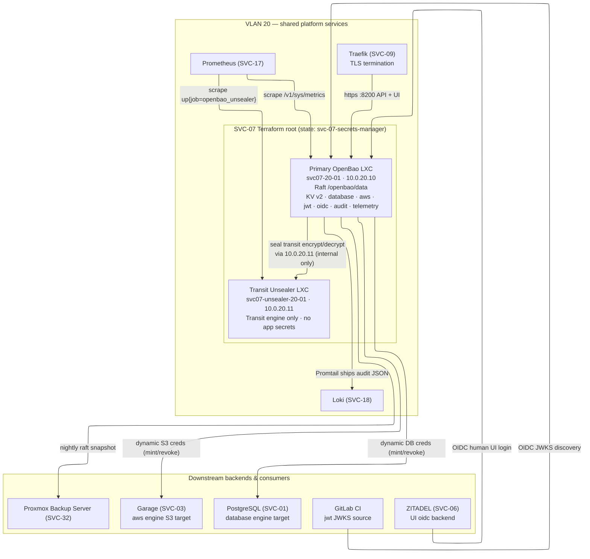
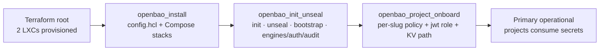
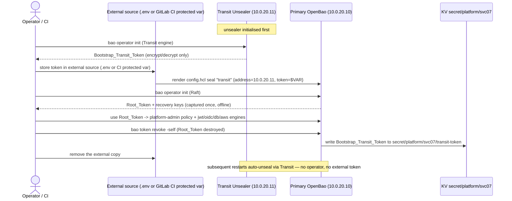

# SVC-07 Secrets Manager (OpenBao) — Terraform Root & Operator Runbooks

The **top-level documentation entry point** for SVC-07 (OpenBao). It ties
together the whole feature: the Terraform root that provisions the two OpenBao
LXCs, the three Ansible roles that install / initialise-unseal / onboard, the
one-time bootstrap runbook, the per-project onboarding runbook, and the
disaster-recovery restore runbook.

SVC-07 is a **shared platform service** on **VLAN 20**, not a per-project
resource. It is deliberately built from **two** unprivileged LXCs:

- **`svc07-20-01`** (`10.0.20.10`) — the **primary** OpenBao instance: Raft
  integrated storage plus KV v2, `database`, `aws`, `jwt`, `oidc`, the audit
  device, and telemetry.
- **`svc07-unsealer-20-01`** (`10.0.20.11`) — a **seal-only Transit unsealer**:
  the Transit engine and unseal key only, holding no application secrets.

The two-LXC split is a security-architecture choice (separate failure domains
for the sealed store and the key that opens it), not a scaling one — see
[`design.md`](../../../.kiro/specs/svc-07-secrets-manager/design.md) "Overview".

This root lives at `infra/projects/svc-07-secrets-manager/` with its own
GitLab-managed Terraform state name `svc-07-secrets-manager`, deliberately
separate from the [platform-foundation root](../../platform-foundation/README.md)
and every per-project `<slug>-infra` root, so a `terraform destroy` here removes
only these two LXCs (Requirement 9.6, 9.7; `structure.md`).

> **Related docs**
> - Compute module contract: [`../../modules/proxmox-compute/README.md`](../../modules/proxmox-compute/README.md)
> - `openbao_install` role: [`../../../ansible/roles/openbao_install/README.md`](../../../ansible/roles/openbao_install/README.md)
> - `openbao_init_unseal` role: [`../../../ansible/roles/openbao_init_unseal/README.md`](../../../ansible/roles/openbao_init_unseal/README.md)
> - `openbao_project_onboard` role: [`../../../ansible/roles/openbao_project_onboard/README.md`](../../../ansible/roles/openbao_project_onboard/README.md)
> - `docker-compose-app` role: [`../../../ansible/roles/docker-compose-app/README.md`](../../../ansible/roles/docker-compose-app/README.md)
> - **Restore runbook (60-min RTO):** [`../../../ansible/roles/openbao_install/RESTORE-RUNBOOK.md`](../../../ansible/roles/openbao_install/RESTORE-RUNBOOK.md)
> - Offline-vs-cluster testing guide: [`../../../TESTING.md`](../../../TESTING.md)

---

## Component topology

Both containers sit on VLAN 20. The primary's `seal "transit"` stanza points at
the unsealer over the internal VLAN-20 path; the unsealer is never exposed
through Traefik. External callers reach the primary's port 8200 only via Traefik.
Diagram adapted from [`design.md`](../../../.kiro/specs/svc-07-secrets-manager/design.md)
"Component topology".



---

## What this Terraform root declares

| File | Declares |
|---|---|
| `versions.tf` | `bpg/proxmox` provider pin (`~> 0.111.1`), Terraform `>= 1.6.0`, and the partial `backend "http"` (state name `svc-07-secrets-manager`). |
| `providers.tf` | The API-token-based Proxmox provider (`terraform@pve` identity — never root). |
| `variables.tf` | Guest-provisioning inputs the shared module does not carry (node, template, datastore, the two VMIDs). No IP literal — addresses are computed. |
| `main.tf` | Exactly **two** `proxmox_virtual_environment_container` resources (primary + unsealer) via the shared `proxmox-compute` module, consumed unmodified. |
| `outputs.tf` | `openbao_internal_ip` (`10.0.20.10`), `openbao_api_port` (`8200`), `openbao_unsealer_internal_ip` (`10.0.20.11`) — non-secret, consumed by the Ansible dynamic inventory. |

The two IPs are **computed** by the module via `cidrhost("10.0.20.0/24", 10 + host_index)`
(`10.0.20.10` for the primary at index 0, `10.0.20.11` for the unsealer at
index 1) — never written as an operator literal (Requirement 9.2, 9.3; NET-00 §3).

---

## The three Ansible roles (install → init/unseal/bootstrap → onboard)

The configuration layer is three cohesive roles that run in order, each
documented in its own README:

| Order | Role | Responsibility |
|---|---|---|
| 1 | [`openbao_install`](../../../ansible/roles/openbao_install/README.md) | Templates the two `config.hcl` shapes (primary + Transit-only unsealer) and the two Compose stacks (via [`docker-compose-app`](../../../ansible/roles/docker-compose-app/README.md)); pins `openbao/openbao:2.4` (pulled through Zot, SVC-14); idempotent version check. |
| 2 | [`openbao_init_unseal`](../../../ansible/roles/openbao_init_unseal/README.md) | One-time init of both LXCs (`bao status`-guarded), Transit auto-unseal wiring, the CI-optional bootstrap-token flow, engine/auth/audit enablement, swap lockdown, and the Prometheus/Promtail scrape/tail fragments. |
| 3 | [`openbao_project_onboard`](../../../ansible/roles/openbao_project_onboard/README.md) | Per-project isolation triple (`policy-<slug>`, `auth/jwt/role/<slug>-ci`, KV path) for one slug; fully idempotent. |



> The downstream `openbao-agent` sidecar every *other* service runs (to pull its
> own scoped secrets at container-start) is **out of scope** for SVC-07 — this
> feature builds the server side only.

---

## Prerequisites

- The Proxmox API token for `terraform@pve`, whose custom PVE role additionally
  carries the **`SDN.Allocate`** privilege on `/sdn` (NET-00 §6, ADR-0001,
  Requirement 9.8). This root only *consumes* the identity — it never declares
  or re-grants the role. Absence surfaces as an authorization failure with no
  container created.
- The VLAN-20 shared-services SDN zone/VNet (`p20`) — a
  platform-foundation-owned precondition, referenced here, not created.
- Two non-colliding Proxmox VMIDs (`openbao_primary_vmid`, `openbao_unsealer_vmid`).
- Cluster placement/storage/template inputs matching your cluster (see
  **Input variables** below) — the `-var` values in the examples are illustrative,
  not fixed constants.
- The project venv at `~/venv/devinfra/` with PyYAML (and, when installed,
  `ansible`/`ansible-lint`/`yamllint`) — per the `dev-workflow.md` venv conventions.
- Terraform CLI (`>= 1.6.0`) on `PATH` in CI. **Terraform is not installed in the
  local authoring environment**, so the `terraform` commands below marked
  `offline` run wherever the binary exists (locally or in CI).

### Input variables

The guest placement, storage, template, and VMIDs are Terraform variables declared
in [`variables.tf`](./variables.tf) (the authoritative list). Some are **required**
(no default) and some are **defaulted** — the defaults follow the platform standard
and may not match a given cluster, so verify them against yours rather than assuming
the example values apply:

| Variable | Default | Notes |
|---|---|---|
| `proxmox_node_name` | **required** | PVE node the two LXCs are created on. `pve-node-01` in the examples is a placeholder — use your node's real name (`pvesh get /nodes`). |
| `openbao_primary_vmid` / `openbao_unsealer_vmid` | **required** | Two free, non-colliding VMIDs. |
| `openbao_template_file_id` | **required** | `pveam` LXC template volume ID, form `<datastore>:vztmpl/<file>`; the **stock** Debian 12 or Ubuntu 24.04 template (e.g. `local:vztmpl/debian-12-standard_12.7-1_amd64.tar.zst`). The stock template has **no** Docker — the `common` role installs Docker + Compose per host (ADR-0003; the earlier pre-baked `debian-12-docker` template was abandoned). |
| `openbao_datastore_id` | `local-zfs` | Storage pool for the LXC rootfs (PF §6/§7 standard). A stock non-ZFS PVE install usually has `local-lvm` instead — if `apply` reports `storage 'local-zfs' does not exist`, run `pvesm status` and override `-var="openbao_datastore_id=<pool>"`. |
| `openbao_template_os_type` | `debian` | Set to `ubuntu` if the template above is Ubuntu 24.04 rather than Debian 12. |

The `plan`/`apply` examples below show **all** of this root's non-secret `-var`s
explicitly (the required ones plus the two defaulted ones, `openbao_datastore_id`
and `openbao_template_os_type`), with real-shaped placeholder values you
substitute for your cluster. Credentials are supplied via exported `TF_VAR_*`
env vars, never as `-var` (see the Apply section).

### Placeholders — never real credentials or hostnames

Every example uses placeholders, substituted at run time. **No token, TLS key,
recovery key, or hostname literal appears in this documentation, and no credential
value is ever echoed** — only the env-var *name* is referenced
(`documentation-testing.md`, `security-standards.md`).

| Placeholder in docs | Substituted with | Notes |
|---|---|---|
| `https://pve.example.internal:8006/` | `TF_VAR_proxmox_endpoint` | Proxmox API endpoint |
| `USER@REALM!TOKENID=UUID` | `TF_VAR_proxmox_api_token` | `terraform@pve` API token, sensitive |
| `<GITLAB-HOST>` / `<PROJECT-ID>` | `CI_API_V4_URL` / `CI_PROJECT_ID` | GitLab state backend addressing |
| CI job token | `CI_JOB_TOKEN` | GitLab-managed state auth |
| `openbao.<platform-domain>` | the real Traefik host rule | primary API/UI ingress |
| `<BOOTSTRAP_TRANSIT_TOKEN>` | `OPENBAO_BOOTSTRAP_TRANSIT_TOKEN` env var | bootstrap only; env-var **name** only, never a value |
| `<PLATFORM_ADMIN_TOKEN>` | `OPENBAO_ADMIN_TOKEN` env var | day-2 onboarding; env-var **name** only |
| `<slug>` | the real project slug (e.g. `dronefleet`) | must be recorded in `projects.yaml` |

---

## Terraform workflow

State is a GitLab-managed HTTP **partial** backend: the `backend "http"` block in
`versions.tf` is intentionally empty and all attributes are supplied at `init`
time via `-backend-config`. The state name for this root is
`svc-07-secrets-manager` and must be used verbatim in the address.

### Initialize — state name `svc-07-secrets-manager` (Tier-2, requires-infra)

`terraform init` reaches the GitLab state backend, so it needs the `CI_*`
variables present. For a purely offline format/validate loop, use
`-backend=false` (next section).

Run from the `infra/projects/svc-07-secrets-manager` root (the `cd` below handles it):

<!-- doctest: requires-infra -->
<!-- cwd: . -->
```bash
cd infra/projects/svc-07-secrets-manager
terraform init \
  -backend-config="address=${CI_API_V4_URL}/projects/${CI_PROJECT_ID}/terraform/state/svc-07-secrets-manager" \
  -backend-config="lock_address=${CI_API_V4_URL}/projects/${CI_PROJECT_ID}/terraform/state/svc-07-secrets-manager/lock" \
  -backend-config="unlock_address=${CI_API_V4_URL}/projects/${CI_PROJECT_ID}/terraform/state/svc-07-secrets-manager/lock" \
  -backend-config="username=gitlab-ci-token" \
  -backend-config="password=${CI_JOB_TOKEN}" \
  -backend-config="lock_method=POST" \
  -backend-config="unlock_method=DELETE" \
  -backend-config="retry_wait_min=5"
```

### Format and validate (offline, Tier-1)

`terraform fmt` and `terraform validate` need no Proxmox and no state backend.
`validate` requires provider schemas, so run `init -backend=false` first to
install them without touching remote state.

<!-- doctest: offline -->
<!-- cwd: . -->
```bash
cd infra/projects/svc-07-secrets-manager
terraform fmt -check -recursive
```

<!-- doctest: offline -->
<!-- cwd: . -->
```bash
cd infra/projects/svc-07-secrets-manager
terraform init -backend=false
terraform validate
```

### Plan (offline, Tier-1)

An offline plan with placeholder credentials and `-refresh=false` validates the
resource graph — it must show **exactly two** `proxmox_virtual_environment_container`
resources (primary + unsealer) and no other container resources (Requirement 9.1).

<!-- doctest: offline -->
<!-- cwd: . -->
```bash
cd infra/projects/svc-07-secrets-manager
terraform plan \
  -refresh=false \
  -var="proxmox_node_name=pve-node-01" \
  -var="openbao_primary_vmid=1070" \
  -var="openbao_unsealer_vmid=1071" \
  -var="openbao_template_file_id=local:vztmpl/debian-12-standard_12.7-1_amd64.tar.zst" \
  -var="openbao_datastore_id=local-lvm" \
  -var="openbao_template_os_type=debian" \
  -var="proxmox_endpoint=https://pve.example.internal:8006/" \
  -var="proxmox_api_token=USER@REALM!TOKENID=UUID" \
  -out=tfplan.svc07
# Dummy, non-contacting placeholder creds are passed as -var here ONLY because
#   -refresh=false makes this an offline graph check. A LIVE apply/destroy uses
#   the exported TF_VAR_proxmox_* convention instead (see the Apply section).
```

### Apply (Tier-2, requires-infra)

A **real** apply targets a live Proxmox cluster and creates the two LXCs. It
requires the `SDN.Allocate` privilege and the `TF_VAR_proxmox_*` credentials, so
it is **Tier-2 (requires-infra)**; skipped (not failed) when credentials are
absent, per `documentation-testing.md`.

Export the cluster credentials as `TF_VAR_*` first (mirrors `.env`'s
`PROXMOX_SDN_TEST_*`) — the same convention the
[INSTALL-RUNBOOK](./INSTALL-RUNBOOK.md) uses. Setting env vars contacts nothing,
so this export block is **offline**; the `terraform apply` that consumes it is
the requires-infra step. Credentials are **not** re-passed as `-var`.

<!-- doctest: offline -->
<!-- cwd: . -->
```bash
export TF_VAR_proxmox_endpoint="${PROXMOX_SDN_TEST_ENDPOINT}"
export TF_VAR_proxmox_api_token="${PROXMOX_SDN_TEST_TOKEN}"
export TF_VAR_proxmox_insecure="true"   # self-signed test cert
```

Run from the `infra/projects/svc-07-secrets-manager` root (the `cd` below handles it):

<!-- doctest: requires-infra -->
<!-- cwd: . -->
```bash
cd infra/projects/svc-07-secrets-manager
terraform apply \
  -var="proxmox_node_name=pve-node-01" \
  -var="openbao_primary_vmid=1070" \
  -var="openbao_unsealer_vmid=1071" \
  -var="openbao_template_file_id=local:vztmpl/debian-12-standard_12.7-1_amd64.tar.zst" \
  -var="openbao_datastore_id=local-lvm" \
  -var="openbao_template_os_type=debian"
# proxmox_endpoint / proxmox_api_token / proxmox_insecure come from the exported
#   TF_VAR_* block above — never re-passed as -var.
# proxmox_node_name: use YOUR node's real name (`pvesh get /nodes`).
# openbao_datastore_id: non-ZFS clusters use local-lvm — run `pvesm status`.
# openbao_template_file_id: stock template, no Docker (common role installs it);
#   confirm the filename with `pveam available | grep debian-12-standard`.
# openbao_template_os_type: set to `ubuntu` for an Ubuntu 24.04 template.
```

### Read the outputs (Tier-2, requires-infra)

<!-- doctest: requires-infra -->
<!-- cwd: . -->
```bash
cd infra/projects/svc-07-secrets-manager
terraform output openbao_internal_ip
terraform output openbao_api_port
terraform output openbao_unsealer_internal_ip
```

---

## Runbook 1 — One-time bootstrap (init, unseal, engines, root-token revoke)

The bootstrap closes a chicken-and-egg loop: OpenBao is the platform's secrets
origin, yet its own Transit token must arrive from an operator-supplied,
**never-committed** source before OpenBao can protect it. Per PF §11, OpenBao's
own seal/unseal material is handled *outside* the FR-8 first-secret flow — so a
homelab operator can do the entire bootstrap locally with a gitignored `.env`,
and a pipeline can equally use a GitLab CI protected + masked variable. **Neither
source is hardcoded as the only path.** The sequence rotates the token *into* KV
and removes the external copy immediately after the primary is live (Requirement
5.4, 5.5; Security AC 1, 7).



### Preflight — CLI sanity (offline, Tier-1)

Confirm the OpenBao CLI is present before touching the cluster. `bao -help`
contacts nothing and exits 0.

<!-- doctest: offline -->
```bash
bao -help
```

Lint the two roles that drive the bootstrap (requires `ansible-lint` in the
venv; invoke by absolute path per `dev-workflow.md`):

<!-- doctest: offline -->
<!-- cwd: ansible -->
```bash
~/venv/devinfra/bin/ansible-lint roles/openbao_install roles/openbao_init_unseal
```

### Validate the primary Compose stack (offline, Tier-1)

Render + validate the primary Compose stack config (no host ports, Traefik
labels, pinned image) before bringing the primary up. Run from the stack
directory that `openbao_install` writes (`/opt/compose/openbao` by default).

<!-- doctest: offline -->
```bash
docker compose config
```

### Run install + init/unseal (Tier-2, requires-infra)

The token is supplied at run time via the env-var **name** only
(`OPENBAO_BOOTSTRAP_TRANSIT_TOKEN`) from a gitignored `.env` (homelab) or a
GitLab CI protected + masked variable (pipeline). It is **never** written into a
vars file, a Compose file, or this document.

> The control host must be able to reach the VLAN-20 guests
> (`10.0.20.10` / `10.0.20.11`) over SSH first — a Proxmox SDN VLAN zone is L2
> only, so an off-VLAN control host needs the ADR-0004 reachability prerequisite
> (Proxmox host routes + firewalls VLAN 20; a static route on the developer
> machine). See the
> [INSTALL-RUNBOOK reachability note](./INSTALL-RUNBOOK.md#1b-install-docker--compose-on-the-two-lxcs-the-common-role)
> and [`../../../.kiro/decisions/0004-ansible-control-node-placement-and-sdn-reachability.md`](../../../.kiro/decisions/0004-ansible-control-node-placement-and-sdn-reachability.md).

The playbooks run from the **repo root** against the generated inventory
`ansible/inventory/svc-07-secrets-manager.generated.yml`, produced by
`generate_inventory.py` from the Terraform outputs — see the
[INSTALL-RUNBOOK generate step](./INSTALL-RUNBOOK.md#1b-install-docker--compose-on-the-two-lxcs-the-common-role)
(regenerate after every `terraform apply`; the file is gitignored and carries no
secret):

<!-- doctest: requires-infra -->
<!-- cwd: . -->
```bash
~/venv/devinfra/bin/ansible-playbook \
  -i ansible/inventory/svc-07-secrets-manager.generated.yml \
  ansible/playbooks/openbao.yml --tags "install,init"
```

The role runs the **unsealer** first (its Transit engine is what the primary
auto-unseals against), then the primary's Raft init, then engine/auth/audit
enablement *inside* the root-token window, then revokes the Root_Token, rotates
the bootstrap token into KV `secret/platform/svc07/transit-token`, and removes
the external copy. See [`openbao_init_unseal`](../../../ansible/roles/openbao_init_unseal/README.md)
"The task-6.2 bootstrap flow" for the step-by-step.

### Confirm auto-unseal (Tier-2, requires-infra)

<!-- doctest: requires-infra -->
```bash
curl -sS --cacert /openbao/tls/ca.pem https://10.0.20.10:8200/v1/sys/health
```

Illustrative expected shape (Tier-3, not executed):

<!-- doctest: display-only -->
```json
{ "initialized": true, "sealed": false, "standby": false }
```

---

## Runbook 2 — Per-project onboarding

Onboarding keys off the project **slug** (read-only from `projects.yaml`) and is
idempotent — a second run for the same slug is a byte-identical no-op reporting
`changed=0` (Requirement 1.5, 13.4). It runs day-2 with a **platform-admin**
token (the Root_Token is already revoked), supplied via the env-var name
`OPENBAO_ADMIN_TOKEN`. Full behaviour is documented in the
[`openbao_project_onboard`](../../../ansible/roles/openbao_project_onboard/README.md)
README; the isolation triple it creates is:

- `policy-<slug>` — CRUD on the five KV v2 sub-paths (`secret/{data,metadata,delete,undelete,destroy}/<slug>/*`) and nothing else.
- `auth/jwt/role/<slug>-ci` — bound `project_path`/`aud`, `token_ttl`/`token_max_ttl` both ≤ 3600s, `renewable=false`, `token_policies=[policy-<slug>]`.
- `secret/data/<slug>/` — the KV path exists (metadata-only, never a secret version).

### Lint the onboarding role (offline, Tier-1)

<!-- doctest: offline -->
<!-- cwd: ansible -->
```bash
~/venv/devinfra/bin/ansible-lint roles/openbao_project_onboard
```

### Onboard a slug (Tier-2, requires-infra)

The platform-admin token is referenced by env-var name only and never echoed.

<!-- doctest: requires-infra -->
<!-- cwd: . -->
```bash
~/venv/devinfra/bin/ansible-playbook \
  -i ansible/inventory/svc-07-secrets-manager.generated.yml \
  ansible/playbooks/openbao.yml --tags onboard \
  --extra-vars "project_slug=dronefleet"
```

---

## Runbook 3 — Disaster-recovery restore (60-minute RTO)

The full snapshot-restore procedure — retrieving a Raft snapshot from Proxmox
Backup Server (SVC-32), restoring it into a fresh primary, confirming Transit
auto-unseal, and verifying operational state within 60 minutes (Requirement
11.4) — lives in its own runbook next to the role that owns the nightly snapshot
job:

**➡ [`../../../ansible/roles/openbao_install/RESTORE-RUNBOOK.md`](../../../ansible/roles/openbao_install/RESTORE-RUNBOOK.md)**

Its runnable blocks carry the same doctest tier annotations: `bao -help`,
`proxmox-backup-client --help`, `docker compose config`, and `ansible-lint` are
Tier-1 (offline); the actual PBS retrieve, `raft snapshot restore`, auto-unseal,
and operational-state verification are Tier-2 (requires-infra), exercised by the
`requires_infra`-gated integration test in task 12.4.

---

## Doctest tiers used in this documentation set

Per [`documentation-testing.md`](../../../.kiro/steering/documentation-testing.md),
every runnable code block across this README and the linked role READMEs /
restore runbook carries an explicit tier annotation:

- **Tier-1 (`<!-- doctest: offline -->`)** — no live dependency:
  `terraform fmt`/`validate`/`plan` (with `-backend=false` / `-refresh=false`),
  `bao -help`, `docker compose config`, `ansible-lint`, `yamllint`.
- **Tier-2 (`<!-- doctest: requires-infra -->`)** — needs a live cluster:
  `terraform init`/`apply`/`output`, `bao operator init`, the playbook runs, the
  `curl` health checks, PBS retrieve, and `raft snapshot restore`. Skipped (not
  failed) when infra/credentials are absent.
- **Tier-3 (`<!-- doctest: display-only -->`)** — illustrative only, not
  executed (e.g. the JSON health-shape samples).

No repo-local Tier-1 doctest runner is wired yet; these annotations are ready for
the `documentation-testing.md` tooling (which runs Tier-1 on every markdown save
and all tiers on demand). All examples use placeholders only — no real tokens,
TLS material, or hostnames — and no credential value is ever echoed.

---

## Cross-cutting notes

- **Multi-tenancy / VLAN isolation:** both LXCs live on the shared-services VLAN
  20 (`domain-rules` §1); per-project isolation is enforced by OpenBao
  `policy-<slug>` path-prefixing, not by placing projects on separate VLANs here.
- **Self-hosted & EU-sovereignty posture:** OpenBao is one of the catalog's seven
  explicitly-flagged non-EU exceptions (Linux-Foundation-governed; no
  Vault-class European equivalent of comparable maturity) — flagged, not silent.
- **Terraform state isolation:** state name `svc-07-secrets-manager`, unique
  across all roots; `terraform destroy` here touches only these two LXCs
  (Requirement 9.6, 9.7).
- **Secrets & credential handling:** no secret value is ever committed, echoed,
  or templated into a vars file / Compose file. The bootstrap token comes from a
  gitignored `.env` or a GitLab CI protected + masked variable and is rotated
  into KV with the external copy removed (Requirement 5.4, 5.5; Security AC 1, 7).
- **Naming & addressing:** machine-facing hostnames `svc07-20-01` /
  `svc07-unsealer-20-01` (NET-00 §4) and human-facing tags `proj-shared-openbao` /
  `proj-shared-openbao-unsealer` (PF §4) are both set on the same resources; IPs
  are `cidrhost`-computed, never hand-chosen.
- **Deployment-unit convention:** both LXCs run a `docker compose up -d` stack
  templated by `docker-compose-app`; the primary registers with Traefik via
  Docker labels (no host port), and the unsealer is internal-only (no Traefik
  labels, no host port) — the design's explicit, justified ingress exception
  (PF FR-6, FR-7).
